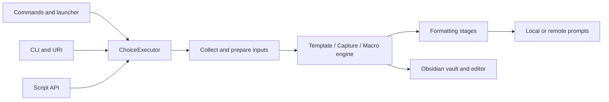

# QuickAdd architecture

QuickAdd turns a choice into a sequence of prompts, formatting operations, and vault writes. Settings store the choice tree; one `ChoiceExecutor` owns each run's variables, date origin, prepared inputs, and outcome.

## Follow a run

| Responsibility | Start here |
| --- | --- |
| Plugin lifecycle and settings persistence | `src/main.ts` |
| Built-in command registration | `src/plugin/registerCoreCommands.ts` |
| CLI registration, parameters, execution and inspection | `src/cli/` |
| URI callbacks and their error redaction | `src/uri/registerQuickAddUri.ts` |
| Public script API and variable lifetimes | `src/quickAddApi.ts`, `src/api/` |
| Choice dispatch, run context, cancellation and outcomes | `src/choiceExecutor.ts` |
| Input discovery and one-page form | `src/preflight/` |
| Vault changes and macro commands | `src/engine/` |
| Token evaluation, previews and prompt construction | `src/formatters/` |
| Local prompts and file/choice suggestions | `src/gui/`, `src/gui/suggesters/` |
| Remote prompt transport and validation | `src/interactive/` |
| AI requests, chunking and request logs | `src/ai/` |
| Package validation, preview, import and export | `src/services/package*.ts` |

## State and boundaries

- `settingsStore` is the live configuration source. Its plugin subscriber persists changes through the conflict-aware save path in `main.ts`. Settings UI controls write through the store.
- An executor carries variables across nested macro steps. Script API calls have explicit rules for snapshotting or clearing them. Keep those lifetimes at the API boundary.
- Preflight discovers inputs before an engine writes. It also shares loaded user-script modules with execution so module initialization happens once per run.
- Formatters evaluate stages in order. Macros, scripts, includes, and global variables can introduce later tokens. Current-file token substitutions deliberately do not rescan their generated text.
- `Formatter` coordinates token stages; `ValueFormatter` owns VALUE resolution and typed property context. Token helpers own date, current-file, script-span, and prompt details. Preview formatters retain their separate side-effect policy.
- Engines own committed-write outcomes. An error while navigating after a write must not turn a committed change into a retryable failure.
- Prompt routing selects a remote provider before the headless or local UI path. Prompt components own their modal lifecycle; the interactive protocol owns wire validation.
- Package validation, preview, and import must interpret the same choice and macro shapes. Previewed assets and capabilities must match what import installs.

## Verification

`pnpm run build-with-lint`, `pnpm run check`, and `pnpm run test:coverage` cover types, lint, Svelte, and unit behavior. Shared fixtures live in `tests/helpers/`; production behavior should be asserted through production entrypoints, with Obsidian and external services stubbed only at their boundaries.

`pnpm run test:e2e` drives a real Obsidian instance. Worktrees use isolated vaults through the repository's E2E runner. See `AGENTS.md` for provisioning, routing, and teardown.

The simplification measurement is reproducible with `python3 .audit/measure-lines.py e15ee783 HEAD`. It counts all tracked UTF-8 text, reports production and tests separately, and includes extracted modules and new helpers.
