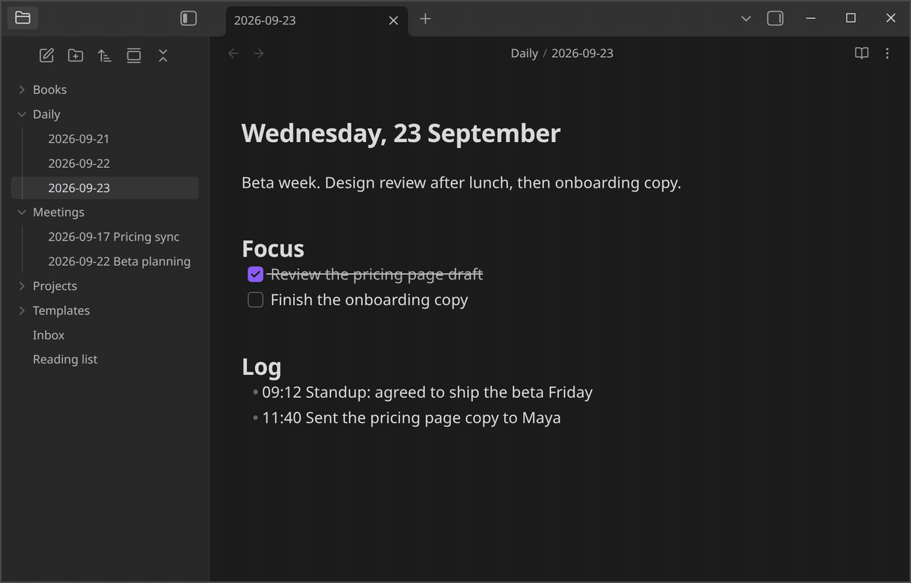

<b>One hotkey to log a line, create a note, or run a whole workflow.</b>

<a href="https://community.obsidian.md/plugins/quickadd">Install</a>&nbsp;· <a href="https://quickadd.obsidian.guide/docs/">Documentation</a>&nbsp;· <a href="https://quickadd.obsidian.guide/docs/Examples/">Examples</a>&nbsp;· <a href="https://github.com/chhoumann/quickadd/discussions">Discussions</a>&nbsp;· <a href="https://github.com/chhoumann/quickadd/releases">Changelog</a>

## What you can build

Each workflow you set up in QuickAdd is called a **choice**. There are four kinds:

- **[Template](https://quickadd.obsidian.guide/docs/Choices/TemplateChoice/)** creates a note from a template, with its name, folder, and properties filled in. For example, a meeting note named with today's date in your Meetings folder.
- **[Capture](https://quickadd.obsidian.guide/docs/Choices/CaptureChoice/)** adds text to a note without opening it. For example, a timestamped line under the Log heading of today's daily note.
- **[Macro](https://quickadd.obsidian.guide/docs/Choices/MacroChoice/)** runs several steps in a row: other choices, Obsidian commands, scripts, and AI prompts. For example, look up a book online and create a note with its details.
- **[Multi](https://quickadd.obsidian.guide/docs/Choices/MultiChoice/)** groups choices into a folder in the QuickAdd menu. For example, a Journal folder holding your daily log and gratitude captures.

Placeholders fill in the details each time a choice runs: `{{DATE}}` inserts today's date, `{{VALUE}}` asks you for text, and `{{FIELD:project}}` suggests the `project` values your notes already use. Others insert links, your selection, or the clipboard. See [format syntax](https://quickadd.obsidian.guide/docs/FormatSyntax/) for all of them.

QuickAdd also has:

- **Forms**: collect every input on [one page](https://quickadd.obsidian.guide/docs/Advanced/onePageInputs/), with dropdowns, date pickers, and sliders.
- **Scripts**: run your own JavaScript as [user scripts](https://quickadd.obsidian.guide/docs/UserScripts/), and call the [QuickAdd API](https://quickadd.obsidian.guide/docs/QuickAddAPI/) from scripts, Templater, or other plugins.
- **Triggers**: run choices from [`obsidian://quickadd` links](https://quickadd.obsidian.guide/docs/Advanced/ObsidianUri/), Apple Shortcuts, [launchers and schedulers](https://quickadd.obsidian.guide/docs/Advanced/TriggerQuickAddFromOutsideObsidian/), or the [Obsidian CLI](https://quickadd.obsidian.guide/docs/Advanced/CLI/).
- **AI**: send prompts to OpenAI, Anthropic, Gemini, or any OpenAI-compatible provider, including local models, with the [AI Assistant](https://quickadd.obsidian.guide/docs/AIAssistant/). AI features stay off until you [turn them on](https://quickadd.obsidian.guide/docs/Settings/#ai--online).
- **Packages**: export your choices as a [package](https://quickadd.obsidian.guide/docs/Choices/Packages/) and import them into another vault.

QuickAdd works on desktop and mobile. The Obsidian CLI is desktop-only.

## Get started

1. In Obsidian, open **Settings → Community plugins**, search for QuickAdd, then install and enable it.
2. Build your first choice with the one-minute [first workflow](https://quickadd.obsidian.guide/docs/#first-workflow) guide.
3. In **Settings → QuickAdd**, click the ⚡ next to a choice to add it to the command palette (on mobile, tap ⋮&nbsp;→&nbsp;**Enable in command palette**). Then give it a hotkey in **Settings → Hotkeys**. You can also run any choice with the **QuickAdd: Run** command.

Using Templater? Add your template folder in QuickAdd's settings and **QuickAdd: New note from template** works right away. [Coming from Templater](https://quickadd.obsidian.guide/docs/ComingFromTemplater/) shows the QuickAdd way to do each Templater job.

## Learn more

- [Examples](https://quickadd.obsidian.guide/docs/Examples/): complete workflows for daily notes, inboxes, meetings, books, movies, and more.
- [Scripting guide](https://quickadd.obsidian.guide/docs/Advanced/ScriptingGuide/): writing your own scripts when the built-in steps aren't enough.
- [FAQ](https://quickadd.obsidian.guide/docs/FAQ/): answers to common questions.
- [llms.txt](https://quickadd.obsidian.guide/llms.txt) and the MCP server at `https://quickadd.obsidian.guide/mcp`: the docs in a form AI assistants can read.

## Help and feedback

- Ask questions and share workflows in [Discussions](https://github.com/chhoumann/quickadd/discussions).
- Report bugs and request features in [Issues](https://github.com/chhoumann/quickadd/issues).
- Report security problems privately, as described in the [security policy](SECURITY.md).

## Contributing

Contributions are welcome. Read [CONTRIBUTING.md](CONTRIBUTING.md) before you start: comment on the issue you want to work on and wait for a go-ahead before writing code.

## Support QuickAdd

If QuickAdd saves you time, you can [buy me a coffee](https://buymeacoffee.com/chhoumann).

## License

[MIT](LICENSE)
