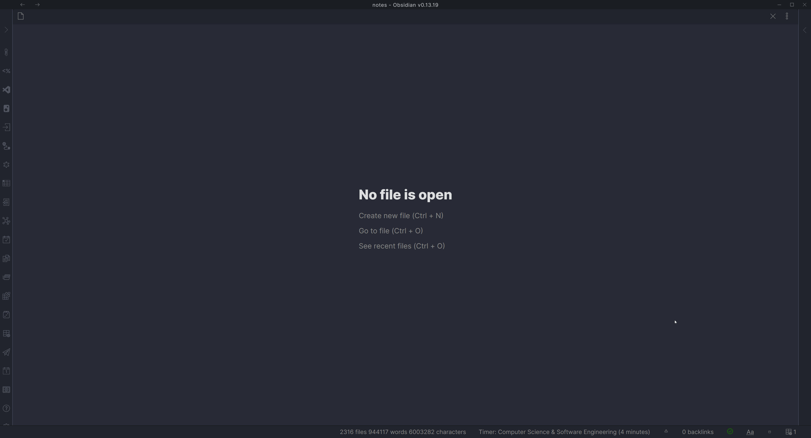

# Movie & Series Script

This script allows you to easily insert a movie or TV show note into your vault.

We use OMDb api to get the movie or TV show information. You can get an API key on the website [here](https://www.omdbapi.com/). This will be needed to use this script.

## Demo


## Installation
We'll need to install a QuickAdd user script for this to work. I have made a video which  shows you how to do so - [click here](https://www.youtube.com/watch?v=gYK3VDQsZJo&t=1730s).
You will need to put the user script into a new macro and then create a Macro choice in the main menu to activate it.
You can find the script [here](./Attachments/movies.js).

1. Save the script (`movies.js`) to your vault somewhere. Make sure it is saved as a JavaScript file, meaning that it has the `.js` at the end.
2. Create a new template in your designated templates folder. Example template is provided below.
3. Open the Macro Manager by opening the QuickAdd plugin settings and clicking `Manage Macros`.
4. Create a new Macro - you decide what to name it. I named mine ``Movie``.
5. Add the user script to the command list.
6. Add a new Template step to the macro. This will be what creates the note in your vault. Settings are as follows:
    1. Set the template path to the template you created.
    2. Enable File Name Format and use `{{VALUE:fileName}}` as the file name format. You can specify this however you like. The `fileName` value is the name of the Movie or TV show without illegal file name characters.
    3. The remaining settings are for you to specify depending on your needs.
7. Click on the cog icon to the right of the script step to configure the script settings. This should allow you to enter the API key you got from OMDb. [Image demonstration](../Images/moviescript_settings.jpg).
8. Go back out to your QuickAdd main menu and add a new Macro choice. Again, you decide the name. I named mine ``🎬 Movie``. This is what activates the macro.
9. Attach the Macro to the Macro Choice you just created. Do so by clicking the cog ⚙ icon and selecting it.

You can now use the macro to create notes with movie or TV show information in your vault.

### Example template

````markdown
---
cover: {{VALUE:Poster}}
---

category:: {{VALUE:typeLink}}
director:: {{VALUE:directorLink}}
genre:: {{VALUE:genreLinks}}
imdbId:: {{VALUE:imdbID}}
ratingImdb:: {{VALUE:imdbRating}}
rating::
year:: {{VALUE:Year}}
cast:: {{VALUE:actorLinks}}
plot:: {{VALUE:Plot}}


````


## Usage
It's possible to access whichever JSON variables are sent in response through a `{{VALUE:<variable>}}` tag (e.g. ``{{VALUE:Title}}``). Below is an example response for the TV show 'Arcane'.
```json
{
    "Title": "Arcane",
    "Year": "2021–",
    "Rated": "TV-14",
    "Released": "06 Nov 2021",
    "Runtime": "N/A",
    "Genre": "Animation, Action, Adventure",
    "Director": "N/A",
    "Writer": "N/A",
    "Actors": "Hailee Steinfeld, Kevin Alejandro, Jason Spisak",
    "Plot": "Set in utopian Piltover and the oppressed underground of Zaun, the story follows the origins of two iconic League champions-and the power that will tear them apart.",
    "Language": "English",
    "Country": "United States, France",
    "Awards": "N/A",
    "Poster": "https://m.media-amazon.com/images/M/MV5BYmU5OWM5ZTAtNjUzOC00NmUyLTgyOWMtMjlkNjdlMDAzMzU1XkEyXkFqcGdeQXVyMDM2NDM2MQ@@._V1_SX300.jpg",
    "Ratings": [
        {
            "Source": "Internet Movie Database",
            "Value": "9.2/10"
        }
    ],
    "Metascore": "N/A",
    "imdbRating": "9.2",
    "imdbVotes": "105,113",
    "imdbID": "tt11126994",
    "Type": "series",
    "totalSeasons": "2",
    "Response": "True"
}
```
