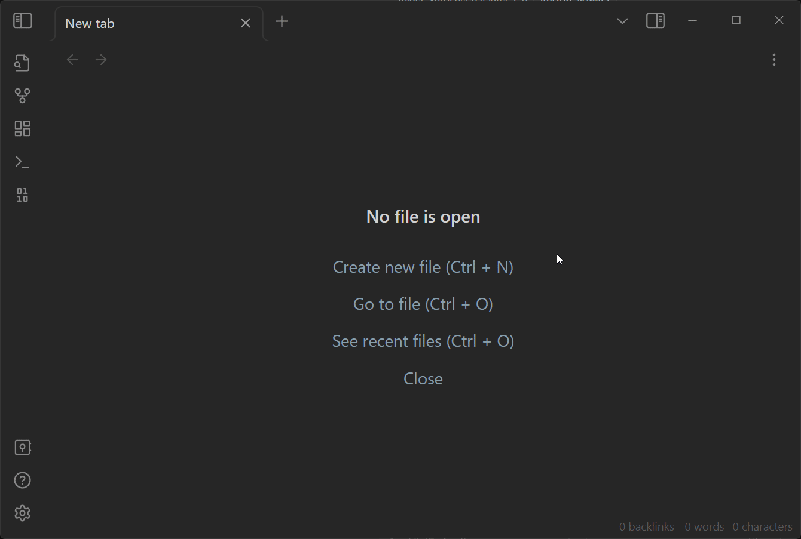

# AI Assistant
The AI Assistant in QuickAdd leverages the power of OpenAI's GPT-3 and GPT-4 models to act as your personal AI assistant within Obsidian. It can streamline your workflows by automating routine tasks and providing intellectual support. To use this feature, you need the QuickAdd plugin and an OpenAI API key. 

## How to Setup the AI Assistant
To set up the AI Assistant, follow these steps:

1. In Obsidian, create a new folder dedicated to AI prompt templates, e.g. `bins/ai_prompts`.
2. Navigate to QuickAdd settings and locate the "AI Assistant" section. Specify the path to the folder you created in step 1.
3. In the same section, paste your OpenAI API key into the "OpenAI API Key" field.



That's really it. You're now ready to use the AI Assistant.

The basic idea is that you set up a QuickAdd Macro, which will trigger the AI Assistant.
The AI Assistant will then use the prompt template you specify to generate a prompt, which it will then send to OpenAI.
OpenAI will then return a response, which the AI Assistant passes on to the QuickAdd Macro.
You can then use the response in subsequent steps in the macro, e.g. to capture to a note, or create a new note.

**Creating prompt templates is simple: just create a note in your prompt templates folder.**

Creating prompt templates is as simple as creating a note within your prompt templates folder. These templates can utilize QuickAdd's [Format Syntax](./FormatSyntax.md) or [Inline Scripts](./InlineScripts.md).

Here's an example of how you can set up a prompt template:


You can also use AI Assistant features from within the [API](./QuickAddAPI.md).

## AI Assistant Settings
Within the main AI Assistant settings accessible via QuickAdd settings, you can configure the following options:

- OpenAI API Key: The key to interact with OpenAI's models.
- Prompt Templates Folder: The location where all your prompt templates reside.
- Default model: The default OpenAI model to be used.
- Show Assistant: Toggle for status messages.
- Default System Prompt Template: Sets the behavior of the model.

For each individual AI Assistant command in your macros, you can set these options:

- Prompt Template: Determines the prompt template to use.
- Model: Specifies the OpenAI model to use, overriding the default model.
- Output Name Variable: Sets the variable name for the AI Assistant’s output.
- System Prompt Template: Determines the models behavior, overriding the default system prompt template.

You can also tweak model parameters in advanced settings:
- **temperature:** Allows you to adjust the sampling temperature between 0 and 2. Higher values result in more random outputs, while lower values make the output more focused and deterministic.
- **top_p:** This parameter relates to nucleus sampling. The model considers only the tokens comprising the top 'p' probability mass. For example, 0.1 means only tokens from the top 10% probability mass are considered.
- **frequency_penalty:** A parameter ranging between -2.0 and 2.0. Positive values penalize new tokens based on their frequency in the existing text, reducing the model's tendency to repeat the same lines.
- **presence_penalty:** Also ranging between -2.0 and 2.0, positive values penalize new tokens based on their presence in the existing text, encouraging the model to introduce new topics.


## AI-Powered Workflows
You can create powerful workflows utilizing the AI Assistant. Some examples are:

- **Generating Writing Prompts:** Using links to related notes to generate writing prompts.
- **Summarizer:** Create summaries of selected text.
- **Transform Selected:** Transform selected text based on provided instructions.
- **Flashcard Creator:** Generate flashcards based on selected text.
- **Get Me Started Writing About…:** Generate points to kickstart your writing on a given topic.
- **Manual Prompt:** Provide a manual prompt to the AI assistant.
- **Alternative Viewpoints:** Obtain alternative perspectives and improvements on your draft.
- **Prompt Chaining:** Chain multiple prompts together, with each prompt using the output of the previous one.

All of these examples, and more, can be found in [Christian's blog post about the AI Assistant](https://bagerbach.com/blog/obsidian-ai).

Please note, using the AI Assistant will incur costs depending on the API usage. Set spending limits on your OpenAI account to avoid unexpected expenses. Play around with different models to find the one that best suits your needs.

### Example: Summarizer
Here’s a simple prompt where you select some text, and then use the assistant with that prompt.
Then it’ll spit out an AI-generated summary:

```markdown
Please summarize the following text. Use only the text itself as material for summarization, and do not add anything new. Rewrite this for brevity, in outline form:
{{value}}
```

You can use the getting-started demonstration shown earlier to set this up.