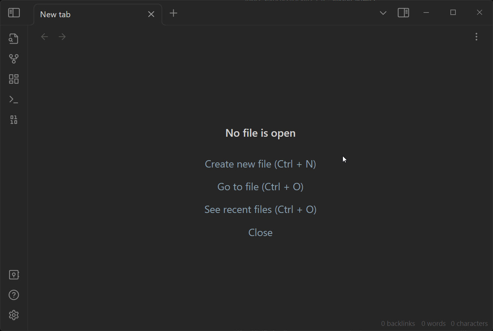
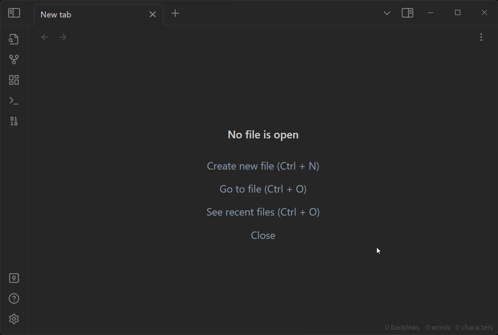

# AI Assistant

The AI Assistant in QuickAdd leverages the power of Large Language Models (LLMs) to act as your personal AI assistant within Obsidian. It can streamline your workflows by automating routine tasks and providing intellectual support. To use this feature, you need the QuickAdd plugin and a provider you'd like to use.

## How to Setup the AI Assistant

To set up the AI Assistant, follow these steps:

1. In Obsidian, create a new folder dedicated to AI prompt templates, e.g. `bins/ai_prompts`.
2. Open QuickAdd settings and, in the choice list, click the **Configure AI Assistant** icon button (the sparkles icon at the bottom of the list). This opens the **AI Assistant Settings** modal.

   :::note
   The Configure AI Assistant button is only shown when "Disable AI & Online features" is turned off in QuickAdd settings.
   :::
3. In the **AI Assistant Settings** modal, set **Prompt Template Folder Path** to the folder you created in step 1, then click **Edit Providers** to add a provider. If you are using OpenAI, you will need to add your API key in the [provider](#providers) settings. The video below is from an older version, but the process is similar.



That's really it. You're now ready to use the AI Assistant.

The basic idea is that you set up a QuickAdd Macro, which will trigger the AI Assistant.
The AI Assistant will then use the prompt template you specify to generate a prompt, which it will then send to your selected provider.
The provider will then return a response, which the AI Assistant passes on to the QuickAdd Macro.
You can then use the response in subsequent steps in the macro, e.g. to capture to a note, or create a new note.

**Creating prompt templates is simple: just create a note in your prompt templates folder.**

Creating prompt templates is as simple as creating a note within your prompt templates folder. These templates can utilize QuickAdd's [Format Syntax](./FormatSyntax.md) or [Inline Scripts](./InlineScripts.md).

Here's an example of how you can set up a prompt template:



You can also use AI Assistant features from within the [API](./QuickAddAPI.md).

## Providers

QuickAdd supports multiple providers for LLMs.
QuickAdd works with OpenAI-compatible APIs and also supports Google Gemini.

Here are a few providers that are known to work with QuickAdd:

-   [OpenAI](https://openai.com)
-   [Gemini (Google AI)](https://ai.google.dev)
-   [TogetherAI](https://www.together.ai)
-   [Groq](https://groq.com)
-   [Ollama (local)](https://ollama.com)

Paid providers expose their own API, which you can use with QuickAdd. Free providers, such as Ollama, are also supported.

By default, QuickAdd will add the OpenAI and Gemini providers. To manage providers, open the **AI Assistant Settings** modal (see [How to Setup the AI Assistant](#how-to-setup-the-ai-assistant)) and click **Edit Providers** next to the **Providers** setting. This opens the **Providers** modal, where each existing provider has **Edit** and delete (trash) buttons.

To add a provider, click the **Add Provider** button at the top of the **Providers** modal. This opens the **Add a provider** picker with cards for common providers (OpenAI, Gemini, Groq, Together, OpenRouter, etc.). For the provider you want, select or create a SecretStorage entry for your API key and click **Connect** to add it. You can also use **Add custom...** under **Custom provider** to create any custom endpoint.

QuickAdd stores provider API keys in Obsidian's SecretStorage. The provider settings only keep the secret name, not the key itself.
Existing provider API keys are migrated into SecretStorage automatically.

Here's a video showcasing adding Groq as a provider:

<video controls style={{width: "100%"}}>

  <source src="https://github.com/chhoumann/quickadd/assets/29108628/493b556a-a8cd-4445-aa39-054d379c7bb9" type="video/mp4"/>
</video>

### Local LLMs

You can use your own machine to run LLMs. This is useful if you want to keep your data private, or if you want to use a specific model that isn't available on the cloud.
To use a local LLM, you need to set up a server that can run the model.
You can then add the server as a provider in QuickAdd.

One such server is [Ollama](https://ollama.com). Ollama is a free, open-source, and self-hosted LLM server. You can set up Ollama on your own machine, and then use it as a provider in QuickAdd.
You can find the [quick start documentation here](https://github.com/ollama/ollama/blob/main/README.md#quickstart).
Ollama binds to the port `11434` ([src](https://github.com/ollama/ollama/blob/main/docs/faq.md#how-can-i-expose-ollama-on-my-network)), so your provider settings would be as follows:

```
Name: Ollama
URL: http://localhost:11434/v1
API Key secret: (empty)
```

And that's it! You can now use Ollama as a provider in QuickAdd.
Make sure you add the model you want to use. [mistral](https://ollama.com/library/mistral) is great.

### Gemini (Google AI)

Gemini is supported out of the box.

```
Name: Gemini
URL: https://generativelanguage.googleapis.com
API Key secret: (AI Studio API key)
Models (add one or more — use Browse models for the exact current IDs):
  - gemini-3-pro (Max Tokens: 1000000)
  - gemini-3-flash (Max Tokens: 1000000)
```

Notes:

- Use only supported parameters for Gemini (temperature, top_p). Frequency/presence penalties are not sent to Gemini.
- Make sure "Disable AI & Online features" is turned off in QuickAdd settings to enable requests.

### Importing and syncing models

- Use the **Model source** dropdown inside each provider to choose where QuickAdd discovers models: your provider's `/v1/models` endpoint, the public models.dev directory, or an automatic mode that tries the provider first and falls back to models.dev.
- The "Browse models" button pulls from whichever source you selected, letting you search and multi-select models even for custom OpenAI-compatible endpoints that models.dev does not list.
- Choose Add-only to merge or Replace to overwrite the provider's model list.
- Enable Auto-sync to keep your model list updated; use Sync now for a manual refresh. Auto-sync honors the same model source you picked.

## AI Assistant Settings

In the **AI Assistant Settings** modal (opened via the **Configure AI Assistant** icon button in the QuickAdd choice list), you can configure the following options:

-   **Providers**: The providers for the AI Assistant. Click **Edit Providers** to manage endpoints and API key secrets (SecretStorage).
-   **Default Model**: The default model for the AI Assistant. The list of models is built from the models you have added across your configured providers, plus an "Ask me" option that prompts you to pick a model each time.
-   **Prompt Template Folder Path**: Path to your folder with prompt templates.
-   **Show Assistant**: Show status messages from the AI Assistant.
-   **Default System Prompt**: The default system prompt for the AI Assistant. Sets the behavior of the model.
-   **Confirm AI tool calls**: When an AI agent runs a tool (see *Tool / function calling* below), whether to ask first. *Destructive tools only* (default) confirms any tool not marked read-only; *Always* confirms every tool; *Never* defers to each tool's own setting. A tool that requires approval is always confirmed regardless.

For each individual AI Assistant command in your macros, you can set these options:

-   **Prompt Template**: Determines the prompt template to use.
-   **Model**: The model the AI Assistant will use, overriding the default model.
-   **Output variable name**: Sets the variable name for the AI Assistant’s output.
-   **System Prompt**: Determines the model's behavior, overriding the default system prompt.

You can also tweak model parameters in advanced settings:

-   **temperature:** Allows you to adjust the sampling temperature between 0 and 2. Higher values result in more random outputs, while lower values make the output more focused and deterministic.
-   **top_p:** This parameter relates to nucleus sampling. The model considers only the tokens comprising the top 'p' probability mass. For example, 0.1 means only tokens from the top 10% probability mass are considered.
-   **frequency_penalty:** A parameter ranging between -2.0 and 2.0. Positive values penalize new tokens based on their frequency in the existing text, reducing the model's tendency to repeat the same lines. (Not applicable to Gemini.)
-   **presence_penalty:** Also ranging between -2.0 and 2.0, positive values penalize new tokens based on their presence in the existing text, encouraging the model to introduce new topics. (Not applicable to Gemini.)

## Tool / function calling (scripts)

Beyond one-shot prompts, the AI Assistant can act as a small **agent**: you give the model a
prompt plus a set of *tools* (JavaScript functions), and it decides which to call, in a bounded
multi-step loop, until it has an answer. This is available from the [script API](./QuickAddAPI.md)
only — tools are JS functions, so they live in a User Script (a macro), not in a stored choice.

```js
module.exports = async ({ quickAddApi, app }) => {
  const agent = quickAddApi.ai.agent({
    model: "gpt-5",
    system: "You are a vault librarian. Ground every claim in the user's notes.",
    tools: { ...quickAddApi.ai.tools.vault({ only: ["read_note", "search_notes"] }) },
  });
  const { text } = await agent.generate({ prompt: "What do my notes say about gardening?" });
  return text;
};
```

QuickAdd ships **built-in tools** you can opt into (`quickAddApi.ai.tools.vault/workspace/system`),
and you can declare your own with `quickAddApi.ai.tool({ description, inputSchema, execute })`. See the
[API reference](./QuickAddAPI.md) for the full surface (agents, tools, structured output via a `schema`).

:::warning Tool calls run your code with model-chosen arguments
Tool handlers run with full vault and network access. The **model** decides which tool to call and
with what arguments — possibly influenced by note content it reads. Treat tool results and note
content as untrusted data, validate the arguments your handlers receive, never pass them to
`format()`/`eval`/a shell, and never put secrets in a tool's description or arguments. Destructive
tools ask for confirmation by default (the **Confirm AI tool calls** setting); read-only tools run
automatically.
:::

## AI-Powered Workflows

You can create powerful workflows utilizing the AI Assistant. Some examples are:

-   **Generating Writing Prompts:** Using links to related notes to generate writing prompts.
-   **Summarizer:** Create summaries of selected text.
-   **Transform Selected:** Transform selected text based on provided instructions.
-   **Flashcard Creator:** Generate flashcards based on selected text.
-   **Get Me Started Writing About…:** Generate points to kickstart your writing on a given topic.
-   **Manual Prompt:** Provide a manual prompt to the AI assistant.
-   **Alternative Viewpoints:** Obtain alternative perspectives and improvements on your draft.
-   **Prompt Chaining:** Chain multiple prompts together, with each prompt using the output of the previous one.

All of these examples, and more, can be found in [Christian's blog post about the AI Assistant](https://bagerbach.com/blog/obsidian-ai).

Please note, using the AI Assistant will incur costs depending on the API usage. Set spending limits on your OpenAI account to avoid unexpected expenses. Play around with different models to find the one that best suits your needs.

### Example: Summarizer

Here’s a simple prompt where you select some text, and then use the assistant with that prompt.
Then it’ll spit out an AI-generated summary:

```markdown
Please summarize the following text. Use only the text itself as material for summarization, and do not add anything new. Rewrite this for brevity, in outline form:
{{value}}
```

You can use the getting-started demonstration shown earlier to set this up.
