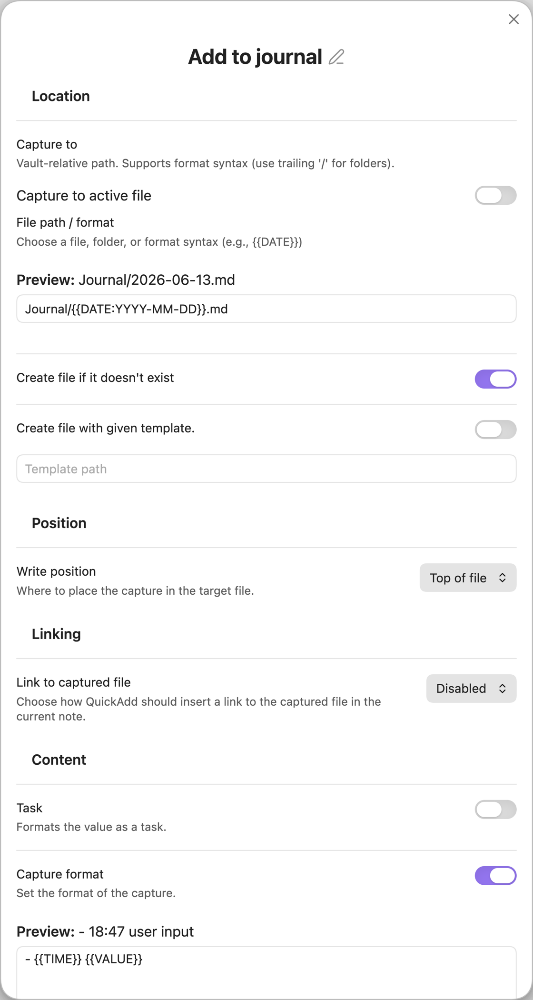

Allows to quickly capture your input and save it from anywhere in Obsidian, without leaving your current window setup e.g.

-   Add messages to your work log
-   Save interesting links for later reading and watching
-   Individually timed notes in Daily notes file



## Capture To

_Capture To_ is the name of the file you are capturing to.
You can choose to either enable _Capture to active file_, or you can enter a file name in the _File Name_ input field.

QuickAdd treats file names as basename-first by default:
- If you do **not** provide an extension, QuickAdd creates/targets a Markdown file (`.md`).
- If you provide an explicit supported extension (for example `.md` or `.canvas`), QuickAdd keeps that extension.
- Capture to `.base` files is not supported. Use a Template choice for `.base` workflows.

This field also supports the [format syntax](../FormatSyntax.md), which allows you to use dynamic file names.
I have one for my daily journal with the name `bins/daily/{{DATE:gggg-MM-DD - ddd MMM D}}.md`.
This automatically finds the file for the day, and whatever I enter will be captured to it.

If a value used in the target file name contains a line break or another control character, QuickAdd folds it to a space in the created path and strips trailing spaces or periods from that path segment. The value inserted into the note content is not changed.

### How QuickAdd picks a target

When **Capture to active file** is disabled, QuickAdd resolves the _File path /
format_ value after applying format syntax:

- An empty value, or `/`, opens a whole-vault picker for Markdown files.
- A value starting with `#` opens a picker for Markdown files with that tag.
- A value starting with `property:` opens a picker for Markdown files filtered by
  a frontmatter field (see [Capturing to a property](#capturing-to-a-property)).
- A value ending in `/` opens a folder picker.
- A value ending in a supported file extension, such as `.md` or `.canvas`,
  targets that file path directly.
- A value without an extension targets a folder only when that folder exists and
  there is no same-name Markdown file. For example, if both `Projects/` and
  `Projects.md` exist, `Projects` targets `Projects.md`; use `Projects/` to
  force the folder picker.

Folder pickers include Markdown files in the selected folder and its nested
folders. The picker also accepts custom input, so you can type a new file name
or path and let QuickAdd create it when **Create file if it doesn't exist** is
enabled. When creation is enabled, the picker still opens for an empty folder,
tag, property, or filtered scope so you can type the first note name to create.

The list is ordered like Obsidian's Quick Switcher: notes you opened most
recently appear first (this session first, then your recent-files history), then
everything else alphabetically. Ordering deliberately ignores modification time,
so a sync or import that touches old notes does not push them to the top. Files
in Obsidian's **Excluded files** list sink to the bottom but stay selectable.
When **Create file if it doesn't exist** is enabled, a **Create new note:
&lt;name&gt;** row lets you create a note from what you typed; it is hidden when
the typed name already matches a note in scope, so typing an existing name
selects that note instead of offering a duplicate.

### Capturing to folders

You can also type a **folder name** into the _Capture To_ field, and QuickAdd will ask you which file in the folder you'd like to capture to.
This also supports the [format syntax](../FormatSyntax.md). You can even write a filename in the suggester that opens, and it will create the file for you - assuming you have the _Create file if it doesn't exist_ setting enabled.

For example, you might have a folder called `CRM/people`. In this folder, you have a note for the people in your life. You can type `CRM/people` in the _Capture To_ field, and QuickAdd will ask you which file to capture to. You can then type `John Doe` in the suggester, and QuickAdd will create a file called `John Doe.md` in the `CRM/people` folder.

You could also write nothing - or `/` - in the _Capture To_ field. This will open the suggester with all of your files in it, and you can select or type the name of the file you want to capture to.
Paths are vault-relative. A leading `/` is ignored (except a lone `/`, which opens the file picker for the whole vault).

Capturing to a folder will show all files in that folder. This means that files in nested folders will also appear.

### Capturing to tags

Similarly, you can type a **tag name** in the _Capture To_ field, and QuickAdd will ask you which file to capture to, assuming the file has the tag you specify.

If you have a tag called `#people`, and you type `#people` in the _Capture To_ field, QuickAdd will ask you which file to capture to, assuming the file has the `#people` tag.

### Capturing to filtered files

You can combine folder and tag filters in the _Capture To_ field with `|`.
This is useful when the destination could live in several folders, or when it
must match several tags.

- `folder:Goals|folder:Projects` - notes inside either folder
- `tag:active|tag:work` - notes that have both tags
- `folder:Goals|folder:Projects|tag:active|tag:work` - active work notes in either folder
- `folder:Goals|exclude-folder:Archive|exclude-tag:done` - goals that are not archived or done

Repeated `folder:` filters are OR filters. Repeated `tag:` filters are AND
filters. Exclusions remove any matching file.

Capture still writes to one destination per run. If you want to select multiple
related files for metadata, use the `{{FILE:<folder>|multi}}` format syntax in
the capture format instead of the _Capture To_ field.

### Capturing the same entry to multiple files

Capture writes to one destination each time it runs. To write the same entry to
several fixed files, compose multiple Capture choices with a Macro:

1. Create one Capture choice for each destination file.
2. Give each Capture choice the same format variable, for example
   `- {{VALUE:entry}}`.
3. Create a Macro and add each Capture choice as a **Nested Choice** command.
4. Run the Macro. QuickAdd prompts for `entry` once and reuses that value for
   the later Capture choices.

For example, to log the same event to two person notes:

| Choice | Capture To | Format |
| --- | --- | --- |
| Log to Person A | `People/Person A.md` | `- {{VALUE:entry}}` |
| Log to Person B | `People/Person B.md` | `- {{VALUE:entry}}` |

Then create a Macro such as `Log event with Person A and Person B` and add both
Capture choices as nested commands.

If the destination files are dynamic, use one Capture choice with a formatted
target path and run it repeatedly from a user script. For example:

| Setting | Value |
| --- | --- |
| Capture To | `People/{{VALUE:person}}.md` |
| Format | `- {{VALUE:entry}}` |

Then call that Capture choice once for each selected person:

```js
module.exports = async ({ quickAddApi }) => {
	const entry = await quickAddApi.inputPrompt("Entry");
	const people = await quickAddApi.checkboxPrompt([
		"Person A",
		"Person B",
		"Person C",
	]);

	for (const person of people) {
		await quickAddApi.executeChoice("Log event to person", {
			entry,
			person,
		});
	}
};
```

Pass the variables object on every `executeChoice` call. Each call clears its
temporary variables after the target choice runs.

### Capturing to a property

You can pre-filter the picker by an arbitrary **frontmatter property** by typing
`property:<field>=<value>` in the _Capture To_ field. QuickAdd then asks you which
note to capture to, limited to notes whose frontmatter matches.

For example, if your notes have a `type` field (`draft`, `index`, `log`, …), typing
`property:type=draft` opens a picker containing only the notes whose `type` is
`draft`.

- `property:type=draft` — notes whose `type` equals `draft`.
- `property:type` — notes that **have** a `type` field, regardless of value
  (presence mode).
- The value is matched case-insensitively, trimmed. For a list-valued property
  (`type: [draft, idea]`), the note matches if **any** entry equals the value.
- The value supports [format syntax](../FormatSyntax.md), e.g.
  `property:status={{VALUE}}` resolves the value when the capture runs.

You can also combine a property with the shared file filters using `|`, the same
grammar as the [`{{FIELD}}`](../FormatSyntax.md) token (folder / tag / exclude-\*):

- `property:type=draft|folder:Notes` — only drafts inside `Notes/`.
- `property:type=draft|exclude-folder:Archive` — drafts not in `Archive/`.
- `property:type=draft|exclude-tag:done` — drafts not tagged `#done`.

Notes:

- This matches **YAML frontmatter** only, not inline Dataview `field:: value` fields.
- The field name is matched case-insensitively (so `property:type` matches a `Type:` field).
- Value matching is always case-insensitive; only the `folder` / `tag` /
  `exclude-folder` / `exclude-tag` / `exclude-file` pipe filters are applied.
- Because `|` starts a filter, a property value cannot itself contain `|`.
- As with the tag picker, typing a new note name (with **Create file if it
  doesn't exist** enabled) creates that note — it will not automatically receive
  the property.

### File picker labels

When QuickAdd asks you to choose a note, it shows the note's frontmatter `title`
when available, then its first level-1 heading, then its file basename. The
selected destination remains the real vault path, so captures still write to the
same file even when the displayed label is friendlier than the filename.

## Capture Options

The Capture builder is grouped into sections: **Location**, **Position**, **Linking**, **Content**, and **Behavior**.

-   _Create file if it doesn't exist_ will do as the name implies - you can also create the file from a template, if you specify the template (the input box will appear below the setting).
-   _Task_ will format your captured text as a task.
-   _Use editor selection as default value_ controls whether the current editor selection is used as `{{VALUE}}`. Choose **Follow global setting**, **Use selection**, or **Ignore selection** (global default lives in Settings > Input). This does not affect `{{SELECTED}}`.
-   _Write position_ is a dropdown that controls where Capture writes. The available options depend on whether _Capture to active file_ is enabled:
    -   **At cursor** (active file) / **Top of file** (target file) - the first option's label changes with the mode
    -   **Top of file (after frontmatter)** (active file only)
    -   **New line above cursor** (active file only)
    -   **New line below cursor** (active file only)
    -   **After line…** — insert after a target line. You can either type the target now, or enable **Choose heading when capturing** to pick a heading from the note at run time. See [Insert after](#insert-after).
    -   **Before line…**
    -   **Bottom of file**
-   _Link to captured file_ is a dropdown that controls whether QuickAdd inserts a link to the captured file. You can choose between three modes:
    -   **Enabled (strict)** – require the configured link destination to be available
    -   **Enabled (skip if unavailable)** – inserts the link when possible and silently drops current-note link insertion when nothing is open
    -   **Disabled** – never append a link

    When either enabled mode is selected, _Link destination_ controls where the link is written:
    -   **Current note** – insert the link into the active Markdown editor
    -   **Specified note** – append the link to the bottom of an existing Markdown note, such as an index or MOC, without opening that note

    For **Current note**, strict mode keeps the legacy behavior and requires a focused Markdown editor, except Canvas-triggered capture skips link insertion when no Markdown editor is available. For **Specified note**, QuickAdd validates the destination note before writing the capture.

    For the **Current note** destination, a _Link placement_ dropdown appears so you can choose where the link is placed:
    -   **Replace selection** - Replaces any selected text with the link (default)
    -   **After selection** - Preserves selected text and places the link after it
    -   **End of line** - Places the link at the end of the current line
    -   **New line** - Places the link on a new line below the cursor
    -   **In frontmatter property** - Adds the link to a named frontmatter property

    When **In frontmatter property** is selected, set the property name and choose how strictly QuickAdd should handle missing or non-list properties:
    -   **Create or convert** (default) - Create the property if it is missing, or convert an existing scalar value into a list before appending the new link. Object values still throw an error.
    -   **Create if missing** - Create the property if it is missing. Existing scalar/object values still throw an error.
    -   **Require list** - Append only to an existing list property. Empty/null properties are treated as empty lists; missing properties and existing scalar/object values throw an error.

    If the cursor is in an editable Obsidian Properties field when the Capture
    choice starts, and the placement is not **In frontmatter property**, QuickAdd
    appends the link to that focused property instead of using the stale editor
    cursor behind the Properties panel. Text properties receive the link at the
    end of the value, and list properties receive a new list item.

    For any **Current note** body placement — **Replace selection**, **After selection**, **End of line**, and **New line** — an extra _Link type_ dropdown appears, letting you choose **Link** (`[[Note]]`) or **Embed** (`![[Note]]`). An embed transcludes the linked note's contents at the placement position (for example **New line** + **Embed** drops `![[Note]]` on its own line; the inline placements insert it on the same line). The **In frontmatter property** placement and the **Specified note** destination stay link-only.

    For the **Specified note** destination, choose an existing Markdown file. QuickAdd appends a normal link at the bottom of that file after each successful capture. It does not create the index file, insert under a heading, update properties, or remove duplicate links.

-   _Copy link to clipboard_ copies a link to the captured file after the Capture
    choice runs. This works separately from _Link to captured file_, so you can
    copy the link without inserting it into the current note, or do both. The
    copied link is a vault-path wikilink, which makes it suitable for pasting
    into another note.

### Opening the captured file

When _Capture to active file_ is disabled, the **Behavior** section shows an _Open_ toggle (described as "Open the captured file."). Enabling it reveals the shared file-opening controls:

-   _File Opening Location_ - a dropdown for where to open the captured file: **Reuse current tab**, **New tab**, **Split pane**, **New window**, **Left sidebar**, or **Right sidebar**.
-   _Split Direction_ - shown only when location is **Split pane**; choose **Split right** or **Split down**.
-   _View Mode_ - how to display the opened file: **Source**, **Preview**, **Live Preview**, or **Default**.
-   _Focus new pane_ - a toggle to focus the opened tab immediately after opening. Shown for every location except **Reuse current tab**.

When QuickAdd opens and focuses a Markdown capture target in an editable mode, it places the editor cursor at the end of the inserted capture so you can keep typing there. This is skipped for preview/unfocused opens and when Templater cursor markers take over.

### Run Templater on entire destination file after capture

The **Behavior** section also has a _Run Templater on entire destination file after capture_ toggle. This is an advanced / legacy option: it executes any `<% %>` anywhere in the destination file, including inside code blocks. Leave it off unless you specifically need that whole-file Templater pass.

### Templater and newly created files

Capture has two different Templater paths when it creates a missing Markdown
file:

- If **Create file if it doesn't exist** is enabled without a QuickAdd template,
  QuickAdd creates a blank file first. When Templater's new-file trigger is
  enabled and applies to that location, QuickAdd waits for Templater to finish
  before inserting the capture content.
- If **Create with template** is enabled, QuickAdd owns the initial file
  content. It renders the selected QuickAdd template, suppresses Templater's
  new-file/directory trigger for that creation event, and then runs Templater
  once on the content QuickAdd wrote.

This means a blank Capture-created file can receive Templater's directory
template first, while a Capture-created file that uses a QuickAdd template runs
Templater on QuickAdd's selected template content instead.

## Canvas Capture Notes

QuickAdd supports two Canvas capture workflows:

- Capture to one selected card in the active Canvas view
- Capture to a specific card in a specific `.canvas` file

### 1) Capture to selected card in active Canvas

This mode is enabled when **Capture to active file** is on and the active leaf
is a Canvas.

Supported card targets:

- Text cards
- File cards that point to markdown files

### 2) Capture to specific card in specific `.canvas` file

This mode is enabled when **Capture to active file** is off, the capture path
resolves to a `.canvas` file, and **Target canvas node** is set.

When the capture path is a `.canvas` file, QuickAdd shows a node picker that
helps you choose a node id directly from that board.

### Write position support in Canvas

- Text cards support: **Top of file**, **Bottom of file**, **After line...**, **Before line...**
- File cards (markdown targets) support: **Top of file**, **Bottom of file**, **After line...**, **Before line...**
- Canvas does not support cursor-based modes: **At cursor**, **New line above cursor**, **New line below cursor**

If **Capture to active file** is enabled and you leave the default write
position at **At cursor**, capture will abort in Canvas until you switch to a
supported mode.

Canvas capture requires exactly one selected card in selected-card mode. If the
selection is missing, multi-select, or unsupported, QuickAdd aborts with a
notice instead of writing to the wrong place.

When append-link is set to **Enabled (requires active file)** and capture runs
from a Canvas card without a focused Markdown editor, the capture still writes
and link insertion is skipped.

For a step-by-step setup, see
[Capture: Canvas Capture](../Examples/Capture_CanvasCapture).

### Canvas Capture FAQ

**Why did my capture abort in Canvas?**

Most often one of these is true:

- No card is selected
- More than one card is selected
- The selected card type is unsupported
- The selected write mode is cursor-based

**Can I target a specific card in a Canvas file?**

Yes. Set capture path to a `.canvas` file and choose a **Target canvas node**.

**Does "At cursor" work in Canvas cards?**

No. Use top, bottom, insert-after, or insert-before placement.

**Can I capture to a file card that points to a Canvas file?**

No. File-card capture supports markdown targets only.

**Can I still create new Canvas files from templates?**

Yes. Template choices support `.canvas` templates.

## Insert after

Insert After will allow you to insert the text after some line with the specified text.
By default, QuickAdd preserves blank lines after ATX headings to keep heading
spacing intact. Use **Blank lines after match** to control this behavior:

-   **Auto (headings only)** - Skip blank lines only when the matched line is
    a Markdown heading.
-   **Always skip** - Skip all consecutive blank lines after the match.
-   **Never skip** - Insert immediately after the matched line.

Example (Auto, Insert After `# H` with content `X`):

```markdown
# H

X
A
```

With Insert After, you can also enable `Insert at end of section` and `Consider subsections`.
You can see an explanation of these below.

I use this in my daily journal capture, where I insert after the heading line `## What did I do today?`.

It's also possible to use `Create line if not found`, which will create the line if it doesn't exist. This is useful if you want to insert after a line that might not exist in the file you're capturing to.
This setting can place the created line at the **Top** or **Bottom** of the file, at your **Cursor** position, or **Ordered** — at its sorted position among same-level headings. See [Ordered section placement](#ordered-section-placement) for reverse-chronological daily logs, changelogs, and other sorted sections.

The target may span several lines: type `\n` in the **Insert after** field to match a multi-line anchor (the preview shows it expanded). **Inline insertion** is the exception — because it inserts on the same line, immediately after the matched text, its target must be a single line; a multi-line (`\n`) target there is rejected with a notice rather than matched. Use the default placement for multi-line anchors.

### Ordered section placement

When `Create line if not found` is enabled and its location dropdown is set to **Ordered** (the full label is `Ordered (place new section among siblings)`), a missing "Insert after" heading is created at its **sorted position among same-level sibling headings** instead of at the top or bottom of the note. This is the building block for a reverse-chronological log: a new dated section is added above older ones, while a fixed title/intro stays pinned at the top.

This is the recipe for the classic "daily log, newest first" note (issue [#481](https://github.com/chhoumann/quickadd/issues/481)):

-   **Capture to**: your log note (enable `Create file if it doesn't exist` if you want it auto-created).
-   **Format**: the entry, ending with a newline, e.g. `- {{TIME:HH:mm}} {{VALUE}}\n`. The trailing newline (or enabling `Capture as task`) is what keeps multiple entries on the same day on separate lines — without it, repeated same-day captures run together on one line.
-   **Insert after**: the day heading, `## {{DATE:YYYY-MM-DD}}`.
-   **Insert at end of section**: off, so each new entry lands directly under the day heading (newest entry on top within the day).
-   **Create line if not found**: on, with the location set to **Ordered**, **Sort sections by** = `Date`, and **Section order** = `Newest / highest first`.

Running it on consecutive days (and twice on the same day) produces:

```markdown
# My Daily Log

A short intro that always stays at the top.

## 2026-06-16
- 09:40 reviewed the code
- 09:13 started the design

## 2026-06-14
- 09:00 older entry
```

The first capture of a day creates `## 2026-06-16` directly below the intro and above `## 2026-06-14`; later captures that day find the existing heading and add their entry on top. The `# My Daily Log` title stays put because it is a different heading level (only `##` headings are sorted against each other), and any YAML frontmatter is skipped entirely — it is never treated as a heading, even if it contains `#` lines.

#### Sort options

Once `Create line if not found` is on and its location is **Ordered**, these controls appear (the last two only for the sort keys noted):

-   **Sort sections by** — how the sort key is read from each heading's text:
    -   `Insertion order (no sorting)` — newest-first simply prepends the new section above the others; oldest-first appends it below. No parsing.
    -   `Text (A→Z)` — case-insensitive text compare.
    -   `Number` — the leading number in the heading (e.g. `## 12 Project X`).
    -   `Date` — parsed with a **Date format** (shown only for this key; auto-detected from the `{{DATE:…}}` token in your "Insert after" text, and editable). Trailing decoration like `## 2026-06-14 (Friday)` is ignored.
    -   `Version (semver)` — `major.minor.patch`, so `1.10.0` correctly sorts above `1.9.0`. A leading `v` and the Keep a Changelog `## [1.10.0] - 2026-06-16` bracket form are both understood.
-   **Section order** — `Newest / highest first` (descending) or `Oldest / lowest first` (ascending).
-   **Existing unparseable headings** — shown for the `Date`, `Number`, and `Version (semver)` keys: where to rank existing headings whose text can't be parsed for the chosen key (e.g. an `## Unreleased` heading in a versioned changelog) — `Sort existing unparseable headings to bottom` (default) or `…to top`. A new heading that can't be parsed is always appended at the end.

Use **Insert at end of section** (above) to control the order *within* each section: off = newest entry on top (good for date logs), on = entries appended at the section end (good for changelogs).

#### More examples

A changelog, newest version on top — **Insert after** `## {{VALUE:version}}`, **Format** `- {{VALUE:change}}\n`, **Insert at end of section** on (new changes append below earlier ones in the same version), **Create line if not found** on → **Ordered**, **Sort by** `Version (semver)`, **Order** `Newest / highest first`:

```markdown
# Changelog

## 1.10.0
- new feature
- another fix in 1.10.0

## 1.9.0
- old fix
```

A "books read" note grouped by year — **Insert after** `## {{DATE:YYYY}}`, **Format** `- {{VALUE}}\n`, **Create line if not found** on → **Ordered**, **Sort by** `Date` with **Date format** `YYYY`, **Order** `Newest / highest first`.

#### Notes and limits

-   The heading is created **once** and reused: every later capture finds it, so the section is never duplicated. This relies on the heading resolving to the **same text** each time, so use a stable token (`{{DATE:…}}`, a `{{VALUE:…}}` you supply) — not a random or constantly-changing one.
-   Sorting is over **all same-level headings in the note**; it is not scoped to one parent section. For the layouts above (a single group of dated/versioned `##` sections under one title) this is exactly what you want. Keep the fixed title/intro at a different heading level (e.g. an `#` title above `##` sections) so it is never treated as a sortable sibling.
-   Ordered placement only positions the **new** section; it does not re-sort sections you already have.
-   **Ordered** is for headings and can't be combined with **Inline insertion**.

### Choose heading when capturing

Insert After normally uses a target line you type when you build the choice. Enable
**Choose heading when capturing** to instead pick the heading **at run time**: when you
run the capture, QuickAdd reads the target note and shows a dropdown of its headings — pick
one, and the text is inserted under it. This is the same idea as the note-selection dropdown
that appears when no file name is specified, but for headings within a single note. It's
useful when the heading varies between runs, or when you'd rather not remember and type it.

The picked heading simply becomes the insert-after target, so every placement control still
applies:

-   By default the text is inserted directly under the chosen heading line. Enable `Insert at end of section` to append it to the end of that heading's section instead.
-   `Consider subsections`, `Blank lines after match`, and `Create line if not found` work exactly as for Insert after.

Notes:

-   You can also **type a heading** that doesn't exist yet. To have QuickAdd create it, enable `Create line if not found` (type the heading with its `#` markers, e.g. `## Tasks`).
-   The dropdown lists ATX headings (lines starting with `#`). For a brand-new note created from a template, the picker can't list the template's headings yet (the note doesn't exist at pick time) — type the heading and use `Create line if not found`.
-   If you use the one-page input form, the heading dropdown still appears as a separate step after the form.

### Consider subsections -option

#### `Consider subsections` disabled

Behavior with `Insert after` & `Insert at end`:

```markdown
## 1. First heading

**Insert after** comes here.

-   content 1
-   content 2
-   content 3
    **Insert at end** comes here.

### 1.1. Nested heading 1

Content

## 2. Another heading

Content
```

#### `Consider subsections` enabled

Behavior with `Insert after` & `Insert at end`:

```markdown
## 1. First heading

**Insert after** comes here

-   content 1
-   content 2
-   content 3

### 1.1. Nested heading 1

Content
**Insert at end** comes here. Captures to after this, as it's considered part of the "1. First heading" section.

## 2. Another heading

Content
```

## Insert before

Insert Before inserts the capture before the first line that matches the specified text.
The target accepts QuickAdd format syntax, so values such as `{{title}}` and
`{{linkcurrent}}` can be used in the match text.

It's also possible to use `Create line if not found`, which will create the
line if it doesn't exist. For Insert Before, QuickAdd writes the captured
content first, then creates the missing line below it. This setting can place
the line at the start or end of the file, or at your current cursor position.

## Capture Format

Capture format lets you specify the exact format that you want what you're capturing to be inserted as.
You can do practically anything here. Think of it as a mini template.

If you do not enable this, QuickAdd will default to `{{VALUE}}`, which will insert whatever you enter in the prompt, or (if selection-as-value is enabled) the current editor selection.

You can use [format syntax](../FormatSyntax.md) here, which allows you to use dynamic values in your capture format.

If the capture format is long, put the full format in a template file and use a `{{TEMPLATE:...}}` token as the capture format:

```text
{{TEMPLATE:Templates/Capture Format.md}}
```

QuickAdd replaces the token with the template file contents, then processes the result through the normal capture formatter. The referenced file can contain the same format syntax you would otherwise type inline, such as `{{VALUE}}`, `{{DATE}}`, `{{MACRO:...}}`, inline scripts, and additional `{{TEMPLATE:...}}` includes. Include the file extension in the token; template includes support `.md`, `.canvas`, and `.base` files.

One-page input preflight and `quickadd:check` scan the referenced template files too, so prompts inside a file-backed capture format appear up front like inline capture format prompts.

This is useful when you want to edit, version, or reuse a complete capture format as a normal note. You can also use `{{TEMPLATE:Templates/Partial.md}}` inside a larger inline capture format when only part of the format should come from a file.

If you want to insert `.base` content into your current note, keep **Capture to active file** enabled and use a `.base` template token in the capture format. See [Capture: Insert a Related Notes Base into an MOC Note](../Examples/Capture_InsertBaseTemplateIntoActiveFile.md).
If you want QuickAdd to create a brand new note that already contains an
embedded Base, use a Template choice instead. See
[Template: Create an MOC Note with a Link Dashboard](../Examples/Template_CreateMOCNoteWithLinkDashboard.md).

If your capture format includes an inline `js quickadd` block and you need to
transform user input, prefer reading input in script code through
`this.quickAddApi.inputPrompt(...)` and/or assigning script variables on
`this.variables`. Avoid relying on `{{VALUE}}` inside JavaScript string
literals. See [Inline scripts](../InlineScripts.md#execution-order-and-value).

In my journal capture, I have it set to `- {{DATE:HH:mm}} {{VALUE}}`. This inserts a bullet point with the time in hour:minute format, followed by whatever I entered in the prompt.
