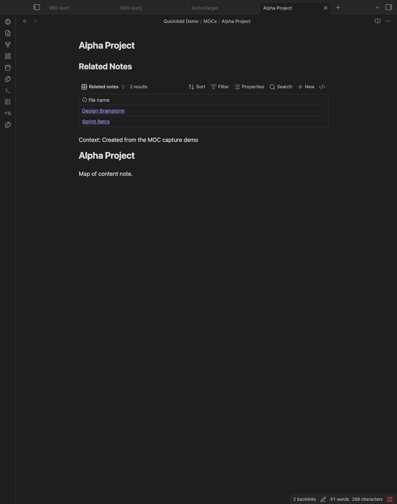

Use this pattern when you want QuickAdd to insert a live "related notes" Base
view into a map-of-content (MOC) note.

## Why this pattern

Capture does not write directly to `.base` files, but it can still pull content
from a `.base` template and insert that content into the active markdown note.
This is useful for MOCs where you want a note-local index of backlinks.

## Setup

1. Create a `.base` template file, for example
   `Templates/MOC Related Notes.base`:

```yaml
filters:
  and:
    - 'file.ext == "md"'
    - "file.hasLink(this.file)"
    - "file.path != this.file.path"
views:
  - type: table
    name: Related notes
```

2. Create a Capture choice.
3. Enable **Capture to active file**.
4. Set **Active file write position** to **Top**.
5. In **Capture format**, reference your `.base` template with an explicit file
   extension:

Example:

````markdown
## Related Notes

```base
{{TEMPLATE:Templates/MOC Related Notes.base}}
```

Context: {{VALUE}}
````

6. Run the Capture choice while your MOC note is active
   (for example `MOCs/Alpha Project.md`).

QuickAdd resolves the `.base` template and inserts it into the active note.
Because the base view is embedded in that note, `this.file` points at the MOC,
so the table shows notes that link to that specific MOC.


