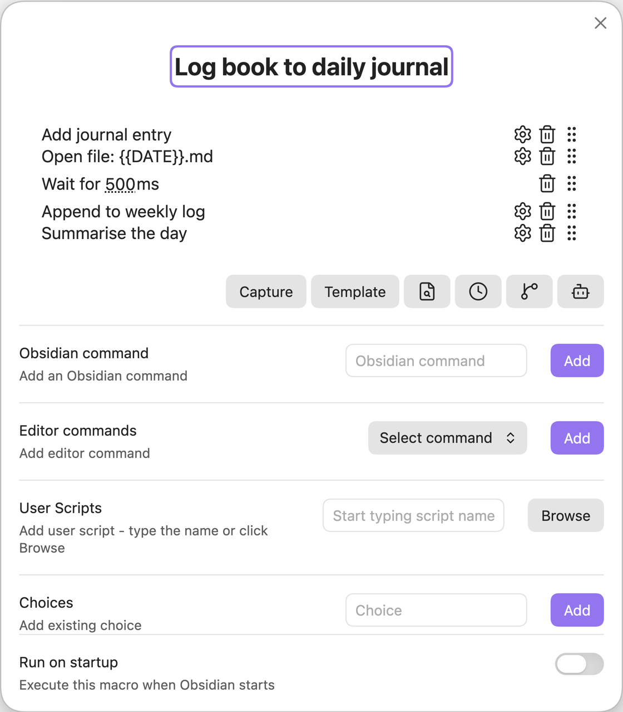

```js
// You have to export the function you wish to run.
// QuickAdd automatically passes a parameter, which is an object with the Obsidian app object
// and the QuickAdd API (see description further on this page).
module.exports = async (params) => {
	// Object destructuring. We pull inputPrompt out of the QuickAdd API in params.
	const {
		quickAddApi: { inputPrompt },
	} = params;
	// Here, I pull in the update function from the MetaEdit API.
	const { update } = app.plugins.plugins["metaedit"].api;
	// This opens a prompt with the header "📖 Book Name". val will be whatever you enter.
	const val = await inputPrompt("📖 Book Name");
	// This gets the current date in the specified format.
	const date = window.moment().format("gggg-MM-DD - ddd MMM D");
	// Invoke the MetaEdit update function on the Book property in my daily journal note.
	// It updates the value of Book to the value entered (val).
	await update("Book", val, `bins/daily/${date}.md`);
};
```
