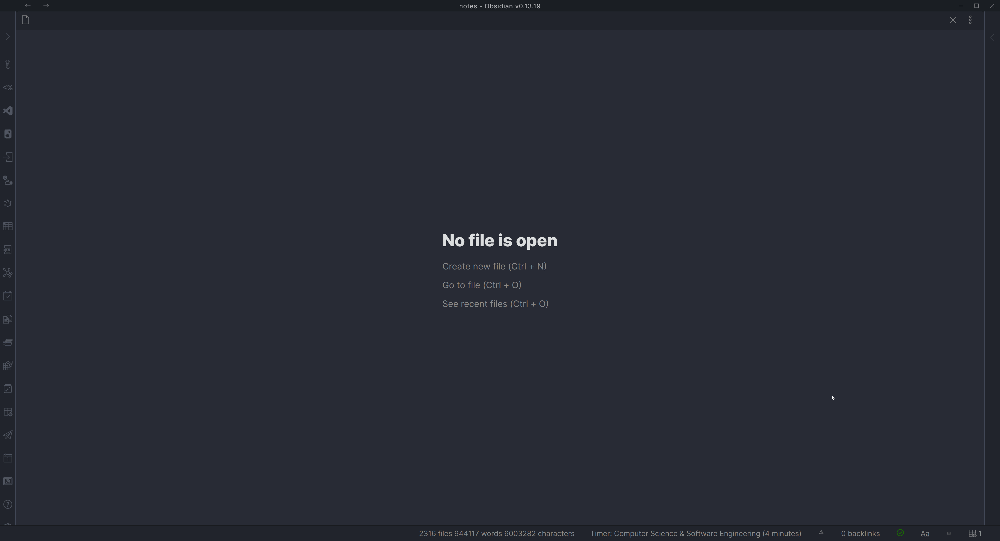

This script allows you to easily insert a movie or TV show note into your vault.

We use OMDb api to get the movie or TV show information. You can get an API key on the website [here](https://www.omdbapi.com/). This will be needed to use this script.

## Demo



## Installation

<details>
<summary>Prerequisites</summary>

- You must have an OMDb API key. Request one at `https://www.omdbapi.com/` and keep it handy. The script will not run without it.

</details>

We'll need to install a QuickAdd user script for this to work. I have made a video which shows you how to do so - [click here](https://www.youtube.com/watch?v=gYK3VDQsZJo&t=1730s).
You will need to put the user script into a new macro and then create a Macro choice in the main menu to activate it.
You can find the script <a href="/scripts/movies.js" download>here</a>.

1. Save the script (`movies.js`) to your vault. Make sure it is saved as a JavaScript file, meaning that it has the `.js` at the end. **Important:** Do not save scripts in the `.obsidian` directory - they will be ignored. Valid locations include folders like `/scripts/`, `/macros/`, or any custom folder in your vault.
2. Create a new template in your designated templates folder. Example template is provided below.
3. Open the QuickAdd settings and click "Add Choice". Select "Macro" and give it a name - you decide what to call it. I named mine `🎬 Movie`. This is what activates the macro.
4. Click the configure button (⚙️) on your new Macro choice to open the Macro Builder.
5. Add the user script to the command list.
6. Add a Template command to the macro. This will be what creates the note in your vault. Settings are as follows:
    1. Set the template path to the template you created.
    2. Enable File Name Format and use `{{VALUE:fileName}}` as the file name format. You can specify this however you like. The `fileName` value is the name of the Movie or TV show without illegal file name characters.
    3. The remaining settings are for you to specify depending on your needs.
7. Click on the cog icon to the right of the script command to configure the script settings. This should allow you to enter the API key you got from OMDb. [Image demonstration](../Images/moviescript_settings.jpg).

You can now use the macro to create notes with movie or TV show information in your vault.

### Troubleshooting

- "TypeError: Failed to construct 'URL': Invalid URL"
  - Ensure you are using the latest `movies.js` from this repo. The example has been updated to avoid `new URL()` internally.
  - Verify your OMDb API key is entered in the script settings (cog icon on the script step).

- "No results found."
  - Try searching by the exact IMDb ID (e.g. `tt0111161`).
  - Check for typos in the title or try a more specific query.
  - Confirm your OMDb API key is valid and not rate limited.

### Example template

This template stores the movie's metadata as Obsidian **front matter properties**. The
multi-value fields (`cast`, `genre`, `director`) come from the script as lists and become
proper **List** properties with clickable links. Scalar link/text values are wrapped in
quotes so the front matter stays valid, and the plot lives in the note body so longer text
(with punctuation or quotes) can't break the front matter.

```markdown
---
category: "{{VALUE:typeLink}}"
director: {{VALUE:directorLink}}
genre: {{VALUE:genreLinks}}
cast: {{VALUE:actorLinks}}
year: "{{VALUE:Year}}"
imdbId: "{{VALUE:imdbID}}"
imdb: "[IMDb]({{VALUE:imdbUrl}})"
ratingImdb: "{{VALUE:imdbRating}}"
rating: 
cover: "{{VALUE:Poster}}"
---


{{VALUE:Plot}}
```

:::tip
Keep the quotes around single-link and text values (for example `category` and `imdbId`).
A bare `[[Movies]]` in front matter is read by Obsidian as a nested list rather than a link.
The list fields (`cast`, `genre`, `director`) don't need quotes — QuickAdd writes them as
real list properties for you.
:::

## Usage

It's possible to access whichever JSON variables are sent in response through a `{{VALUE:<variable>}}` tag (e.g. `{{VALUE:Title}}`). Below is an example response for the TV show 'Arcane'.

```json
{
	"Title": "Arcane",
	"Year": "2021–",
	"Rated": "TV-14",
	"Released": "06 Nov 2021",
	"Runtime": "N/A",
	"Genre": "Animation, Action, Adventure",
	"Director": "N/A",
	"Writer": "N/A",
	"Actors": "Hailee Steinfeld, Kevin Alejandro, Jason Spisak",
	"Plot": "Set in utopian Piltover and the oppressed underground of Zaun, the story follows the origins of two iconic League champions-and the power that will tear them apart.",
	"Language": "English",
	"Country": "United States, France",
	"Awards": "N/A",
	"Poster": "https://m.media-amazon.com/images/M/MV5BYmU5OWM5ZTAtNjUzOC00NmUyLTgyOWMtMjlkNjdlMDAzMzU1XkEyXkFqcGdeQXVyMDM2NDM2MQ@@._V1_SX300.jpg",
	"Ratings": [
		{
			"Source": "Internet Movie Database",
			"Value": "9.2/10"
		}
	],
	"Metascore": "N/A",
	"imdbRating": "9.2",
	"imdbVotes": "105,113",
	"imdbID": "tt11126994",
	"Type": "series",
	"totalSeasons": "2",
	"Response": "True"
}
```
