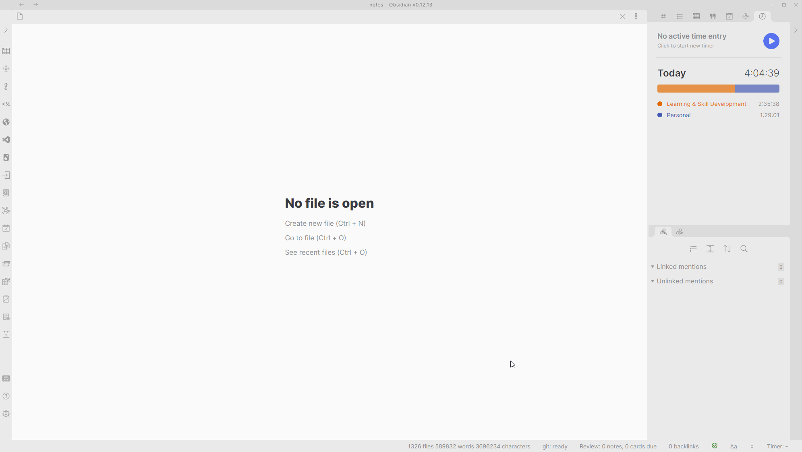
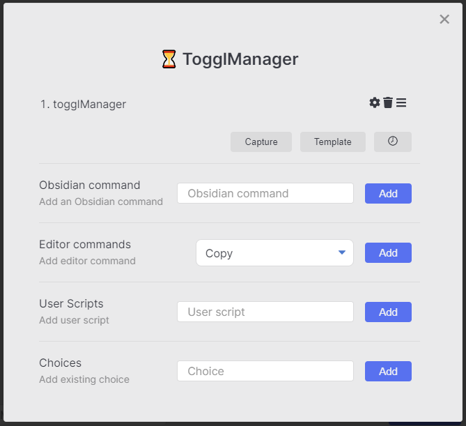
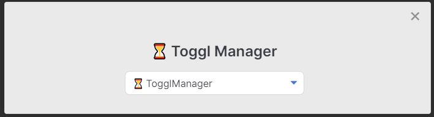

This [Macro](../Choices/MacroChoice.md) allows you to set preset time entries for [Toggl Track](https://track.toggl.com).

It uses the [Toggl plugin](https://github.com/mcndt/obsidian-toggl-integration) for [Obsidian](https://obsidian.md). Make sure that is set up before you continue.



We'll need to install a QuickAdd user script for this to work. I have made a video which  shows you how to do so - [click here](https://www.youtube.com/watch?v=gYK3VDQsZJo&t=1730s).
You will need to put the user script into a new macro and then create a Macro choice in the main menu to activate it.
You can find the script <a href="/scripts/togglManager.js" download>here</a>.

## Installation
1. Save the script (`togglManager.js`) to your vault. Make sure it is saved as a JavaScript file, meaning that it has the `.js` at the end. **Important:** Do not save scripts in the `.obsidian` directory - they will be ignored. Valid locations include folders like `/scripts/`, `/macros/`, or any custom folder in your vault.
2. Open the QuickAdd plugin settings, click "Add Choice", and select "Macro". You decide what to name it. I named mine ``⏳ Toggl Manager``. This is what activates the macro.
3. Click the configure button (the cog ⚙ icon) on the choice to open the Macro Builder.
4. Add the user script to the command list.

Your Macro should look like this:



Your Macro Choice should look like this: 



## Configuration
You will need to configure your script to match your own settings. I have included some example settings from my own setup, but you'll likely want to make it match your own preferences.

To customize the script, open the JavaScript file you just saved. You'll see this menu setup:
````js
const menu = {
    "🧠 Learning & Skill Development": { // Sub-menu for Learning and Skill Development
        togglProjectName: "Learning & Skill Development", // Name of your corresponding Toggl project
        menuOptions: {
            "✍ Note Making": "Note Making", // Preset time entry. The left part is what's displayed, and the right part is what Toggl gets.
            "🃏 Spaced Repetition": "Spaced Repetition", // So for this one, I would see '🃏 Spaced Repetition' in my menu, but Toggl would receive 'Spaced Repetition' as the entry.
            "📖 Read Later Processing": "Read Later Processing",
            "👨‍💻 Computer Science & Software Engineering": "Computer Science & Software Engineering",
        }
    },
    "🤴 Personal": {
        togglProjectName: "Personal",
        menuOptions: {
            "🏋️‍♂️ Exercise": "Exercise",
            "🧹 Chores": "Chores",
            "👨‍🔬 Systems Work": "Systems Work",
            "🌀 Weekly Review": "Weekly Review",
            "📆 Monthly Review": "Monthly Review",
            "✔ Planning": "Planning",
        }
    },
    "👨‍🎓 School": {
        togglProjectName: "School",
        menuOptions: {
            "🧠 Machine Intelligence (MI)": "Machine Intelligence (MI)",
            "💾 Database Systems (DBS)": "Database Systems (DBS)",
            "🏃‍♂ Agile Software Engineering (ASE)": "Agile Software Engineering (ASE)",
            "💻 P5": "P5",
        }
    }
};
````

In the menu, there'll be 3 sub-menus with their own time entries. I have added some comments to explain the anatomy of the menu.

You can customize it however you like. You can add more menus, remove menus, and so on.
