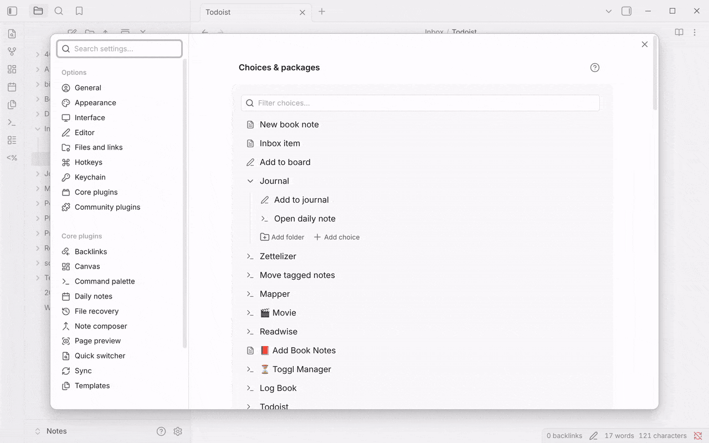
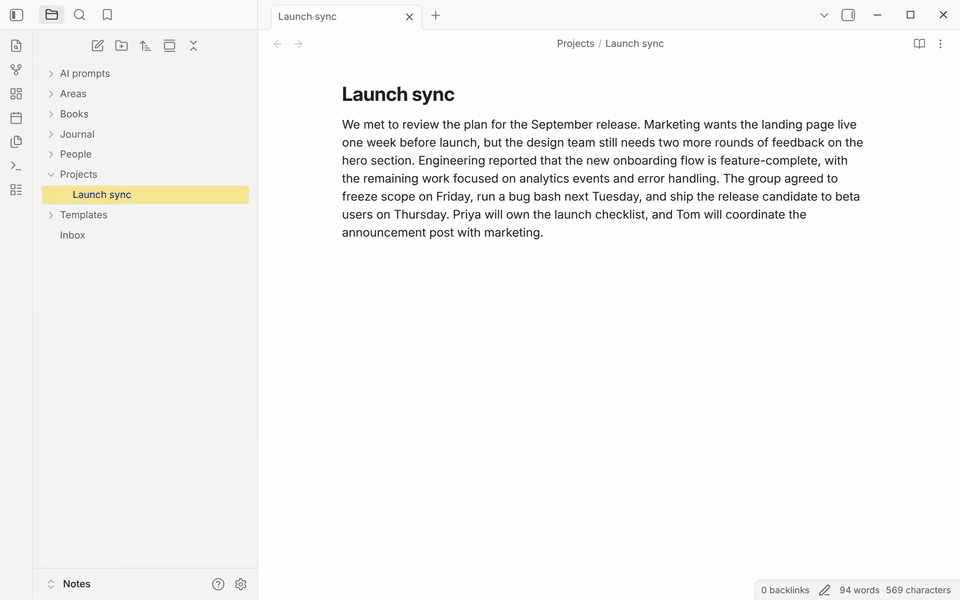

QuickAdd's AI Assistant sends a prompt to an AI model and drops the reply back
into your workflow. There are two ways to use it:

- **From a Macro command** - no code. You pick a prompt template, and QuickAdd stores the model's reply as a variable that later steps can insert.
- **From a User Script** - for structured output, tool calling, or custom control flow.

By the end you have an AI step wired into a choice: generate a note title,
summarize a selection, or answer a question from your vault.

:::note
The AI Assistant settings and AI requests are available only when **Disable AI &
online features** is turned off in QuickAdd settings.
:::

## Setup {#setup}

1. Create a folder for AI prompt templates, for example `AI prompts`.
2. Open **Settings → QuickAdd**, turn off **Disable AI & online features**
   (under **AI & online**), and open **AI Assistant** just below it. The
   **Configure AI Assistant** button in the choice list (the sparkles icon at
   the bottom of the list) and the **QuickAdd: Open AI Assistant settings**
   command open the same page.
3. Set **Prompt template folder** to the folder you created.
4. Under **Providers**, set up at least one provider. OpenAI and Gemini are
   already listed: open one, link an API key secret with **Link...**, and click
   **Sync now** to pull the provider's current models. To add another provider,
   click **+**. See [Connect a provider](#providers-and-local-models).
5. Choose a **Default model**, or leave it as **Ask me** to pick a model each run.

Changes on these pages save as you make them. The settings pages need QuickAdd
2.28.0 or later; earlier versions edit providers in dialogs with **Save** and
**Cancel**.



Prompt templates are Markdown notes in your prompt template folder. They can use
QuickAdd [Format Syntax](/docs/FormatSyntax/), including values collected earlier
in the same macro.

:::caution[Prompt templates can run code]
A prompt template goes through the **full** QuickAdd format pass every time the
AI command fires - including [inline scripts](/docs/InlineScripts/) (`js
quickadd` code fences), `{{MACRO:}}` and `{{TEMPLATE:}}`. That is the same
trust model as a Template choice: a prompt template is not just text sent to
the model, it is a note QuickAdd executes. Review prompt templates you did not
write yourself - for example ones that arrive with an imported
[package](/docs/Choices/Packages/) - exactly as you would review a script.
:::

After setup, add an **AI Assistant** command to a Macro. The command formats the
selected prompt template, sends it to the selected model, then stores the
response as macro variables for later steps.

In the recording below, a `Summarize` prompt template (containing
`{{SELECTED}}`) feeds the selected paragraph to the model, the command stores
the reply as `summary`, and a Capture writes `{{VALUE:summary}}` to the bottom of
the active note.



## What each setting does {#settings-semantics}

Some of these settings are read live on every run; two of them are only a
template for new commands. The difference matters, so it is called out per
setting:

- **Prompt template folder** is the folder QuickAdd reads prompt-template notes from. Read live on every run.
- **Providers** is the list of model endpoints and model ids QuickAdd can use. Read live on every run.
- **Default model** and **Default system prompt** are the starting values for **new** AI Assistant Macro commands: they are copied into a command when you add it. Editing a default later does not change commands you already created - edit each command instead. Setting the default model to **Ask me** makes new commands open a model picker at run time.
- **Show assistant** controls QuickAdd's AI progress notices. Read live on every run.
- **Confirm AI tool calls** controls script-agent tool confirmation. Read live on every run. See [Tool approval and safety](#tool-approval-and-safety).

The script APIs behave differently from Macro commands here:
`quickAddApi.ai.prompt()`, `chunkedPrompt()`, and `ai.agent()` read the **live**
default system prompt at call time when you pass no `systemPrompt`/`system`
override (the model is always passed explicitly).

Each AI Assistant Macro command holds its own:

- **Prompt template**, which is a Markdown note in the prompt template folder, not raw prompt text.
- **Model**, the model this command uses. Copied from the default at creation; **Ask me** opens a model picker at run time.
- **Output variable name**, which controls the variable names written for later Macro steps.
- **System prompt**, sent with this command's requests. Copied from the default at creation.
- Advanced model parameters, described in [Advanced sampling settings](#advanced-sampling-settings).

### System prompts are sent as written {#system-prompt-is-literal}

QuickAdd resolves [Format Syntax](/docs/FormatSyntax/) in the **prompt template**
only. The system prompt - both the default and a command's own - goes to the
model exactly as you typed it, so `{{DATE}}` in a system prompt arrives at the
model as the eight characters `{{DATE}}`.

Put anything that needs a token in the prompt template instead.

## Connect a provider {#providers-and-local-models}

QuickAdd supports OpenAI-compatible providers, Google Gemini, and Anthropic.
Custom or unknown providers use the OpenAI-compatible request shape by default.

Built-in provider cards are available for:

- OpenAI
- Gemini
- Anthropic
- Groq
- TogetherAI
- OpenRouter
- Hugging Face
- Mistral
- DeepSeek

:::note
Provider API keys are stored through Obsidian SecretStorage. QuickAdd stores the
secret reference in settings, not the key value. Older plaintext provider keys
are migrated to SecretStorage.
:::

### Add a provider {#add-a-provider}

1. Open **Settings → QuickAdd → AI Assistant**.
2. Next to **Providers**, click **+** (on mobile, tap **Add provider** below
   the list).
3. Pick a provider card, select a SecretStorage entry for the API key, then click **Connect**.

Connecting a provider imports its current model list right away, so you can pick
a working model immediately. If the live import fails (for example, while
offline), the built-in providers fall back to a shipped model list and refresh
automatically once the provider is reachable.

For a provider that is not listed, click **Add custom...** under **Custom
provider**, then open the new provider in the list. Set its name, endpoint, API key secret if needed, model
source, and models manually.

To check a key, open the provider and click **Test connection**. QuickAdd asks
the provider's own models endpoint with the linked key and shows either how many
models it lists or the provider's error.

The [Obsidian CLI](/docs/Advanced/CLI/#quickaddai-test-connection) runs the same
check. Name the provider by its ID or its name:

```bash
obsidian vault=dev quickadd:ai-test-connection provider=openai
```

It prints `"ok":true` with `modelCount`, or `"ok":false` with the provider's
error. `apiKeyLinked` says whether a key is linked. The output never contains
the key.

### Local models and Ollama {#local-models-and-ollama}

Use **Custom provider** for Ollama and most local OpenAI-compatible servers.

For Ollama:

```text
Name: Ollama
Endpoint: http://localhost:11434/v1
API key: leave blank
Model source: Provider models endpoint
Models: import from the running Ollama server, or add the model name manually
```

Leaving the API key blank works for Ollama. Model import from `/v1/models` sends
no `Authorization` header when the key is blank. Regular OpenAI-compatible chat
requests still include an empty `Bearer` header. If your local server rejects
that, configure the server to allow it or select a SecretStorage entry with the
token it expects.

When adding a model manually (the **+** next to **Models** on the provider's
page), the model name must match the id your server expects, such as `mistral`
or `llama3.1`. The **Context window** value is the model's context window in
tokens. See [Model settings and token budgets](#model-settings-and-token-budgets).

### One name, two providers {#provider-ids-and-duplicate-model-names}

Every provider has a stable **ID** - a short slug like `openai` or `my-proxy`,
shown under the provider's **Name** on its settings page. The ID never changes, even if you rename the
provider, and scripts use it to address a model on a specific provider.

Two providers can serve models with the same name - for example, the official
OpenAI provider and an OpenAI-compatible proxy can both list `gpt-4o`. Model
dropdowns group models by provider so you always pick a specific provider's
model, and QuickAdd remembers that choice. Reordering providers, renaming them,
or auto-syncing new models never changes which endpoint an existing command
talks to.

If the provider a command is pinned to is later deleted, QuickAdd falls back to
the first provider that serves a model with that name and warns you about the
switch. Re-select the model in the command to pin it again.

### Where QuickAdd gets the model list: Model source {#model-source}

Each provider has a **Model source** setting:

- **Provider models endpoint** asks the provider for its model list. QuickAdd speaks each provider's native protocol here: OpenAI-compatible `/v1/models`, Anthropic's `/v1/models`, and Gemini's `ListModels`. This is also the usual choice for local providers like Ollama when the server is running.
- **models.dev directory** imports from the public models.dev directory when that directory knows the provider.
- **Automatic** tries the provider first and falls back to models.dev when QuickAdd can map the endpoint.

Imports skip entries that cannot serve chat requests (image generators,
text-to-speech voices, embedding models, realtime audio models) and pinned dated
snapshots such as `gpt-4o-2024-11-20` when the undated id is listed. They carry
each model's context window, output limit, sampling support, and release date
where the source reports them.

The model list shows the newest models first and has a filter box. Models the
provider has deprecated carry a **Retired** badge and are listed last, the
provider's entry on the AI Assistant page shows a warning with the count, and
**Remove retired** clears them in one step. QuickAdd never removes
them on its own, because saved commands may still use them.

If model import fails, you can still add models manually. Use the provider's
exact model id and the model's context-window token count.

### Keep model lists current: Auto-sync {#auto-sync}

Each provider has an **Auto-sync models** toggle. While it is on, QuickAdd
imports new models and refreshed context limits from the provider's model source
once a day and whenever you open the provider's page, so model lists stay current
without plugin updates. Auto-sync only adds models and updates metadata - it
never removes models you have configured, and it does not add models the
directory already marks as deprecated. Use **Sync now** to refresh on demand.
The line under the toggle shows when the provider last synced, or why the last
sync failed.
Models that arrive while the provider's page is open appear in its list right
away, and the **Sync now** notice counts every model added to the list you were
looking at when you clicked it.

Auto-sync is on by default for the built-in OpenAI and Gemini providers and for
providers added from a card. It does nothing while **Disable AI & online
features** is on.

## Model settings and token budgets {#model-settings-and-token-budgets}

### Max tokens is the context window {#max-tokens}

In the provider's model list, **Context** (stored as `maxTokens`) is the
model's context window. It
is the total amount of prompt plus response context the model can handle,
according to the configured provider metadata or the value you entered manually.

QuickAdd uses this value for local estimates, model lookup, and chunk sizing. It
does not mean "make the answer this long", and setting it higher than the
provider actually supports does not increase the provider's real limit.

QuickAdd's token counts are local estimates. Providers enforce the exact limits.
For single AI Assistant prompts, QuickAdd logs when the local prompt estimate is
above the configured context value, but it still sends the request. The provider
may accept it or reject it with a context-window error.

Use these rules when choosing a value:

- For `gpt-4o-mini`, enter `128000`, not a smaller output limit.
- For a local model, use the context window configured for that local model.
- If you do not know the value, import models from the provider if possible, or use the provider's model documentation.

### Max chunk tokens {#max-chunk-tokens}

Chunk sizing has no setting of its own. It is the `maxChunkTokens` option of
[`chunkedPrompt()`](/docs/QuickAddAPI/#max-chunk-tokens) in the script API.

### Output length {#output-length}

The regular Macro AI Assistant command does not have a separate output-length
field.

In scripts, `quickAddApi.ai.agent()` accepts `maxOutputTokens` in the agent
config or per `generate()` call. QuickAdd maps that option to the
provider-specific output field where the provider supports one.

Anthropic requests always require an output token budget. When no explicit
`maxOutputTokens` is set, QuickAdd uses the model's real output limit when the
model list carries one (imported and auto-synced models do), and otherwise a
conservative default of `4096`.

### Advanced sampling settings {#advanced-sampling-settings}

AI Assistant commands expose advanced model parameters:

- **Temperature** controls randomness. Lower values are more focused. Higher values are more varied.
- **Top P** controls nucleus sampling.
- **Frequency penalty** reduces repeated wording on providers that support it.
- **Presence penalty** encourages new topics on providers that support it.

A parameter is only sent when you set it. Untouched settings use the provider's
defaults, and each slider has a reset button that returns it to that state.

Gemini and Anthropic requests use temperature and top P. QuickAdd does not send
frequency or presence penalties to those providers.

:::note[Fixed-sampling models are handled for you]
Many current models use fixed sampling and reject these parameters outright -
OpenAI reasoning models and Anthropic's current generation among them. When a
model is known to use fixed sampling, the parameters are not sent. When a
provider rejects one anyway, QuickAdd retries the request once without sampling
parameters and shows a notice explaining what happened. A sampling slider never
hard-fails a command.
:::

## Get the reply into your notes: Macro output variables {#macro-output-variables}

An AI Assistant Macro command stores the model response in the command's
**Output variable name**. The default name is `output`.

If **Output variable name** is `summary`, QuickAdd writes:

- `summary`: the response text
- `summary-quoted`: the same response formatted as a Markdown blockquote, with each line prefixed by `> `

Later commands in the same Macro can use those values:

```markdown
{{VALUE:summary}}

{{VALUE:summary-quoted}}
```

The variables are scoped to that Macro run. A separate QuickAdd choice run does
not receive them.

### Example: AI-generated note title {#example-ai-generated-note-title}

Create a prompt-template note named `Title Prompt.md` in your prompt template
folder:

```markdown
Generate a short filename-safe title for this text. Reply with only the title.

Text: {{VALUE}}
```

Then use a Macro with two steps:

1. **AI Assistant** command
   - Prompt template: `Title Prompt.md`
   - Output variable name: `aiTitle`
   - Use a low temperature if you want more repeatable titles.
2. **Template** command
   - File name: `{{VALUE:aiTitle}}` (before QuickAdd 2.30.0, this is **File name format**; turn its toggle on first)
   - Template body can also include `{{VALUE:aiTitle}}`.

The same pattern works with Capture choices and User Script commands that run
after the AI step.

### Read the result in a script {#read-the-result-in-a-script}

When a User Script runs later in the same Macro, read the same variable from
`params.variables`:

```js
module.exports = async (params) => {
  const description = params.variables.description;
  console.log(description);
};
```

If this is empty, check the AI Assistant command's **Output variable name**. It
must be `description`, or your script must read the default `output`.

### Script API assignment is explicit {#script-api-assignment-is-explicit}

`quickAddApi.ai.prompt()` and `quickAddApi.ai.chunkedPrompt()` return an object
with the response variables. They write those variables into later Macro steps
only when you set `shouldAssignVariables: true` or `assignToVariable`.

```js
module.exports = async ({ quickAddApi }) => {
  await quickAddApi.ai.prompt("Summarize the current selection.", "gpt-4o-mini", {
    assignToVariable: "summary",
  });
};
```

`assignToVariable` also writes `summary-quoted`. Avoid names that are reserved by
the formatter or variable plumbing: `value`, `title`, `text`, `meta`, names
ending in `-quoted`, names starting with `__qa.`, and names containing `|` or
`,`.

## Structured JSON output {#structured-json-output}

Use structured output when you want separate fields from one model response,
such as title, summary, and tags. This is a User Script workflow, not the plain
Macro AI Assistant command.

The pattern is:

1. User Script calls `quickAddApi.ai.agent().generate({ prompt, schema })`.
2. The script checks `result.object`.
3. The script assigns fields to `params.variables`.
4. A later Template or Capture step uses `{{VALUE:name}}` where each field belongs.

```js
module.exports = async ({ quickAddApi, variables }) => {
  const selectedText = quickAddApi.utility.getSelection();
  if (!selectedText) {
    throw new Error("Select text before running this macro.");
  }

  const result = await quickAddApi.ai.agent({ model: "gpt-4o-mini" }).generate({
    prompt: `Extract a title, a short summary, and up to five tags from this text:\n\n${selectedText}`,
    schema: {
      type: "object",
      properties: {
        title: { type: "string" },
        summary: { type: "string" },
        tags: {
          type: "array",
          items: { type: "string" },
        },
      },
      required: ["title", "summary", "tags"],
    },
  });

  const data = result.object;
  if (!data || typeof data !== "object") {
    throw new Error("The AI response did not match the expected JSON shape.");
  }

  variables.aiTitle = String(data.title ?? "");
  variables.aiSummary = String(data.summary ?? "");
  variables.aiTags = Array.isArray(data.tags)
    ? data.tags.map(String).join(", ")
    : "";
};
```

Then use a Template step after the script:

```markdown
# {{VALUE:aiTitle}}

{{VALUE:aiSummary}}

Tags: {{VALUE:aiTags}}
```

Structured output supports a small JSON Schema subset: `type`, `properties`,
`required`, `items`, `enum`, `const`, `description`, and `title`. Avoid
provider-specific schema keywords such as `minLength`, `pattern`, `$ref`,
`format`, `anyOf`, and `allOf` in QuickAdd examples.

If the model response does not parse or does not validate, QuickAdd makes one
repair attempt. If that still fails, `result.object` is `undefined`, so scripts
should handle that as shown above.

## Tool and function calling {#tool-and-function-calling}

QuickAdd 2.14.0 added a script API for tool and function calling:

- `quickAddApi.ai.agent(config)` creates an agent.
- `agent.generate({ prompt })` runs a bounded multi-step loop.
- `quickAddApi.ai.tool(def)` declares a JavaScript function the model may call.
- `quickAddApi.ai.tools.vault()`, `workspace()`, and `system()` provide opt-in built-in tools.

Tools are available from User Scripts. They are JavaScript functions, so they do
not live inside a stored AI Assistant Macro command.

```js
module.exports = async ({ quickAddApi }) => {
  const agent = quickAddApi.ai.agent({
    model: "gpt-4o-mini",
    system: "Answer from the user's vault when possible.",
    tools: {
      ...quickAddApi.ai.tools.vault({
        only: ["read_note", "search_notes"],
      }),
      word_count: quickAddApi.ai.tool({
        description: "Count words in a text string.",
        inputSchema: {
          type: "object",
          properties: {
            text: { type: "string" },
          },
          required: ["text"],
        },
        readOnly: true,
        execute: ({ text }) => {
          const words = String(text ?? "")
            .trim()
            .split(/\s+/)
            .filter(Boolean);
          return { count: words.length };
        },
      }),
    },
    maxSteps: 12,
  });

  const result = await agent.generate({
    prompt: "What do my notes say about project planning?",
    assignToVariable: "answer",
  });

  return result.text;
};
```

Agent results include:

- `text`: final assistant text
- `object`: structured result, only when `schema` was passed
- `steps`: tool-loop steps
- `toolCalls` and `toolResults`: calls and results from the last step
- `usage`: input, output, and total token counts
- `finishReason`: why the run stopped

By default, agents use up to 20 steps. `maxSteps` is capped at 100.

### Tool approval and safety {#tool-approval-and-safety}

The global **Confirm AI tool calls** setting defaults to **Destructive tools
only (recommended)**:

- `readOnly: true` tools run automatically under the default setting.
- Tools that are not read-only ask for confirmation under the default setting.
- `needsApproval: true` always asks for confirmation.
- **Always confirm every tool** asks for every tool.
- **Never** defers to each tool's own `needsApproval`.

:::caution[Tool arguments come from the model - treat them as untrusted]
Tool handlers run with the same privileges as your script, and the model chooses
tool names and arguments. Validate paths and values, never pass tool input to
`quickAddApi.format()`, `eval`, a shell, or a network request without your own
checks, and do not put secrets in tool descriptions or arguments because those
are sent to the provider.
:::

For the full script API surface, see the
[QuickAdd API reference](/docs/QuickAddAPI/#ai-module).

## Troubleshooting {#troubleshooting}

### The AI settings button is missing {#the-ai-settings-button-is-missing}

Turn off **Disable AI & online features** in QuickAdd settings. The **AI
Assistant** page and its buttons are hidden while AI and online features are
disabled. With no choices yet,
the button is **Configure AI Assistant** below **New choice**; otherwise it is
the sparkles icon in the bar under the choice list.

### My model is not listed {#my-model-is-not-listed}

Open **Settings → QuickAdd → AI Assistant** > your provider, then click
**Sync now**. Providers with **Auto-sync models** on pick up new
models automatically once a day. You can also browse and import models, or add
the model manually - the model name must exactly match what the provider expects.

### A local provider does not respond {#a-local-provider-does-not-respond}

Check that the local server is running and that the endpoint includes the right
base path. For Ollama, use:

```text
http://localhost:11434/v1
```

If the server requires auth, select an API key secret. If the API key is blank,
model import sends no `Authorization` header, while OpenAI-compatible chat
requests include an empty `Bearer` header.

### Max tokens is confusing {#max-tokens-is-confusing}

Use the model's context-window size. Do not use the model's advertised output
limit. If a request is rejected for context length, shorten the prompt, pick a
model with a larger context window, or use chunked prompting.

### A later Macro step cannot read the AI result {#a-later-macro-step-cannot-read-the-ai-result}

Check these in order:

1. The AI Assistant command and the later command must be steps in the same Macro.
2. The later step must use the AI command's **Output variable name**.
3. If you did not set a name, read `{{VALUE:output}}`.
4. In a script step, inspect `Object.keys(params.variables)` to see what arrived.
5. If you called `quickAddApi.ai.prompt()` from a script, set `shouldAssignVariables: true` or `assignToVariable`.

### My script does nothing {#my-script-does-nothing}

QuickAdd User Scripts must export a function. Put your code inside
`module.exports`:

```js
module.exports = async ({ quickAddApi, variables }) => {
  const result = await quickAddApi.ai.prompt("Say hello.", "gpt-4o-mini");
  variables.output = result.output;
};
```

See the [User Scripts Reference](/docs/UserScripts/).

### Structured output returned no object {#structured-output-returned-no-object}

`result.object` can be `undefined` when the model fails to return JSON that
matches the schema after QuickAdd's repair attempt. Keep the schema simple, use a
current model that supports structured output, and handle the missing object in
your script.

### A tool run is waiting forever {#a-tool-run-is-waiting-forever}

The tool probably opened a confirmation modal. In unattended CLI runs, use only
`readOnly: true` tools, change **Confirm AI tool calls** for that vault, or
design your script so `needsApproval` is not required for that path.

## Workflow ideas {#workflow-ideas}

- **Summarizer:** summarize selected text and capture it to a note.
- **Transform Selected:** rewrite the active selection with a prompt template.
- **AI title:** generate a filename-safe title, then use it in a Template step.
- **Structured note:** extract fields with `agent.generate({ schema })`, then place them in an output template.
- **Vault Q&A:** use `ai.agent()` with read-only vault tools to answer from notes.

:::caution
All provider usage may incur provider costs. Use provider-side spending limits
where available.
:::
