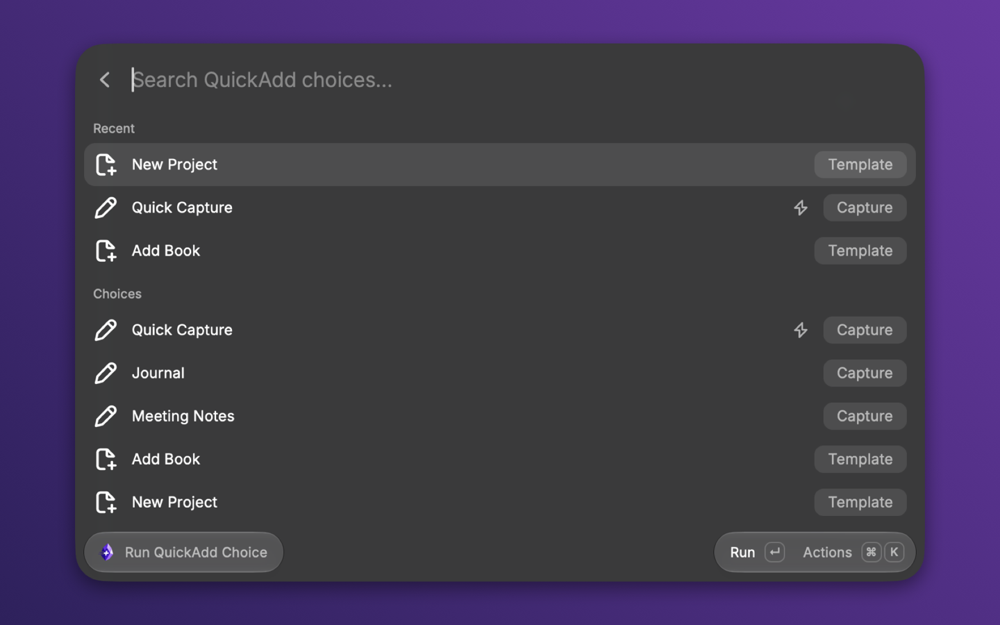
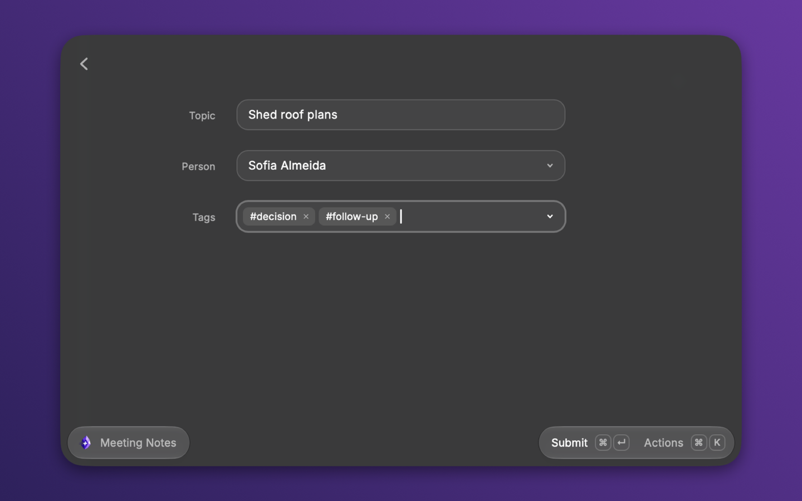
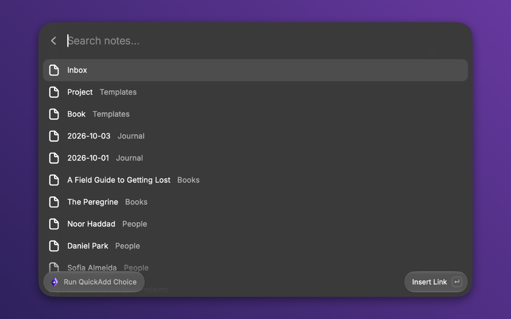

The QuickAdd extension for [Raycast](https://www.raycast.com) runs your choices
from Raycast on macOS and shows their prompts as Raycast forms and lists. It
drives QuickAdd through the [Obsidian CLI](/docs/Advanced/CLI/), so the choices
you already have work from Raycast without changes.

## Install {#install}

The extension is not in the Raycast Store yet, so install it from source.

1. In Obsidian, turn on **Settings → General → Command line interface**, then
   restart Obsidian.
2. Clone the extension and start it. You need Node.js and npm.

   ```bash
   git clone https://github.com/chhoumann/raycast-quickadd
   cd raycast-quickadd
   npm install
   npm run dev
   ```

   `npm run dev` builds the extension and adds it to Raycast. Leave it running
   while you use the extension.

3. In Raycast, search for **Run QuickAdd Choice**.

## Run a choice {#run-a-choice}

1. Open Raycast and run **Run QuickAdd Choice**.
2. Pick a choice. The list groups choices by their Multi folder. Up to five
   choices you ran often and recently sit under **Recent** at the top.
3. Press Enter. QuickAdd runs the choice inside Obsidian and sends each prompt
   to Raycast.

A choice that uses the current note, such as a capture to the active file or
an appended link, first asks which note that is, since Raycast cannot see the
tab open in Obsidian.



Every prompt QuickAdd raises appears in Raycast:

- A choice's own inputs, such as `{{VALUE:title}}`, `{{VDATE:due,YYYY-MM-DD}}`,
  and a `{{FILE:People}}` note picker, arrive together as one form.
- Prompts a macro script raises, such as `inputPrompt`, `suggester`,
  `yesNoPrompt`, `checkboxPrompt`, and `requestInputs`, arrive one at a time.
  A suggester is a searchable list, and an info panel is a page with a
  **Continue** action.
- A date field gets a time picker when its format has a time part.
- A multi-select field is a tag picker. A value declared multi-line in
  QuickAdd, such as `{{VALUE:notes|type:multiline}}`, is a text area with room
  to dictate.
- A note picker starts empty, as in QuickAdd's own form, and a required one
  must have a pick before the form submits.



In a text field, type `[[` to pick a note or alias, or type `#` at the start
of a word to pick a tag, most used first. The lists come from QuickAdd's
[`quickadd:suggest`](/docs/Advanced/CLI/#quickaddsuggest), so they match what
the editor offers. Picking an item inserts the link or tag where you typed.



When the run finishes, a toast reads **Created** or **Added to** with the file
name and offers **Open in Obsidian**. A choice with no prompts finishes with the
toast alone.

To stop a run, choose **Cancel Run** (`Cmd+Shift+Backspace`) from the actions.
QuickAdd ends the run in Obsidian.

To run a choice with QuickAdd's own dialogs instead, open the actions (`Cmd+K`)
and choose **Run in Obsidian**. Use it for a choice whose prompts Raycast cannot
show, such as a Templater prompt.

## Capture from anywhere {#capture-from-anywhere}

Three commands send text to a Capture choice without opening a list:

| Command | Sends |
| --- | --- |
| **Quick Capture** | The text you type as the command's argument |
| **Capture Selection** | The text selected in the frontmost app |
| **Capture Clipboard** | The text on the clipboard |

Set each command's **Capture Choice** preference to the name of a Capture
choice, as shown in **Run QuickAdd Choice**. The text runs as the choice's
`{{VALUE}}`. The command runs without prompts, so pick a choice that needs
nothing else, such as a capture whose target file exists or that creates it. If
several vaults have QuickAdd, also set the **Vault** preference.

Give each command a hotkey in Raycast's extension settings. Capture Selection
reports **No text selected** and Capture Clipboard reports **Clipboard is
empty** when there is nothing to send.

## Hotkeys and Quicklinks {#hotkeys-and-quicklinks}

To put one choice in Raycast's root search, select it in **Run QuickAdd
Choice**, open the actions (`Cmd+K`), and choose **Pin as Quicklink**. Raycast
creates a Quicklink named after the choice. Search for it by name, or give it a
hotkey or an alias in Raycast's settings. A pinned choice runs in the vault it
was pinned from and opens its prompts at once.

**Pin as Quicklink with Argument** makes a Quicklink that takes text inline.
Type the Quicklink's name, press Tab, type the text, and press Enter. The text
runs as the choice's `{{VALUE}}`, so a pinned capture with a plain `{{VALUE}}`
works like Quick Capture for that one choice. Any other prompt still opens in
Raycast. A choice without a plain `{{VALUE}}` ignores the text.

A choice with its command toggle on in QuickAdd shows a bolt icon in the list.
Those are the choices you reach for by hotkey, so they are good candidates to
pin.

## Multiple vaults {#multiple-vaults}

The extension reads Obsidian's vault list and uses the one vault that has
QuickAdd enabled. When several vaults have it, **Run QuickAdd Choice** asks
which vault to use, and the capture commands stop with a message until you set
the **Vault** preference. A set **Vault** preference wins over detection. A
pinned Quicklink always runs in the vault it was pinned from.

When the vault is closed, the extension opens it, which starts Obsidian when
needed, and waits about 20 seconds for QuickAdd to answer. **Run QuickAdd
Choice** reopens itself once the vault is ready, so Raycast comes back if
Obsidian took the focus.

Obsidian addresses a vault by its folder name. When two registered vaults share
a folder name, the extension refuses to run in either of them, because the CLI
could reach the wrong one. Rename one of the folders.

## What you need {#requirements}

| Feature | Needs |
| --- | --- |
| Everything | macOS, Raycast, and Obsidian 1.12 or later installed with the 1.12 installer, with **Command line interface** turned on. The in-app update alone does not add the CLI |
| Quick Capture, Capture Selection, Capture Clipboard | QuickAdd 2.15 or later |
| Run QuickAdd Choice, with a choice's inputs on one form | QuickAdd 2.17.2 or later |
| Cancel Run stops the run in Obsidian, and the **Created** and **Added to** finish messages | QuickAdd 2.20 or later |
| Note pickers that start empty, `[[` and `#` completion, and Escape ending the run | QuickAdd 2.31 or later |

## Limitations {#limitations}

- Templater's own prompts, such as `tp.system.prompt`, open in Obsidian. When a
  run waits a few seconds with no prompt, Raycast says that QuickAdd may be
  asking something in Obsidian and offers **Open Obsidian** (`Cmd+O`).
- [`{{SELECTED}}`](/docs/FormatSyntax/#selected) inside a choice reads the
  selection in Obsidian's editor, not the text selected on your Mac. Use
  **Capture Selection** for the Mac selection.
- Escape does not go back to the previous prompt. It leaves the run, and
  QuickAdd ends the run in Obsidian.

## Troubleshooting {#troubleshooting}

- **"Turn on Obsidian's command line interface" or "Obsidian CLI not found"**:
  turn on **Settings → General → Command line interface** in Obsidian and
  restart Obsidian. If the `obsidian` command lives somewhere other than
  `/opt/homebrew/bin`, `/usr/local/bin`, or inside `Obsidian.app`, set
  **Obsidian CLI Path** in the extension preferences.
- **"Another vault is also named ..."**: two registered vaults share a folder
  name. Rename one of the folders. See [Multiple vaults](#multiple-vaults).
- **"Several vaults have QuickAdd"** from a capture command: set the **Vault**
  preference to the vault to capture into.
- **"Obsidian does not know ..."**: the **Vault** preference points at a folder
  Obsidian has not opened. Open it once with **Open folder as vault**.
- **"Obsidian did not open ... with QuickAdd ready within 20 seconds"**: open
  the vault in Obsidian yourself, check that QuickAdd is enabled there, and run
  the command again.
- **"Link and tag completion needs QuickAdd 2.31 or later"**: update QuickAdd
  from **Settings → Community plugins** in Obsidian. The form still submits
  without completion.
- **"Could not capture" with missing inputs**: the capture choice asks for more
  than `{{VALUE}}`. Pick a choice that runs without prompts, or run it from
  **Run QuickAdd Choice**, which shows the prompts.
- **"Update the extension"**: QuickAdd sent a prompt type this version of the
  extension does not know. Pull the latest source and run `npm run dev` again.
