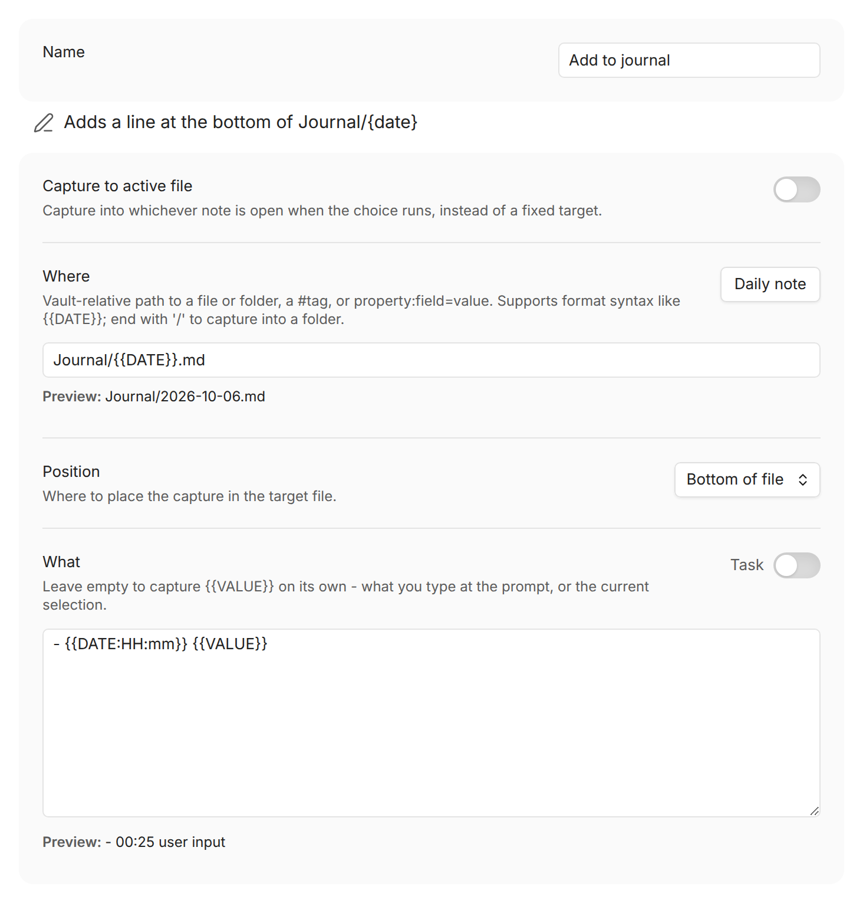

A Capture choice adds text or updates a property **without opening the note**.
Press a hotkey, type your entry, and QuickAdd files it exactly where it belongs - while you
stay right where you are. Use it to:

- Add timestamped entries to your daily note
- Log work under the right heading of a project note
- Save interesting links for later reading



## Set up your first capture {#set-up}

1. In **Settings → QuickAdd**, click **New choice** → **Add to a note**. The
   Capture builder opens as a page of the settings window; set **Name** to
   `Add to journal`. (Before QuickAdd 2.30.0, the builder is a dialog; click
   its name at the top to rename it.)
2. Set **Where** to where entries should land, for example
   `Journal/{{DATE}}.md`. (In earlier versions, this is **Capture to**.)
3. Click **More settings** and turn on **Create file if it doesn't exist**, so
   the first capture of the day creates today's note instead of stopping with
   a "Target file missing" notice.
4. In **What**, describe one entry, for example
   `- {{DATE:HH:mm}} {{VALUE}}`. (In earlier versions, this is **Capture
   format**; before QuickAdd 2.30.0, turn on its toggle first.)
5. Run it: command palette → `QuickAdd: Run`, pick `Add to journal`,
   type your entry.

You now have this in today's journal note:

```markdown
- 09:42 Standup moved to Wednesday
```

Assign the choice a hotkey (⚡ icon, or Obsidian's Hotkeys settings) once it
behaves the way you want.

## Choose where it goes: Where {#capture-to}

_Where_ is the note you are capturing to. Either enable **Capture to
active file** to write into the note you are currently in, or enter a file
path.

The path supports [format syntax](/docs/FormatSyntax/), so it can be dynamic.
A daily journal capture might use:

```text
Journal/{{DATE:YYYY-MM-DD - ddd MMM D}}.md
```

Every run finds today's file, and your entry is captured to it.

For your daily note, click **Daily note** next to **Where** (QuickAdd
2.30.0 or later). It writes
[`{{DAILY}}`](/docs/FormatSyntax/#daily) into the field and turns on **Create
file if it doesn't exist**. `{{DAILY}}` uses the folder, date format, and
template from Obsidian's **Daily notes** settings, or from Periodic Notes when
it manages your daily notes, so the path always matches the note **Open
today's daily note** opens. [`{{WEEKLY}}`, `{{MONTHLY}}`, `{{QUARTERLY}}`, and `{{YEARLY}}`](/docs/FormatSyntax/#periodic-notes)
do the same for Periodic Notes.

File names are Markdown-first:

- No extension means a Markdown file: `Inbox` targets `Inbox.md`.
- An explicit supported extension (`.md`, `.canvas`) is kept.
- `.base` files are not supported as capture targets - use a Template choice for `.base` workflows.

:::note
If a value used in the file name contains a line break or another control
character, QuickAdd folds it to a space and strips trailing spaces or periods
from that path segment. The text inserted into the note is not changed.
:::

### How QuickAdd picks the target {#how-quickadd-picks-a-target}

When **Capture to active file** is off, the resolved _Where_
value decides what happens:

| You write | What happens |
| --- | --- |
| `Inbox.md` (or any path with an extension) | Captures straight to that file |
| nothing, or `/` | Opens a picker with every Markdown note in the vault |
| `Projects/` (trailing slash) | Opens a picker confined to that folder |
| `Projects` (existing folder, no extension) | Same picker, unless `Projects.md` exists - then the file wins |
| `#people` | Picker with notes carrying that tag |
| `property:type=draft` | Picker with notes whose frontmatter matches - see [filtering by a property](#capturing-to-a-property) |

Paths are vault-relative; a leading `/` is ignored (except a lone `/`, which
opens the whole-vault picker).

The picker is ordered like Obsidian's Quick Switcher: notes you opened most
recently come first, then everything else alphabetically. Ordering ignores
modification time on purpose, so a sync that touches old notes doesn't push
them to the top. Files in Obsidian's **Excluded files** list sink to the
bottom but stay selectable.

You can also **type a new name** into the picker: with **Create file if it
doesn't exist** enabled, a **Create new note: &lt;name&gt;** row appears and
QuickAdd creates the note for you. The create row is selected first, so press
Enter to create the exact name you typed even when existing notes are fuzzy
matches. The row hides when the typed name matches an existing note in scope,
so typing an existing name selects it instead of offering a duplicate. The
picker still opens for an empty folder, tag, property, or filtered scope so you
can create the first note there.

In the [one-page input form](/docs/Advanced/onePageInputs/), this picker starts
empty, and the form doesn't submit until you choose a note or a new note name
(QuickAdd 2.30.0 or later; earlier versions picked the first note for you).

### Capture to a folder {#capturing-to-folders}

Type a folder name (like `CRM/people`) and QuickAdd asks which note in that
folder to capture to - nested folders included. Format syntax works here too.

For example: you keep one note per person in `CRM/people`. Set _Capture To_ to
`CRM/people`, run the capture, and pick the person. Type `John Doe` instead
and QuickAdd creates `CRM/people/John Doe.md` (with **Create file if it
doesn't exist** enabled).

### Capture to a tag {#capturing-to-tags}

Type a tag (like `#people`) and QuickAdd asks which note carrying that tag to
capture to.

### Filter by folders and tags together {#capturing-to-filtered-files}

Combine filters with `|` when the destination could live in several folders,
or must match several tags:

| You write | The picker shows |
| --- | --- |
| `folder:Goals\|folder:Projects` | Notes in either folder |
| `tag:active\|tag:work` | Notes with **both** tags |
| `folder:Goals\|folder:Projects\|tag:active` | Active notes in either folder |
| `folder:Goals\|exclude-folder:Archive\|exclude-tag:done` | Goals that aren't archived or done |

Repeated `folder:` filters are OR filters. Repeated `tag:` filters are AND
filters. Exclusions remove any matching file.

Capture still writes to **one** destination per run. To select several related
notes for metadata, use the [`{{FILE:<folder>|multi}}`](/docs/FormatSyntax/#file)
placeholder in the capture format instead.

### Capture to notes with a matching property {#capturing-to-a-property}

Type `property:<field>=<value>` to limit the picker to notes whose frontmatter
matches. If your notes have a `type` field, `property:type=draft` opens a
picker containing only the notes whose `type` is `draft`.

This selects the destination note. [**Position → Property**](#property)
controls whether the capture updates one of that note's properties.

- `property:type=draft` - notes whose `type` equals `draft`.
- `property:type` - notes that **have** a `type` field, whatever the value.
- Matching is case-insensitive and trimmed. For a list property (`type: [draft, idea]`), the note matches if **any** entry equals the value.
- The value supports [format syntax](/docs/FormatSyntax/): `property:status={{VALUE}}` asks when the capture runs.

Combine with the shared file filters using `|`, the same syntax as
[`{{FIELD}}`](/docs/FormatSyntax/#field-filters):

- `property:type=draft|folder:Notes` - only drafts inside `Notes/`.
- `property:type=draft|exclude-folder:Archive` - drafts not in `Archive/`.
- `property:type=draft|exclude-tag:done` - drafts not tagged `#done`.

Good to know:

- Matches **YAML frontmatter** only, not inline Dataview `field:: value` fields.
- The field name matches case-insensitively (`property:type` matches a `Type:` field), and value matching is always case-insensitive.
- Only the `folder:` / `tag:` / `exclude-folder:` / `exclude-tag:` / `exclude-file:` pipe filters are applied here.
- Because `|` starts a filter, a property value cannot itself contain `|`.
- Typing a new note name (with **Create file if it doesn't exist**) creates the note, but does not automatically give it the property.

### Send one entry to several notes {#capturing-the-same-entry-to-multiple-files}

Capture writes to one destination per run. To write the same entry to several
fixed notes, compose Capture choices with a [Macro](/docs/Choices/MacroChoice/):

1. Create one Capture choice per destination.
2. Give each the same named value, for example `- {{VALUE:entry}}`.
3. Create a Macro and add each Capture choice as a **Nested Choice** command.
4. Run the Macro: QuickAdd prompts for `entry` once and reuses the answer.

| Choice | Where | Format |
| --- | --- | --- |
| Log to Person A | `People/Person A.md` | `- {{VALUE:entry}}` |
| Log to Person B | `People/Person B.md` | `- {{VALUE:entry}}` |

If the destinations are dynamic, use one Capture choice with a formatted
target and run it repeatedly from a [user script](/docs/UserScripts/):

| Setting | Value |
| --- | --- |
| Where | `People/{{VALUE:person}}.md` |
| Format | `- {{VALUE:entry}}` |

```js
module.exports = async ({ quickAddApi }) => {
	const entry = await quickAddApi.inputPrompt("Entry");
	const people = await quickAddApi.checkboxPrompt([
		"Person A",
		"Person B",
		"Person C",
	]);

	for (const person of people) {
		await quickAddApi.executeChoice("Log event to person", {
			entry,
			person,
		});
	}
};
```

Pass the variables object on every `executeChoice` call - each call clears its
temporary variables after the choice runs.

### Friendlier names in the picker {#file-picker-labels}

The picker labels each note by its frontmatter `title` when available, then
its first level-1 heading, then its file name. The selected destination is
always the real file, so captures write to the same place even when the label
is friendlier than the filename.

You can also find a note by its `aliases`. A note found that way shows the
alias with the note's name beneath it, as in Obsidian's quick switcher, and
typing an alias exactly picks its note instead of offering to create a new one
(QuickAdd 2.30.0 or later).

## Shape the entry: What {#capture-format}

_What_ is the capture format: what actually gets written - think of it as a mini
template for one entry. Left empty, QuickAdd writes `{{VALUE}}`: whatever
you type in the prompt (or your editor selection, if selection-as-value is
enabled). Before QuickAdd 2.30.0, the field has a toggle: it is hidden while
the toggle is off, and off means `{{VALUE}}` on its own.

All of [format syntax](/docs/FormatSyntax/) works here:

```markdown title="Format"
- {{DATE:HH:mm}} {{VALUE}}
```

```markdown title="What gets written (after typing "Called the bank")"
- 09:42 Called the bank
```

To nest a line, press **Tab** in the box: once you have typed or clicked in it,
Tab inserts a tab character (with a selection, it indents every touched line).
Tabbing through the settings still passes the box by, and **Shift+Tab** moves
focus out.

For a long format, keep it in a note and reference it:

```text
{{TEMPLATE:Templates/Capture Format.md}}
```

QuickAdd inserts the file's contents, then processes the result like any
capture format - the file can contain `{{VALUE}}`, `{{DATE}}`,
`{{MACRO:...}}`, inline scripts, and further `{{TEMPLATE:...}}` includes
(`.md`, `.canvas`, and `.base` files; include the extension). This lets you
edit, version, and reuse a complete capture format as a normal note. The
[one-page input form](/docs/Advanced/onePageInputs/) and `quickadd:check` scan
referenced template files too, so their prompts appear up front.

:::note
A capture into the note body inserts included content as-is. If the referenced
template starts with its own `---` frontmatter block and the target note already has one, you
get a literal second block - use
[Apply Template to Note](/docs/ApplyTemplateToNote/) when frontmatter should
merge.
:::

:::note
To insert `.base` content into your current note, keep **Capture to active
file** enabled and use a `{{TEMPLATE:...}}` placeholder pointing at a `.base` file in the format - see
[Capture: Insert a Related Notes Base into an MOC Note](/docs/Examples/Capture_InsertBaseTemplateIntoActiveFile/).
To create a brand-new note that embeds a Base, use a Template choice - see
[Template: Create an MOC Note with a Link Dashboard](/docs/Examples/Template_CreateMOCNoteWithLinkDashboard/).
:::

If your format includes an inline `js quickadd` block and you need to
transform input, read input in script code via
`this.quickAddApi.inputPrompt(...)` and assign variables on `this.variables` -
don't put `{{VALUE}}` inside JavaScript string literals. See
[Inline scripts](/docs/InlineScripts/#execution-order-and-value).

## The options, one by one {#capture-options}

The Capture builder starts with one line that says what the capture does, for
example *Adds a line at the bottom of Journal/{date}*. It changes as you change
the settings below it.

Under it are the settings every capture needs: **Where**, **Position**, and
**What**, with the **Task** toggle next to **What**. Then come
[Inputs](#inputs) and [Steps](#steps). The rest of the options below are behind
**More settings** at the bottom. **More settings** opens by itself when one of
them is changed from what a new capture has, so a capture you set up shows what
you set. Once you open it, it stays open for that capture until Obsidian
restarts.

### Create the note if it's missing {#create-file-if-it-doesnt-exist}

_Create file if it doesn't exist_ does what it says. Optionally create the
file **from a template** - an input for the template file appears below the
setting.

### Format the entry as a task {#task}

_Task_, the toggle next to **What**, formats your captured text as a task
(`- [ ] ...`).

### One entry per line {#one-entry-per-line}

_Requires QuickAdd 2.30.0 or later._

_One entry per line_ writes the capture format once for each line of
`{{VALUE}}`. Paste, select, or type several lines, and each becomes its own
entry:

```markdown title="Format (with Task on)"
{{VALUE}} 📅 {{VDATE:due,YYYY-MM-DD}}
```

```markdown title="You type three lines and answer "friday""
- [ ] Book the venue 📅 2026-10-02
- [ ] Send the invites 📅 2026-10-02
- [ ] Order the cake 📅 2026-10-02
```

Good to know:

- Blank lines are skipped and each line is trimmed. If every line is blank, nothing is written, unless `{{VALUE}}` has a `|default:`, which is written once.
- Every other placeholder is asked once and reused for every line. Macros (`{{MACRO:...}}`), inline scripts, and included templates run once per capture, not once per line. `{{RANDOM:...}}` gives each line its own value.
- The `{{VALUE}}` prompt opens as a multi-line box, and so does its field in the [one-page input form](/docs/Advanced/onePageInputs/). A `|type:` on the token wins.
- A multi-line editor selection, or a value passed from a script, the URI, or the CLI, is split the same way.
- Only the `{{VALUE}}` written in the Capture format splits. A `{{VALUE}}` inside an included `{{TEMPLATE:...}}` is filled once, as a whole.

### Which day {#date-origin}

Same [Which day](/docs/Choices/TemplateChoice/#date-origin) setting as a
Template.

Imagine you capture into `Daily/{{DATE}}.md` at 3pm. The path picks the note.
The line `- {{TIME}} bought milk` is 3pm, even if that note is yesterday.
That's the useful split: the note is the day, the stamp is when you wrote it.

`{{DATE:HH:mm}}` looks like it should print yesterday, but `HH:mm` only
prints the clock, so you still get `15:00`. Put `{{DATE}}` on the line if
you want the note's day next to the text.

Most people leave this on Today and hold Shift in the QuickAdd menu for the
days that aren't today. If you'd rather have a hotkey for that, see
[Command palette](#command-palette). Your existing hotkey still captures to
today.

### Use your selection as the answer {#use-editor-selection}

_Use editor selection as default value_ controls whether selected text in the
editor is used as `{{VALUE}}` instead of prompting: **Follow global setting**,
**Use selection**, or **Ignore selection** (the global default lives in
[**Settings → QuickAdd → Advanced**](/docs/Settings/#advanced-input), or on the main
QuickAdd tab before QuickAdd 2.30.0). This does not affect `{{SELECTED}}`.

### Pick where in the note it lands: Position {#write-position}

_Position_ controls where in the note the entry is written. The options
depend on whether **Capture to active file** is enabled:

- **At cursor** (active file) / **Top of file** (target file) - the first option's label changes with the mode
- **Top of file (after frontmatter)** (active file only)
- **New line above cursor** / **New line below cursor** (active file only)
- **After line…** - insert after a target line you specify, or pick a heading at run time. The workhorse for structured notes - see [Insert after](#insert-after).
- **Before line…** - see [Insert before](#insert-before)
- **Bottom of file** - starts the entry on a new line. For a blank line between entries, put one in the format, as in `{{VALUE}}\n\n`. Before QuickAdd 2.30.0, a format ending in `\n` also left a blank line before each new entry.
- **Property** - set a frontmatter value or add items to a list.

### Capture into a property {#property}

**Position → Property** writes the capture format to one frontmatter
property in a Markdown note. The note's body and unrelated property values stay
intact. QuickAdd uses Obsidian's frontmatter writer, so YAML formatting can change.

**Property** selects the key:

- **Named property** uses a fixed name such as `status`, or a formatted name such
  as `{{VALUE:property}}`.
- **Choose when capturing** opens a picker with the target note's properties.
  With **Create property if missing** enabled, you can also enter a new name.

Property names match case-insensitively and keep the note's existing spelling.
An exact match wins. If several keys differ only in case and none matches exactly,
QuickAdd stops the capture instead of choosing one.

**Action** controls the update:

- **Set value** replaces the property's value. An empty value clears a list.
- **Add to list** adds new items below the existing ones. Exact duplicates are
  skipped. An existing text, number, or checkbox value causes an error.

For a list property, each line of the Capture format is one item, the same way
Enter works in Obsidian's List property editor. Lines are trimmed, blank lines
are ignored, and a comma inside a line stays part of that item.

#### Keep the current value with `{{PROPERTY}}`

In the format, `{{PROPERTY}}` is the property's current value. Put it where
that value should appear. When the format contains it, **Add to list** and
**Set value** write the same list. QuickAdd drops duplicate items and keeps
the first occurrence. An existing list item that contains a line break stops
the capture. See [format syntax](/docs/FormatSyntax/#property) for examples.

Other useful patterns:

- Several fixed lines add several items in one run, with no prompt.
- `{{VALUE}}` on its own line adds whatever you type as one more item.
- A `{{VALUE:notes|type:multiline}}` prompt is a free-form "one item per line"
  box.
- Text, number, checkbox, date, and date-time properties never split on line
  breaks.
- A `|multi` picker or a script's list on its own line adds one item per pick,
  next to any other lines. Its `|format:markdown` or `|format:yaml` adds no dashes or brackets.
  `|format:inline` or `|format:spaced` joins the picks into one item, and so
  does other text on the picker's line. This needs QuickAdd 2.28.0 or later;
  earlier versions join the picks into one item when the format has other
  lines.
- A format that is only a `|multi` picker or a script's list writes each item
  as it is, even one that contains a line break. Next to other lines, such an
  item stops the capture.

Neither action converts an existing text, number, or checkbox property into a
list. An empty or whitespace-only text value or empty list with **Add to list**
leaves the note unchanged. It does not create a missing note, write properties,
insert links, or copy links.

Inline scripts read the current value through
[Property Capture variables](/docs/InlineScripts/#property-capture-variables).

**Create property if missing** permits a new key. When disabled, a missing key
stops the capture. **Create file if it doesn't exist** separately controls
whether QuickAdd can create the destination note.

The Capture format supplies the value. A format made entirely of one `VALUE`,
`FIELD`, or `FILE` token preserves a typed number, checkbox, or list. Combining
a token with other text produces text. An explicit multi-select output format,
such as `|format:spaced`, also produces the requested text representation.

For a Number or Checkbox property, a plain `{{VALUE}}` or `{{VALUE:rating}}`
automatically uses the matching input widget and value type. This also applies
to a missing property whose type is already set in Obsidian. An explicit
`|type:` option takes precedence.

| Property | Action | Capture format | Result |
| --- | --- | --- | --- |
| `status` | **Set value** | `{{VALUE:status}}` | The entered text. |
| `rating` | **Set value** | `{{VALUE:rating\|type:number}}` | A Number property. |
| `done` | **Set value** | `{{VALUE:done\|type:checkbox}}` | A Checkbox property. |
| `tags` | **Add to list** | `work` and `personal` on two lines | Adds both tags without a prompt. |
| `tags` | **Add to list** | `{{VALUE:work,personal\|multi}}` | Adds the selected tags. |
| `tags` | **Add to list** | `{{VALUE:work,personal\|multi}}` then `inbox` on two lines | Adds the selected tags and `inbox`. |
| `tags` | **Add to list** | `work` then `{{PROPERTY}}` on two lines | Inserts `work` above the existing tags. |
| `status` | **Set value** | `{{PROPERTY}} → Ready` | Keeps the current text and appends ` → Ready`. |
| `people` | **Set value** | `{{FILE:People\|multi\|link}}` | Replaces the list with links to the selected notes. |

The value must match the property's Obsidian type, or its existing value when
no type is known. A Number property can receive a script value of `42` or the
text `"42"` through a plain `VALUE` token. Literal formats and composite text
are not parsed as YAML: `true` and `[work, personal]` remain text. Text properties
also preserve values such as `001`. Commas in text remain part of one value.
Objects and lists containing non-text values are rejected. **Set value** removes
exact duplicate list items while preserving their order.

For a new property without a known type, the captured value determines the type.
Date properties accept `YYYY-MM-DD`, and date-time properties accept ISO
date-time text such as `2026-09-07T14:30`. An intentional empty text value or
empty list clears a matching property with **Set value**. Use `|optional` to
allow an empty prompt answer. Cancelling a prompt stops the capture.

Several lines of text are the one exception. **Set value** stops with an error
instead of guessing, because several lines usually mean a list, and writing them
as text would register the property as Text for the whole vault and block every
later **Add to list**. Use **Add to list** to create it as a list, or set the
property's type in Obsidian first - choose Text to keep the lines as one value.

QuickAdd collects and validates the property inputs before writing or creating
the note. **Task** and **Run Templater on entire destination file after capture**
are hidden and do not apply to property captures.

Scripts can supply native values through `executeChoice`. With **Add to list**,
property `tags`, and format `{{VALUE:tags}}`, this adds two complete items.
The comma inside the first item stays part of that item:

```js
await quickAddApi.executeChoice("Add project tags", {
	tags: ["Research, writing", "work"],
});
```

For a non-interactive CLI run, use **Named property**, optionally with a variable
in its name, and pass typed values through [`vars`](/docs/Advanced/CLI/#passing-variables).
**Choose when capturing** requires an interactive run.

### Link back to the captured note {#link-to-captured-file}

_Link to captured file_ inserts a link to the note you captured to - useful
for leaving a trail in the note you were in. Three modes:

- **Enabled (strict)** - require the configured link destination to be available
- **Enabled (skip if unavailable)** - insert the link when possible, silently skip when nothing is open
- **Disabled** - never insert a link

With either enabled mode, _Link destination_ controls where the link goes:

- **Current note** - insert into the active editor
- **Specified note** - append to the bottom of a chosen note (an index or MOC, for example) without opening it. QuickAdd validates the destination before writing. It appends a plain link only: it won't create the index file, insert under a heading, update properties, or dedupe links.

For **Current note**, strict mode requires a focused Markdown editor (except
Canvas-triggered captures, which skip link insertion when no Markdown editor
is available).

#### Where the link is placed {#link-placement}

For the **Current note** destination, _Link placement_ chooses the spot:

- **Replace selection** - replace any selected text with the link (default)
- **After selection** - keep the selected text, place the link after it
- **End of line** - at the end of the current line
- **New line** - on a new line below the cursor
- **In frontmatter property** - add the link to a named frontmatter property

For **In frontmatter property**, set the property name and how strictly to
handle missing or non-list properties:

- **Create or convert** (default) - create the property if missing, or convert an existing scalar value into a list before appending. Object values still error.
- **Create if missing** - create the property if missing; existing scalar/object values error.
- **Require list** - append only to an existing list property. Empty/null count as empty lists; missing properties and scalar/object values error.

:::note
If your cursor is in an editable Obsidian Properties field when the capture
starts (and placement isn't **In frontmatter property**), QuickAdd appends the
link to that focused property instead of using the stale editor cursor behind
the Properties panel. Text properties get the link at the end of the value;
list properties get a new item.
:::

#### Link or embed {#link-type}

For the body placements (**Replace selection**, **After selection**, **End of
line**, **New line**), a _Link type_ dropdown chooses **Link** (`[[Note]]`) or
**Embed** (`![[Note]]`). An embed transcludes the captured note's contents at
the placement position. **In frontmatter property** and the **Specified
note** destination stay link-only.

#### What the link says {#link-display-text}

For the selection placements with the **Link** type, _Link display text_
chooses the visible text. **Selected text** keeps your highlight as the
display text: selecting `Meeting with Mark` and capturing to
`20240101 Meeting with Mark` inserts
`[[20240101 Meeting with Mark|Meeting with Mark]]`. With nothing selected (or
a selection that can't sit safely inside a link), the plain link is inserted.
Multi-line selections collapse to one line, and vaults using Markdown-style
links get `[Meeting with Mark](20240101%20Meeting%20with%20Mark.md)`.

### Copy a link to the clipboard {#copy-link-to-clipboard}

_Copy link to clipboard_ copies a link to the captured note after the capture
runs - independent of _Link to captured file_, so you can copy without
inserting, or do both. The copied link is a vault-path wikilink, ready to
paste into another note.

### Open the captured note {#opening-the-captured-file}

When **Capture to active file** is off, the **Behavior** section under **More
settings** shows an _Open_ toggle. Enabling it reveals:

- _File opening location_ - **Reuse current tab**, **New tab**, **Split pane**, **New window**, **Left sidebar**, or **Right sidebar**
- _Split direction_ - **Split right** or **Split down** (shown for **Split pane**)
- _View mode_ - **Source**, **Preview**, **Live Preview**, or **Default**
- _Focus new pane_ - focus the opened tab immediately (shown for every location except **Reuse current tab**)

When QuickAdd opens and focuses a Markdown target in an editable mode after a
body capture, it places the cursor at the end of the inserted text so you can keep typing.
This is skipped for preview/unfocused opens and when Templater cursor markers
take over.

Use [`{{CURSOR}}`](/docs/FormatSyntax/#cursor) in the Capture format to place
the cursor within the inserted text. The marker also works when the destination
is already focused in an editing mode and **Open** is off.

### Run it from a hotkey: Command palette {#command-palette}

**Add to command palette** registers the capture as an Obsidian command, the
same switch as the lightning bolt in the choice list. Once it is on, and
[Which day](#date-origin) isn't **Ask each time**, **Also add "Name (pick a
day)"** registers a second command that asks which day first. One hotkey
captures to today, the other to whichever day you pick, from the same
choice.

### Put it in the ribbon: Show in ribbon {#show-in-ribbon}

**Show in ribbon** adds an icon to Obsidian's ribbon that runs the capture. The
icon and its tooltip are the choice's icon and name. The setting saves as soon
as you flip it. A choice nested inside a macro doesn't have it.

### Run Templater on the whole file afterwards {#run-templater-on-entire-destination-file-after-capture}

:::caution[Deprecated]
_Run Templater on entire destination file after capture_ is deprecated and will
be removed in a future release. QuickAdd already runs Templater in what it
captures, so the option is no longer needed. In QuickAdd 2.30.0 or later, the
builder only shows it on choices that already have it on, and a Capture that
uses it shows a notice once per session. Turn it off.
:::

The option executes any `<% %>` anywhere in the destination file, including
inside code blocks. When that pass changes the note, QuickAdd skips placing the
cursor at `{{CURSOR}}`, since the text under the marker may have moved.

### Templater and newly created notes {#templater-and-newly-created-files}

Body captures have two Templater paths when they create a missing Markdown file:

- **Create file if it doesn't exist** without a QuickAdd template: QuickAdd creates a blank file first. If Templater's new-file trigger applies to that location, QuickAdd waits for Templater to finish before inserting the capture.
- **Create with template**: QuickAdd owns the initial content. It renders the selected QuickAdd template, suppresses Templater's new-file/directory trigger for that creation, then runs Templater once on the content QuickAdd wrote.

So a blank Capture-created file can receive Templater's directory template
first, while a template-created file runs Templater on QuickAdd's template
content instead.

Property captures prepare the property value before creating the file. After a
new-file Templater pass, QuickAdd applies the property update to the resulting
frontmatter so the template does not discard the capture.

## See what it asks for: Inputs {#inputs}

The **Inputs** group, above **Steps**, lists what the capture asks for when it
runs, in the order it first appears: in **Where**, then in the capture
format, then in the template a missing note is created with. Each row shows the
input's name, its kind (*value*, *date*, *field*, *file*, *math*, or *pick* for
the note you pick from a folder or tag), and where it is defined. An empty
capture format still asks for `{{VALUE}}`, so it is listed too.

Two controls change how a value, date, or file input is asked for, without
editing the placeholder:

- **Label** - the title of its prompt, and of its field in the one-page form.
  Leave it empty to keep the placeholder's own, shown greyed out in the field.
- **Optional** - whether you can leave it empty. It starts as the placeholder
  says, with `|optional` or without.

Both save as soon as you change them. A run that is given the value up front,
from the CLI or a URI, isn't affected. Rename the placeholder and the input
asks as the placeholder says again.

An input from the template file reads *Defined in* and the file's name. Click
the name to open the file, and change the placeholder there.

A capture nested inside a macro lists its inputs without the controls.

## Do more afterwards: Add a step {#steps}

The last group in the builder, **Steps**, lists what the capture does, one line
per step, for example *Adds a line at the bottom of Inbox* and *Opens it*. The
list follows the settings as you change them.

**Add a step** adds something to do after the capture:

- **Run a script** - a script step with no file yet. Click **Choose file** on
  it to pick the script.
- **Open a note** - an **Open File** step. Set the note in its settings.
- **Wait** - a pause of 100 ms.

Adding a step turns the choice into a [macro](/docs/Choices/MacroChoice/).
QuickAdd saves the capture, makes it the macro's first step as a **Nested
Choice**, adds the new step after it, and opens the Macro builder. The choice
keeps its name, its command, and its hotkey. To change the capture's settings
later, use the gear on its step in the macro.

A capture that is already a step inside a macro lists its steps but has no
**Add a step** button.

## Insert after {#insert-after}

**After line…** inserts the entry after a line with the text you specify -
this is how entries land under the right heading. A journal capture might
insert after `## What did I do today?`.

By default, QuickAdd preserves blank lines after headings to keep spacing
intact. **Blank lines after match** controls this:

- **Auto (headings only)** - skip blank lines only when the matched line is a heading
- **Always skip** - skip all consecutive blank lines after the match
- **Never skip** - insert immediately after the matched line

Example (Auto, insert after `# H` with content `X`):

```markdown
# H

X
A
```

A new Capture starts with **Insert at end of section** on, so each entry lands
below the previous one, and **Create line if not found** on at the **Top**. Turn
**Insert at end of section** off to put the newest entry first. Before QuickAdd
2.30.0, both started off. **Consider subsections** is covered
[below](#consider-subsections--option).

**Create line if not found** creates the target line when it doesn't exist -
useful when the heading might not be in the note yet. The created line can go
at the **Top** or **Bottom** of the file, at your **Cursor**, or **Ordered** -
sorted among same-level headings; see
[Ordered section placement](#ordered-section-placement) for
reverse-chronological logs and changelogs.

At the **Top** or **Bottom**, the created lines sit right against the note's
content, with no blank line between them. In QuickAdd 2.31.0 or later, the
exception is two blockquote lines that would touch, such as a created callout
opener right below a quote: QuickAdd puts one blank line between them, so the
callout renders on its own instead of joining the quote.

The target may span several lines: type `\n` in the **Insert after** field to
match a multi-line anchor (the preview shows it expanded). **Inline
insertion** is the exception - it inserts on the same line, so its target must
be a single line; a `\n` target there is rejected with a notice.

### Ordered section placement {#ordered-section-placement}

When **Create line if not found** is set to **Ordered** (full label:
`Ordered among siblings`), a missing "Insert after"
heading is created at its **sorted position among same-level headings**. This
is the building block for a reverse-chronological log: each new dated section
is added above older ones, while a fixed title stays pinned at the top.

The classic "daily log, newest first" recipe (issue
[#481](https://github.com/chhoumann/quickadd/issues/481)):

- **Where**: your log note (enable `Create file if it doesn't exist` to auto-create it)
- **Format**: the entry with a trailing newline, e.g. `- {{DATE:HH:mm}} {{VALUE}}\n` (task captures add their own newline)
- **Insert after**: the day heading, `## {{DATE:YYYY-MM-DD}}`
- **Insert at end of section**: off, so each entry lands directly under the day heading (newest first within the day)
- **Create line if not found**: on, location **Ordered**, **Sort sections by** = `Date`, **Section order** = `Newest / highest first`

Running it on consecutive days (and twice in one day) produces:

```markdown
# My Daily Log

A short intro that always stays at the top.

## 2026-06-16
- 09:40 reviewed the code
- 09:13 started the design

## 2026-06-14
- 09:00 older entry
```

The first capture of a day creates `## 2026-06-16` below the intro and above
`## 2026-06-14`; later captures that day find the existing heading and add
their entry on top. The `# My Daily Log` title stays put because only
same-level headings (`##`) are sorted against each other, and YAML frontmatter
is never treated as a heading.

#### Sort options {#sort-options}

With **Ordered** selected, these controls appear:

- **Sort sections by** - how the sort key is read from each heading:
  - `Insertion order (no sorting)` - newest-first prepends the new section; oldest-first appends it. No parsing.
  - `Text (A→Z)` - case-insensitive text compare.
  - `Number` - the leading number in the heading (e.g. `## 12 Project X`).
  - `Date` - parsed with a **Date format** (auto-detected from the `{{DATE:…}}` placeholder in your "Insert after" text, and editable). Trailing decoration like `## 2026-06-14 (Friday)` is ignored.
  - `Version (semver)` - `major.minor.patch`, so `1.10.0` sorts above `1.9.0`. A leading `v` and the Keep-a-Changelog `## [1.10.0] - 2026-06-16` form are both understood.
- **Section order** - `Newest / highest first` or `Oldest / lowest first`.
- **Existing unparseable headings** (for `Date`, `Number`, `Version (semver)`) - where to rank headings that can't be parsed for the chosen key (like `## Unreleased` in a changelog): sort to bottom (default) or top. A new heading that can't be parsed is always appended at the end.

Use **Insert at end of section** to control order *within* each section: off
= newest entry on top (date logs), on = entries appended at the end
(changelogs).

#### More examples {#more-examples}

A changelog with the newest version on top - **Insert after**
`## {{VALUE:version}}`, **Format** `- {{VALUE:change}}\n`, **Insert at end of
section** on, **Create line if not found** on → **Ordered**, **Sort by**
`Version (semver)`, **Order** `Newest / highest first`:

```markdown
# Changelog

## 1.10.0
- new feature
- another fix in 1.10.0

## 1.9.0
- old fix
```

A "books read" note grouped by year - **Insert after** `## {{DATE:YYYY}}`,
**Format** `- {{VALUE}}\n`, **Create line if not found** on → **Ordered**,
**Sort by** `Date` with **Date format** `YYYY`, **Order** `Newest / highest
first`.

#### Notes and limits {#notes-and-limits}

- The heading is created **once** and reused - every later capture finds it, so the section is never duplicated. This relies on the heading resolving to the **same text** each time: use a stable placeholder (`{{DATE:…}}`, a `{{VALUE:…}}` you supply), not a random one.
- Sorting covers **all same-level headings in the note**, not one parent section. For the layouts above (dated/versioned `##` sections under one `#` title) that's exactly right - keep the fixed title at a different heading level so it's never a sortable sibling.
- Ordered placement positions the **new** section only; it doesn't re-sort existing ones.
- **Ordered** is for headings and can't be combined with **Inline insertion**.

### Choose the heading when capturing {#choose-heading-when-capturing}

Instead of typing the target line when you build the choice, enable **Choose
heading when capturing** to pick it **at run time**: QuickAdd reads the target
note and shows a dropdown of its headings - pick one, and the entry is
inserted under it. Useful when the heading varies between runs, or when you'd
rather not remember it.

The picked heading simply becomes the insert-after target, so every placement
control still applies: **Insert at end of section**, **Consider
subsections**, **Blank lines after match**, and **Create line if not found**
work exactly as usual.

Good to know:

- You can type a heading that doesn't exist yet; enable `Create line if not found` to have QuickAdd create it (type it with its `#` markers, e.g. `## Tasks`).
- The dropdown lists ATX headings (lines starting with `#`). For a brand-new note created from a template, the picker can't list the template's headings (the note doesn't exist at pick time) - type the heading and use `Create line if not found`.
- With the one-page input form, the heading dropdown still appears as a separate step after the form.

### Consider subsections {#consider-subsections--option}

Controls whether a section's nested subsections count as part of it when using
**Insert at end of section**.

Disabled - the section ends where its first subsection starts:

```markdown
## 1. First heading

**Insert after** comes here.

-   content 1
-   content 2
-   content 3
    **Insert at end** comes here.

### 1.1. Nested heading 1

Content

## 2. Another heading

Content
```

Enabled - subsections belong to the section, so "end of section" is after
them:

```markdown
## 1. First heading

**Insert after** comes here

-   content 1
-   content 2
-   content 3

### 1.1. Nested heading 1

Content
**Insert at end** comes here. Captures to after this, as it's considered part of the "1. First heading" section.

## 2. Another heading

Content
```

## Insert before {#insert-before}

**Before line…** inserts the capture before the first line matching the text
you specify. The target accepts [format syntax](/docs/FormatSyntax/), so
values like `{{TITLE}}` and `{{LINKCURRENT}}` work in the match text.

**Create line if not found** works here too: QuickAdd writes the captured
content first, then creates the missing line below it. The created line can go
at the start or end of the file, or at your cursor.

## Capture to Canvas {#canvas-capture-notes}

QuickAdd supports two Canvas capture workflows:

- Capture to the selected card in the active Canvas view
- Capture to a specific card in a specific `.canvas` file

### Capture to the selected card {#1-capture-to-selected-card-in-active-canvas}

Enabled when **Capture to active file** is on and the active view is a
Canvas. Supported card targets:

- Text cards
- File cards that point to Markdown files

### Capture to a card in a specific file {#2-capture-to-specific-card-in-specific-canvas-file}

Enabled when **Capture to active file** is off, the capture path resolves to
a `.canvas` file, and **Target canvas node** is set. When the path is a
`.canvas` file, QuickAdd shows a node picker so you can choose the card
directly from that board.

### Positions in Canvas {#write-position-support-in-canvas}

- Text cards and file cards (Markdown targets) support: **Top of file**, **Bottom of file**, **After line...**, **Before line...**
- Cursor-based modes (**At cursor**, **New line above/below cursor**) don't exist in Canvas. If **Capture to active file** is on and the write position is still the default **At cursor**, the capture aborts until you switch to a supported mode.

Selected-card mode needs exactly one selected card. If the selection is
missing, multiple, or unsupported, QuickAdd aborts with a notice instead of
writing to the wrong place.

When **Link to captured file** is **Enabled (strict)** and the capture runs
from a Canvas card without a focused Markdown editor, the capture still writes
and link insertion is skipped.

For a step-by-step setup, see
[Capture: Canvas Capture](/docs/Examples/Capture_CanvasCapture/).

### Canvas capture FAQ {#canvas-capture-faq}

**Why did my capture abort in Canvas?** Most often: no card selected, more
than one card selected, an unsupported card type, or a cursor-based write
position.

**Can I target a specific card in a Canvas file?** Yes - set the capture path
to a `.canvas` file and choose a **Target canvas node**.

**Does "At cursor" work in Canvas cards?** No. Use top, bottom, insert-after,
or insert-before placement.

**Can I capture to a file card that points to a Canvas file?** No - file-card
capture supports Markdown targets only.

**Can I still create new Canvas files from templates?** Yes. Template choices
support `.canvas` templates.
