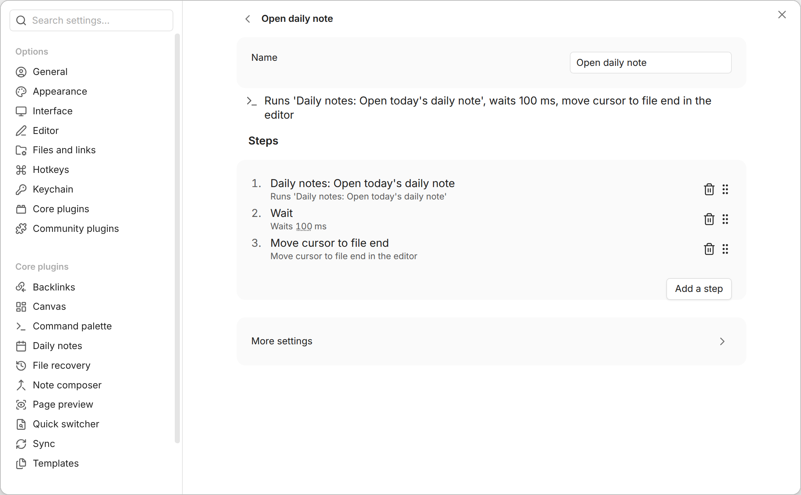

A macro chains several QuickAdd actions into one command you can run from the
palette or a hotkey. Instead of running a template, then a capture, then a
script by hand, a macro runs them in order and passes data from one step to the
next. Reach for a macro when a single choice isn't enough. Use it to:

- Ask a question once and reuse the answer across several steps
- Run your own JavaScript to talk to the Obsidian API or another plugin
- Branch the workflow based on what you picked or what a script returns
- Kick off a routine automatically when Obsidian starts

Macros are QuickAdd's most capable - and most technical - choice type. You
don't need to be a programmer to start: the walkthrough below uses no code at
all. The deeper sections assume you're comfortable with a little JavaScript.

:::tip
Once you have a macro (or a whole collection of choices) that you love, use the
[QuickAdd package exporter](/docs/Choices/Packages/) to bundle it with its
dependencies and share the `.quickadd.json` file with other vaults.
:::

## What is a macro? {#what-are-macros}

A **macro** is a list of commands that run one after another. Each macro is
paired with a **macro choice**, the entry that shows up in the QuickAdd menu and
gives you something to trigger.

### The pieces {#key-concepts}

- **Macro choice** - the trigger that appears in the QuickAdd menu.
- **Macro** - the actual sequence of commands that runs.
- **Commands** - the individual steps (Obsidian commands, scripts, AI prompts, and more).
- **Variables** - data that one command sets and a later command reads, all within a single run.

A Capture or Template choice can grow into a macro: **Add a step** at the
bottom of its settings turns it into a macro that runs it first. See [Do more
afterwards](/docs/Choices/CaptureChoice/#steps) on the Capture page.

## Set up your first macro {#creating-a-macro}

We'll build a tiny macro with no code: it opens today's daily note and drops
your cursor at the end, ready to type. Three commands, run as one.

### Step 1: Create the macro choice {#step-1-create-a-macro-choice}

1. In **Settings → QuickAdd**, click **New choice** → **Run a sequence of
   steps**. The Macro Builder opens as a page of the settings window; set **Name** to
   `Open daily note`. To reopen the builder later, click the gear on the
   choice's row (on a phone, **⋮** → **Configure**). Going back saves it.
   (Before QuickAdd 2.30.0, the builder is a dialog; click its name at the top
   to rename it.)



### Step 2: Build the macro {#step-2-build-your-macro}

1. Click **Add a step** → **Run a command** and pick
   `Daily notes: Open today's daily note`.
2. Click **Add a step** → **Wait** to add a wait of 100 ms. The command step
   doesn't wait for the daily note to open, so without the pause the cursor
   moves before the note is there. If the cursor still ends up in the wrong
   note, click the number under **Wait** and wait longer.
3. Click **Add a step** → **Run an editor command** and choose **Move cursor
   to file end**.
4. Go back to save it, then run it: command palette →
   `QuickAdd: Run` → `Open daily note`.

Your daily note opens and the cursor sits at the end of the file, ready for the
next line - all three steps in a single command. Assign the choice a hotkey (the ⚡
icon, or Obsidian's Hotkeys settings) once it behaves the way you want.

## The builder page {#builder-page}

The page opens with one line that says what the macro does, made from its
steps: "Runs 'Daily notes: Open today's daily note', waits 100 ms, ...". It
follows every change you make below it.

Under **Steps**, each step is a numbered row: its name, and under it what it
does ("Adds a line at the bottom of Inbox", "Runs streaks.js", "Waits 100
ms"). A row's gear opens its settings; a Create or Add row opens that note
step's own page. Drag a row by its handle to reorder it, or focus the handle
and press the up and down arrow keys. The trash can removes the step.

**Add a step** opens a menu of the steps a macro can hold. The macro's
settings (one-page input, Which day, Run on startup, the command palette, the
ribbon and the icon) are under **More settings**, which opens by itself when
one of them is set. See [Macro settings](#macro-settings).

## The steps you can add {#command-types}

Pick a step from **Add a step**. Add as many as you like, in any order.

| Step | What it does |
| --- | --- |
| **Create a note** | Create a note from a template. It is added as a new Template choice inside the macro, and its page opens so you can set it up. |
| **Add to a note** | Write into a note. It is added as a new Capture choice inside the macro, and its page opens so you can set it up. |
| **Open a note** | Open an existing file at a formatted path. Supports all [format syntax](/docs/FormatSyntax/) (`{{DATE}}`, `{{VALUE}}`, and so on), with tab and split options and a **View** (as saved, source mode, reading view or Live Preview). It only opens files that already exist (it won't create one). |
| **Link it** | Link the note an earlier step wrote ([`{{NOTE}}`](/docs/FormatSyntax/#note)) on a new line in the current note. Its settings pick another note, where the link goes, and whether to copy the link too. |
| **Run Templater** | Run Templater's *Replace templates* over the note an earlier step wrote (`{{NOTE}}`), or over the note its settings name. Does nothing without Templater. |
| **Run a script** | Run your own JavaScript to reach the Obsidian API, do complex work, or integrate with other plugins. See [Add a script step](#add-a-user-script-command). |
| **Run a command** | Run any Obsidian command, for example `Daily notes: Open today's daily note` or `Toggle reading view`. |
| **Run an editor command** | Manipulate text in the active editor: copy, cut, paste, [paste with format](#paste-with-format), select the line or a link on it, and move the cursor. See [Editor commands](#editor-commands). |
| **Ask AI** | Run an AI prompt to generate or process content. Offered while online features are on; set up a provider first. |
| **Run a choice** | Run another of your QuickAdd choices - a template, capture, or another macro - so you can reuse existing work and build modular workflows. |
| **If** | Branch the run based on live data. See [Branch with a conditional](#conditional-commands). |
| **Wait** | Pause for a set number of milliseconds, useful when a previous step needs time to finish. |

### Add a script step {#add-a-user-script-command}

Macros don't contain JavaScript directly. Your code lives either in a `.js` file
inside your vault **or** in a ` ```js ` code block inside a note, and the macro
simply runs it. The note option is handy on mobile, where Obsidian cannot open
`.js` files - see
[User Scripts](/docs/UserScripts/#scripts-in-a-note-code-block).

Create a script file such as `scripts/my-macro.js`, or a note such as
`Scripts/my-macro.md` with your code in a ` ```js ` (or ` ```javascript `)
block. QuickAdd runs the **first** matching JavaScript block in a note and
ignores the surrounding prose.

To add it, click **Add a step** → **Run a script**. That opens QuickAdd's
script picker (not your operating system's file picker). It lists the `.js`
files and notes-with-a-code-block that Obsidian has already discovered, so it
can't reach files outside the vault or hidden from Obsidian's index. Each
entry shows its full path, and you can search by folder, so same-named scripts
such as several `view.js` files are easy to tell apart.

To run a specific exported function, type the script with the function after
`::` and press Enter: `my-macro::start` for `scripts/my-macro.js`. If two `.js`
files share that name, use its vault path instead; for a note, type its vault
path, for example `Scripts/my-macro.md::start`.

If the script exports more than one function and you don't name one, QuickAdd
asks which export to run. You can also set an output variable name so later
commands can reuse the result.

A script step says which file it runs under its name ("Runs my-macro.js");
hover it for the full path. A macro made from the
**Run a script** [preset](/docs/Choices/Presets/) starts with a step that has
no file yet: it says **No file chosen** and offers **Choose file**, which opens
the same script picker. Once the step has a file, its gear opens
the script's settings, starting with **Script file** and a **Change** button.
See [The script step](/docs/UserScripts/#script-step) for what each state means
and what changing the file resets.

:::caution[Where to keep scripts]
Keep the script inside your vault, but **not** inside `.obsidian` or any folder
whose name starts with a dot. Obsidian may exclude hidden folders from its file
index, and QuickAdd builds the picker from Obsidian's indexed files, so a hidden
script never shows up. Use a normal folder such as `scripts/`, or a visible
underscore-prefixed folder such as `_quickadd/scripts/`. Full rules are in
[User Scripts](/docs/UserScripts/#adding-scripts-to-macros).
:::

Good to know:

- To **insert text into a note**, don't write it in a script. Use a **Template**
  or **Capture** choice and run it from the macro with **Add to a note**,
  **Create a note** or **Run a choice**. That's the intended way to write
  content, and no YAML frontmatter is required.
- If your script calls the API of another plugin, that plugin must be installed
  and enabled in your vault. You don't need any extra plugin just to run user
  scripts.

### Branch with a conditional {#conditional-commands}

A conditional command lets your macro take one path or another without writing
boilerplate JavaScript. Each conditional has:

- **Condition mode** - compare a macro variable, or run a script that returns
  `true`/`false`.
- **Variable comparisons** - test a variable with operators like equals,
  contains, less than, greater than, or a basic truthiness check. The value type
  (text, number, boolean) controls how the two sides are compared. A variable
  that nothing in the run has set counts as empty: **Is falsy** takes the Then
  branch, and every other operator takes the Else branch.
- **Script mode** - point to a JavaScript file in your vault (with an optional
  exported function) that returns a boolean. The script gets the same parameters
  as any user script, including your macro variables and `params.abort`.
- **Branch editors** - the commands that run when the condition passes
  (**Then**) or fails (**Else**). Each branch is a full command sequence, so you
  can nest more conditionals or reuse any command type.

To add one:

1. Click **Add a step** → **If** in the macro (or in any branch). The
   condition's settings open; define the condition there. The step's gear
   opens them again later.
2. Use the branch buttons to set the steps that run for the **Then** and
   **Else** outcomes. Each branch opens as a page over the macro, led by the
   If step's line, with its own steps and **Add a step**; go back to return to
   it. (Before QuickAdd 2.30.0, a branch opens in a dialog with **Save** and
   **Cancel**.)

The macro runs the matching branch in order, then continues with the rest of the
macro. Branch commands share the same variable map as the outer macro, so they
can read or update variables for later steps.

## Editor commands {#editor-commands}

Editor commands manipulate text in the active editor.

### Paste with format {#paste-with-format}

**Paste with format** preserves rich formatting when you paste from an external
source. Unlike the standard paste, which handles plain text only, it:

- **Detects HTML** in your clipboard
- **Converts it to Markdown** using Obsidian's built-in conversion
- **Preserves formatting** like links, bold, italics, headers, and lists
- **Falls back gracefully** to plain text when no HTML is available

What that looks like in practice:

| You copy | You paste |
| --- | --- |
| A formatted link from a webpage | `[Link Text](https://example.com)` |
| Text with bold/italic | **bold** and *italic* preserved |
| A bulleted list | A proper Markdown list |
| A table from a website | A Markdown table |

:::note
Paste with format uses modern clipboard APIs, with an automatic fallback for
older versions.
:::

### The other editor commands {#other-editor-commands}

- **Copy / Cut / Paste** - standard clipboard operations.
- **Select active line** - select the whole line the cursor is on.
- **Select link on active line** - find and select a link on the current line.
- **Move cursor to file start / file end** - jump to the beginning or end of the file.
- **Move cursor to line start / line end** - jump to the beginning or end of the current line.

## User scripts {#user-scripts}

A user script extends a macro with custom JavaScript, written either in a `.js`
file or in a ` ```js ` code block inside a note. Scripts have access to:

- The Obsidian `app` object
- The QuickAdd API
- A `variables` object for passing data between commands

<a id="basic-script-structure"></a>

The basic shape is an exported async function - QuickAdd calls it with a
`params` object that carries everything you need:

```javascript
module.exports = async (params) => {
    // Destructure the parameters
    const { app, quickAddApi, variables } = params;

    // Your code here
    console.log("Hello from my macro!");

    // Set a variable for use in later commands
    variables.myResult = "Some value";
};
```

<a id="using-the-quickadd-api"></a>
<a id="getting-the-current-selection"></a>
<a id="accessing-other-plugins"></a>
<a id="exporting-multiple-functions"></a>

Everything else about writing scripts lives in the
[User Scripts reference](/docs/UserScripts/):

- [Where a script can live](/docs/UserScripts/#adding-scripts-to-macros) - `.js` file or note code block, and which folders QuickAdd's picker can see.
- [Prompt the user](/docs/UserScripts/#user-input) - input prompts, suggesters, yes/no, and checkbox prompts via `quickAddApi`; the full method list is in the [QuickAdd API](/docs/QuickAddAPI/).
- [Read the editor selection](/docs/QuickAddAPI/#getselection-string) - `quickAddApi.utility.getSelection()`.
- [Reach into other plugins](/docs/UserScripts/#accessing-other-plugins) - talk to Templater, MetaEdit, or any plugin through `app.plugins.plugins`.
- [Offer several actions from one script](/docs/UserScripts/#multiple-entry-points) - export more than one function and pick at run time.
- [Configurable settings](/docs/UserScripts/#configurable-options), [error handling and `abort()`](/docs/UserScripts/#error-handling-and-macro-control), and a shelf of [copy-paste recipes](/docs/UserScripts/#common-patterns--recipes).

## Pass data between commands: variables {#variables-and-data-flow}

Every command in a macro shares one temporary variable map for the current run.
A user script can write `params.variables.bookTitle`, and a later Template or
Capture command can read it back as `{{VALUE:bookTitle}}`.

For the full rules - named `VALUE` prompts, empty values, AI Assistant output
variables, and the `executeChoice` boundary - see
[Variables and data flow](/docs/VariablesDataFlow/).

<a id="advanced-script-patterns"></a>

## Run one export directly: `Macro::member` {#direct-function-access}

When a script [exports several functions](/docs/UserScripts/#multiple-entry-points),
QuickAdd normally asks which one to run. You can skip that prompt by naming the
function:

- `{{MACRO:MyMacro::option1}}` runs `option1` directly.
- `{{MACRO:MyMacro::start}}` runs the `start` function.

When a macro has more than one user script, `Macro::member` picks the script
that uniquely exports the requested member across all scripts in the macro.
QuickAdd resolves it like this:

- If exactly one script exports the member, QuickAdd uses it.
- If no script exports the member, QuickAdd stops and shows an error.
  - Exception: if the macro has no user-script commands at all, QuickAdd can't
    satisfy member access - it logs a warning and returns an empty result
    instead of stopping the macro.
- If several scripts export the member, QuickAdd stops and lists the conflicting
  script names instead of guessing.
- Exception: the convention keys `settings`, `entry`, and `quickadd` (which many
  scripts export as metadata rather than entrypoints) resolve to the **first**
  script that exports them and show a one-time notice pointing at the selector
  form below, rather than stopping. Use the selector if you need a different
  script.

When there's a conflict, target a specific script by name:

- `{{MACRO:MyMacro::Script 1::option1}}`

The selector uses the macro command name shown in the editor. If two user-script
commands share the same name, rename one before using the selector form.

## Macro settings {#macro-settings}

These are under **More settings** on the builder page, which opens by itself
when one of them is set.

### Which day {#date-origin}

Same [Which day](/docs/Choices/TemplateChoice/#date-origin) setting as a
Template. Child choices in the macro inherit that day, so a weekly pack can
ask once and then write every template for last week.

### Run on startup {#run-on-startup}

Enable this to run a macro automatically when Obsidian starts. Handy for:

- Creating a daily note automatically
- Setting up your workspace
- Running maintenance tasks

### Command palette {#command-palette}

**Add to command palette** is the same switch as the lightning bolt in the
choice list. Once it is on, and Which day isn't **Ask each time**, **Also add
"Name (pick a day)"** registers a second command that asks which day before
the macro runs. See
[Command palette](/docs/Choices/TemplateChoice/#command-palette) on the
Template page.

### Show in ribbon {#show-in-ribbon}

**Show in ribbon** adds an icon to Obsidian's ribbon that runs the macro, with
the choice's icon and name. It saves as soon as you flip it. To put a button that runs it in a note instead, see [Buttons in notes](/docs/Choices/NoteButtons/).

## Practical examples {#practical-examples}

### Example 1: Log a book to your daily note {#example-1-book-logging-macro}

Prompt for a book name and write it into today's daily note (using the MetaEdit
plugin):

```javascript
module.exports = async (params) => {
    const { quickAddApi: { inputPrompt }, app } = params;

    // Get book name from user
    const bookName = await inputPrompt("📖 Book Name");

    // Get MetaEdit plugin
    const { update } = app.plugins.plugins["metaedit"].api;

    // Format today's date
    const date = window.moment().format("YYYY-MM-DD");

    // Update the daily note
    await update("Book", bookName, `Daily Notes/${date}.md`);
};
```

### Example 2: Create a task with priority {#example-2-task-management-macro}

Ask for a task and a priority, then hand them to a later Template command as
variables:

```javascript
module.exports = async (params) => {
    const { quickAddApi, app, variables } = params;

    // Get task details
    const task = await quickAddApi.inputPrompt("Task description:");
    const priority = await quickAddApi.suggester(
        ["🔴 High", "🟡 Medium", "🟢 Low"],
        ["high", "medium", "low"]
    );

    // Set variables for use in template
    variables.taskDescription = task;
    variables.taskPriority = priority;
    variables.taskCreated = new Date().toISOString();

    // Create task note using template (in next macro command)
};
```

### Example 3: Scaffold a research workspace {#example-3-research-workflow}

Chain several operations: create a folder structure for a topic, then set
variables for a later template step to fill an overview note.

```javascript
module.exports = async (params) => {
    const { quickAddApi, app, variables } = params;

    // Get research topic
    const topic = await quickAddApi.inputPrompt("Research topic:");

    // Create folder structure
    const vault = app.vault;
    const researchFolder = `Research/${topic}`;

    // Check if folder exists
    if (!await vault.adapter.exists(researchFolder)) {
        await vault.createFolder(researchFolder);
        await vault.createFolder(`${researchFolder}/Sources`);
        await vault.createFolder(`${researchFolder}/Notes`);
    }

    // Set variables for template
    variables.researchTopic = topic;
    variables.researchFolder = researchFolder;

    // Next commands in macro will create the overview note
};
```

## How a sequence runs {#how-a-sequence-runs}

A sequence runs one step at a time, in order. A step that creates a note or
adds to one runs exactly as a Template or Capture choice would, and the note it
ends on becomes the run note, [`{{NOTE}}`](/docs/FormatSyntax/#note), for the
steps after it. A step that links to, opens, or runs Templater on `{{NOTE}}`
works on that note. When a step stops the run, the steps after it do not run.

## When a macro stops {#macro-execution-control}

### What stops a macro {#automatic-abort-behavior}

A macro stops early in three situations:

1. **You cancel** - press Escape or click Cancel in any prompt.
2. **A script errors** - an unhandled error is thrown in a user script.
3. **A script aborts on purpose** - `params.abort()` is called.

When a macro stops:

- Every remaining command is skipped.
- A message is logged explaining why.
- For your own cancel and for explicit aborts, no error dialog appears.
- For a script error, the full error and stack trace are kept for debugging.

## Best practices {#best-practices}

### 1. Handle errors {#1-error-handling}

Wrap script work in `try`/`catch` so a failure is visible and stops the rest of
the macro:

```javascript
module.exports = async (params) => {
    try {
        // Your code here
    } catch (error) {
        console.error("Macro error:", error);
        new Notice(`Macro failed: ${error.message}`);
        throw error; // Re-throw to stop remaining macro commands
    }
};
```

### 2. Check for plugin dependencies {#2-check-for-plugin-dependencies}

Confirm a required plugin is present before you use it:

```javascript
module.exports = async (params) => {
    const { app } = params;

    const requiredPlugin = app.plugins.plugins["plugin-id"];
    if (!requiredPlugin) {
        new Notice("Required plugin not found!");
        return;
    }

    // Continue with plugin operations
};
```

### 3. Use meaningful variable names {#3-use-meaningful-variable-names}

Descriptive names keep a macro readable:

- ✅ `variables.projectName`
- ✅ `variables.meetingDate`
- ❌ `variables.var1`
- ❌ `variables.temp`

### 4. Keep it modular {#4-modular-design}

Break a complex macro into smaller, reusable parts:

- Put distinct operations in separate scripts.
- Reuse existing choices with **Run a choice** steps.
- Keep each script focused on a single purpose.

## Troubleshooting {#troubleshooting}

### Common issues {#common-issues}

**"Syntax error: unexpected identifier"**

- Usually a JavaScript syntax error in your script.
- Check for a missing semicolon, bracket, or quote.
- See [issue #417](https://github.com/chhoumann/quickadd/issues/417) for detailed solutions.

**"Cannot read property of undefined"**

- A plugin or API you're reaching for doesn't exist.
- Add a null check before you use a plugin's API.
- Make sure the plugin is enabled before you run the macro.

**Variables not passing between commands**

- Use a named placeholder such as `{{VALUE:sharedName}}`, or set
  `params.variables.sharedName`, for values later steps need.
- Make sure the script runs *before* the command that reads its variables.
- See [Variables and data flow](/docs/VariablesDataFlow/) for the full model.

**Macro not appearing in command palette**

- Make sure the macro choice is enabled in settings.
- Restart Obsidian if you just created the macro.
- Check that QuickAdd is enabled in Community Plugins.

## Tips and tricks {#tips-and-tricks}

1. **Test incrementally** - build the macro one command at a time, testing each.
2. **Use `console.log`** - log values to the developer console while debugging.
3. **Keep scripts in your vault** - so you can version and back them up.
4. **Share macros** - export and import macro configurations with other users.
5. **Combine with hotkeys** - assign a shortcut to a macro you run often.

## See also {#see-also}

- [Template Choices](/docs/Choices/TemplateChoice/) - for creating new notes
- [Capture Choices](/docs/Choices/CaptureChoice/) - for appending to existing notes
- [Format Syntax](/docs/FormatSyntax/) - available placeholders
- [QuickAdd API](/docs/QuickAddAPI/) - detailed API documentation
- [Examples](/docs/Examples/Macro_BookFinder/) - pre-built macro examples
