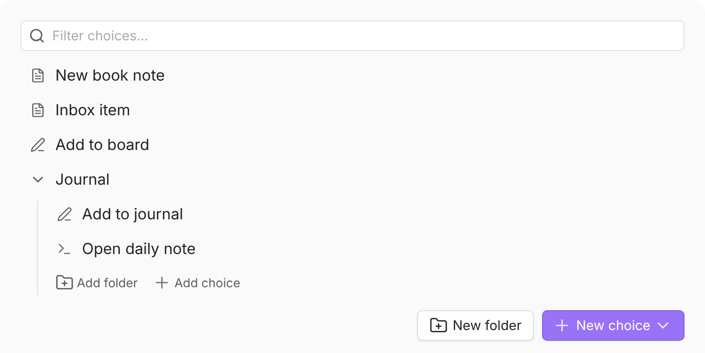
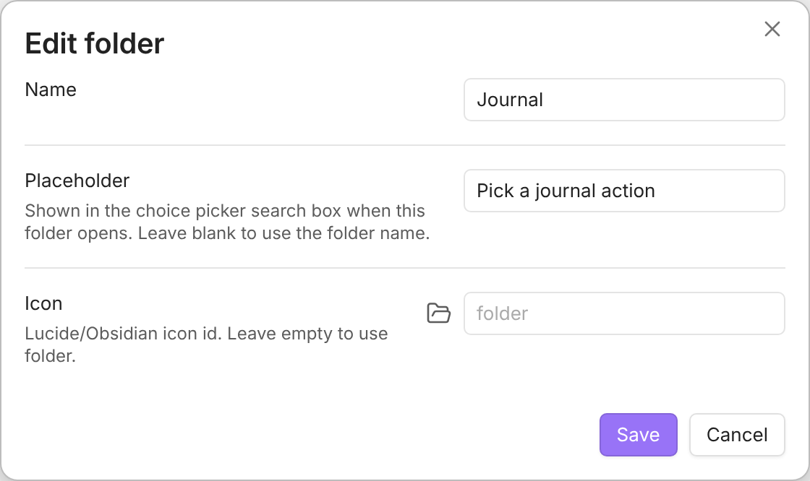

A Multi is a **folder for your other choices**. Group related choices under one
entry in the QuickAdd picker, then open it to see what's inside - handy once your
picker grows past a handful of items. In the settings list, a Multi is the entry
you can fold and unfold. Create one with **New folder** in **Settings →
QuickAdd**.

## Put choices inside a multi {#add-choices}

To create a new choice inside a multi, unfold it and click its **Add choice**
link. To move an existing choice in, **drag it in**. Make sure the multi is
unfolded (as in the screenshot above), then grab the drag handle (⠿) at the
right end of the choice's row - it appears when you hover the row - and drop
the choice onto the rows under the multi. When it works, the choice appears
indented under the multi.

:::tip
An empty multi shows a band that reads **Empty — add a choice or drag one
here**. Drop your first choice onto that band; it highlights when the drop
will land inside the multi. Once one choice is inside, drop the rest among the
nested rows.
:::

## Set the search box hint: Placeholder text {#placeholder-text}

Each multi can show its own hint in the choice picker's search box when you open
it - useful for labeling a complex menu or a grouped workflow. Leave it empty and
the multi's name is used instead.

Because [search reaches everything nested under the multi](#searching-nested-choices),
word the hint for the whole group, not just the top level.

To set it, click the gear on the multi's row to open **Edit folder**, fill in
**Placeholder**, and click **Save**.

## Change a choice's icon {#icons}

Choices in the QuickAdd picker use the same Obsidian/Lucide icons as registered
QuickAdd commands. Every choice type has a default icon, and you can override it
from the choice's **Icon** setting. Icons are monochrome and take on your active
Obsidian theme color.

## Search across nested choices {#searching-nested-choices}

Typing in the choice picker searches every choice nested inside the current
level's multis, not just the level you are looking at. A nested match shows its
folder path (for example `Work / Meetings`) beneath the choice name. This also
applies to the root picker opened by the **QuickAdd: Run** command or the ribbon
icon.

Good to know:

- Browsing is unchanged: with an empty search box, you still see one level at a time.
- The search also matches the folder path, so `work meeting` finds `New meeting` inside `Work / Meetings`.
- Selecting a nested multi from the results opens it. Its **← Back** entry returns to the level you searched from, skipping any levels in between.
- Searching from inside a multi only covers that multi's sub-choices. Go back (or open the root picker) to search more broadly.

To limit search to the level you have open, turn off **Settings → QuickAdd →
Advanced → Search nested choices**.
