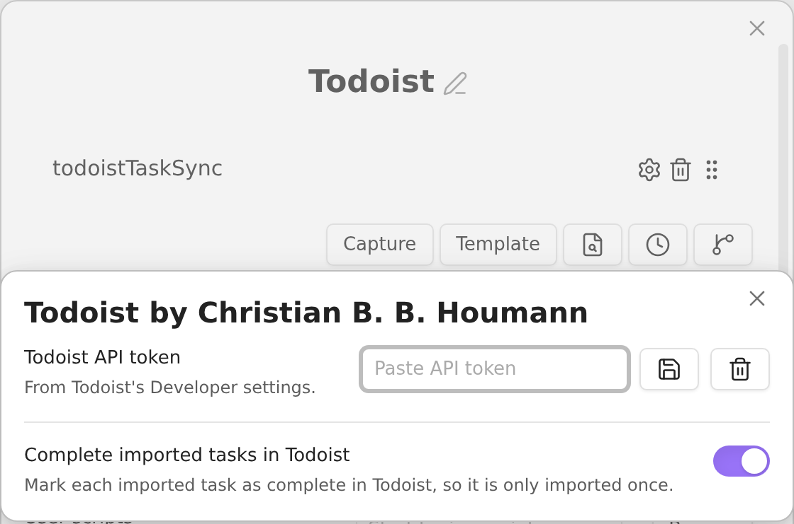
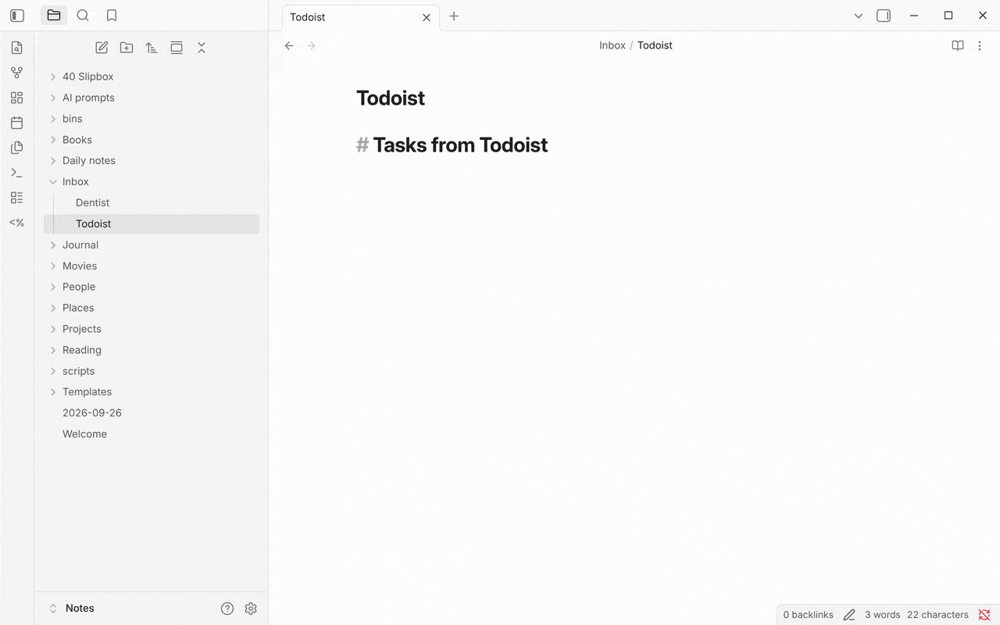

You end up with one QuickAdd command that pulls tasks from your Todoist account into a note in your vault. This is useful for capturing tasks on the go with your phone, then adding them to Obsidian when you get back to your computer.

## Prerequisites

- A Todoist API token. In Todoist, open **Settings → Integrations → Developer** and copy the **API token**. The script talks to the [Todoist API](https://developer.todoist.com/api/v1/) directly, so you don't need the Todoist plugin for Obsidian.
- The <a href="/scripts/TodoistScript.js" download>Todoist Script</a>, saved in your vault as a `.js` file, for example `scripts/todoistTaskSync.js`. Don't save it inside the `.obsidian` folder - QuickAdd ignores scripts there.
- A [macro](/docs/Choices/MacroChoice/) that runs the script, and a [Capture choice](/docs/Choices/CaptureChoice/) that writes its output to a note (set up below).

## How it works

The Todoist Script has three exports, `SelectFromAllTasks`, `GetAllTasksFromProject`, and `GetAllTasksFromSection`.

-   `SelectFromAllTasks` will prompt you to select tasks from all tasks on your Todoist account,
-   `GetAllTasksFromProject` will prompt you for a project and get all tasks from that project, and
-   `GetAllTasksFromSection` will prompt you for a section and get all tasks from that section.

If you run the macro as-is, the script asks you which one to run. To always run one of them, reference it in the Capture format with `::`, for example `{{MACRO:Todoist::GetAllTasksFromProject}}`, or name it in the macro's script command, for example `todoistTaskSync::GetAllTasksFromProject`.

:::caution[Imported tasks are completed in Todoist]
By default, the script completes every task it imports, so the same task isn't imported twice. Recurring tasks move to their next occurrence instead. To keep the tasks open in Todoist, untick **Complete imported tasks in Todoist** in the script's settings.
:::

## Setup

Imported the package above? The script, the macro, and the Capture choice are already in place. Open the **Todoist** macro and follow step 3 to save your token and decide whether imported tasks are completed.

1. Save the <a href="/scripts/TodoistScript.js" download>Todoist Script</a> to your vault, for example as `scripts/todoistTaskSync.js`.
2. In **Settings → QuickAdd**, click **New choice** → **Run a sequence of steps** to add a [Macro choice](/docs/Choices/MacroChoice/). Name it `Todoist`, and add the script to its command list. Add it by its file name (`todoistTaskSync`) to pick an export when the macro runs, or append an export (`todoistTaskSync::GetAllTasksFromProject`) to always run that one. Either way, the script's settings apply.
3. Click the gear (⚙️) next to the script command, paste your Todoist API token into **Todoist API token**, and click the save icon next to it. QuickAdd keeps it in Obsidian's secret storage, not in `data.json`. Leave **Complete imported tasks in Todoist** ticked, or untick it to leave tasks open in Todoist.

    

4. Add a [Capture choice](/docs/Choices/CaptureChoice/) with **New choice** → **Add to a note**, and give it these settings:
    -   _Capture to:_ the path to the file where you want to store the tasks.
    -   _Capture format:_ Enabled - and in the format, write `{{MACRO:Todoist}}` to be asked which export to run, or `{{MACRO:Todoist::GetAllTasksFromProject}}` (or any of the other exports) to run that one directly.

You can make one Capture choice per export, so each has its own command.

## What you get

The tasks are written in this format:
`- [ ] <Task Content> 📅 <YYYY-MM-DD>`

Which equals: `- [ ] Buy groceries 📅 2021-06-27`

This task will be recognized by the Tasks plugin for Obsidian, as well.
If there isn't a date set for the task, they'll simply be entered as `- [ ] Buy groceries`.

## Troubleshooting

- **"Add your Todoist API token in the Todoist script's settings"**: open the macro, click the gear next to the script command, and paste the token. Settings belong to each script command, so if the macro has several commands for this script, set the token on the one that runs.
- **"Todoist rejected the API token (HTTP 401)"**: the token is wrong or was reset. Copy it again from Todoist's Developer settings.
- **"Secret setting ... is unavailable. Re-enter it on this device."**: secrets are stored per device. Paste the token again on this device.
