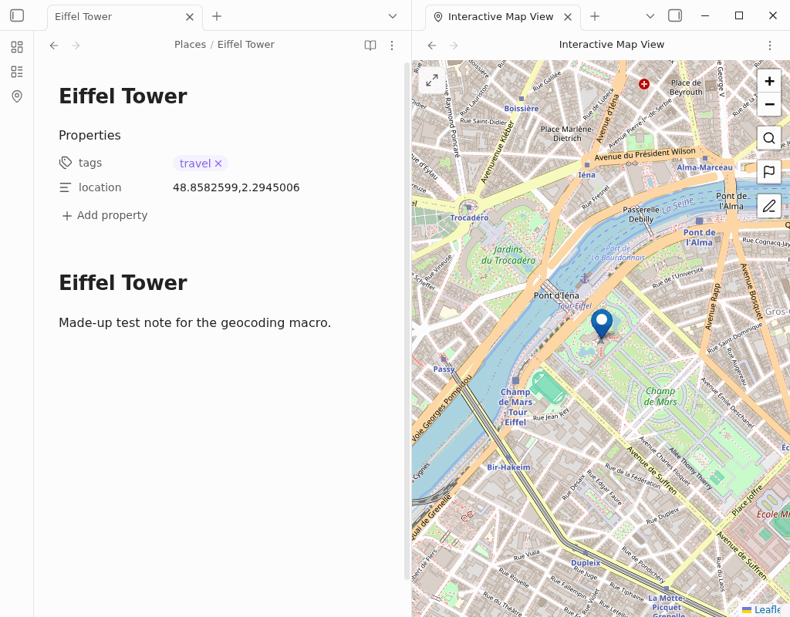

This macro asks you for an address, looks up its coordinates, and sets a `location` property on the note you have open. The value has the form `lat,lng`, for example `location: 48.8582599,2.2945006`. That is the front matter format the [Obsidian Map View plugin](https://github.com/esm7/obsidian-map-view) recommends and writes itself, so Map View places the note on its map.

## Before you start

- The script looks up addresses with [Nominatim](https://nominatim.org/), OpenStreetMap's free geocoding service. It needs an internet connection but no account or API key. Nominatim uses the first match, so a specific address (street, city, country) gives the best result.
- No other plugin is needed to write the property. Install Map View if you want to see your notes on a map.

## Setup

1. Grab the script from [this page](/scripts/getLongLatFromAddress.js). You can either click the download link, or copy the file contents and save them as `getLongLatFromAddress.js`. The `.js` extension is essential.
2. Save the file anywhere in your vault (not inside the `.obsidian` folder). For a fuller walkthrough with video, see [the guide to installing user scripts](/docs/Examples/Capture_FetchTasksFromTodoist/).
3. In **Settings → QuickAdd**, click **New choice** → **Macro**. The Macro Builder opens; click its name at the top to rename it (I call mine `Mapper`). If you close the builder, click the gear (Configure) button on the choice in the list to reopen it. See [the Macro choice docs](/docs/Choices/MacroChoice/) for a full walkthrough.
4. In the Macro Builder, place your cursor in the **User scripts** field to bring up a suggester, pick `getLongLatFromAddress.js` (or click **Browse** to select the file), and click **Add**. It should appear as the first command.
5. Close the QuickAdd settings.

## What you get

Open the note you want to place, run the macro with the `QuickAdd: Run` command in the command palette, and pick your choice. Enter an address, and QuickAdd sets the note's `location` property to that address's coordinates:

```yaml
---
location: 48.8582599,2.2945006
---
```

The prompt names the note it will update, for example **🏠 Address for Eiffel Tower**. That note gets the location even if you [peek](/docs/ControllingPrompts/#peek) and open another note, say to copy the address, before you submit. If the note already has a `location` property, the script replaces its value. If Nominatim finds no match, you get a notice and the note is left unchanged.



:::note
Earlier versions of this script needed MetaEdit to write the property, and this page told MetaEdit users in **All Multi** mode to edit the script. The script now writes the property with Obsidian's own API, so MetaEdit and its edit mode no longer matter. Locations written by the old script keep working in Map View. If you use a different property name for locations in Map View's settings, change `frontmatter.location` in the script to match.
:::
