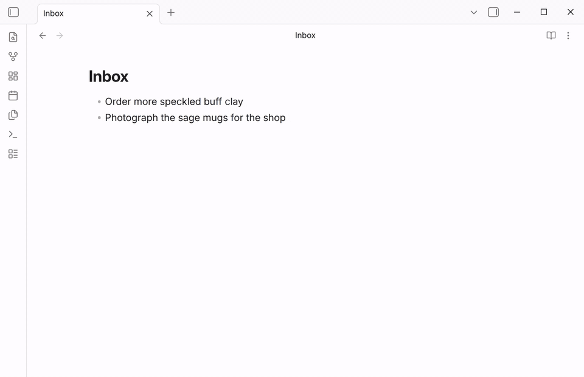

A Capture closes after each entry, so writing down ten ideas means running it
ten times. This macro opens its **Brain dump entry** Capture again after each
entry: type, press Enter, type the next one, and press Esc
when you're done. Every entry becomes its own line in `Inbox.md`.

This example needs QuickAdd 2.29.0 or later. In earlier versions, each new
prompt opened with the entry you had just saved.



## Setup

Imported the package above? It adds the **Brain dump** macro, the **Brain
dump entry** Capture, and `scripts/brainDump.js`. Follow **After importing**
in the card, then skip to [What you get](#what-you-get).

1. Create the Capture. In **Settings → QuickAdd**, click **New choice** →
   **Add to a note**, and set **Name** to `Brain dump entry`.
2. Set **Where** to `Inbox.md` and turn on **Create file if it doesn't
   exist**.
3. Set **Position** to **Bottom of file**.
4. In **What**, enter (before QuickAdd 2.30.0, turn on the **Capture format** toggle first):

   ```text
   - {{VALUE}}
   ```

5. Set **Use editor selection as default value** to **Ignore selection**, so
   text you have selected in a note doesn't stand in for the first entry. Click
   **Done**.
6. <a href="/scripts/brainDump.js" download>Download brainDump.js</a> and save
   it in your vault. QuickAdd doesn't list scripts in `.obsidian` or in other
   folders whose names start with a dot.
7. Click **New choice** → **Run a script** and set **Name** to `Brain dump`.
   On the script step, click **Choose file** and pick `brainDump.js`.
8. Turn **Add to command palette** on and click **Done**.

## What you get

Run **QuickAdd: Brain dump** from the command palette. A prompt titled **Text
to capture** opens. Type an entry and press Enter: QuickAdd adds it to
`Inbox.md` and opens an empty prompt for the next one. Press Esc to stop.
Nothing is written for the prompt you close.

After three entries, `Inbox.md` ends like this:

```markdown
- Try a thinner sage glaze on the rims
- Price the espresso cups for Blue Harbor
- Ask Jonas if the saucers need a foot ring
```

## Repeat a different Capture

The macro can repeat any Capture that asks for input, such as one that adds a
task to today's daily note. In **Settings → QuickAdd**, hover over **Brain dump**
and click its cog, then click the cog on the **brainDump** step and enter that
Capture's name in **Capture choice**.

If the Capture you name doesn't ask for anything, the macro runs it once and
stops with a notice, so it can't keep writing the same line.

The script's loop is one line:

```js
while (await askedForInput(() => params.quickAddApi.executeChoice(choice))) {}
```

`executeChoice` runs the Capture and rejects when you cancel its prompt, which
ends the loop. `askedForInput` reports whether a dialog opened while the
Capture ran, so a Capture that asks for nothing stops the loop too. The
[QuickAdd API](/docs/QuickAddAPI/) page shows how to pass variables to the
Capture.
