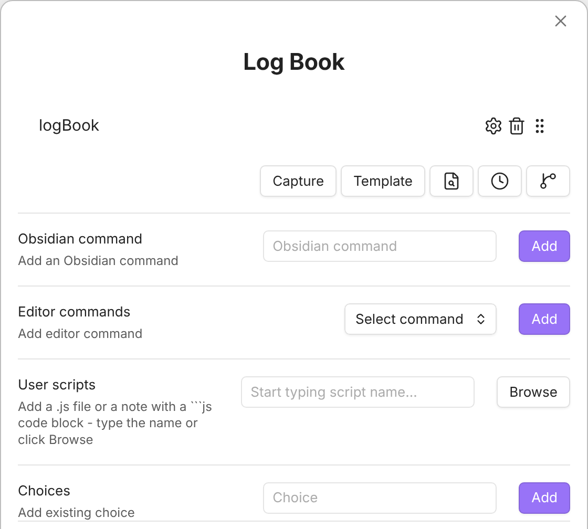

This macro asks which book you are reading and writes your answer to the **Book** property of today's daily journal note, so you can log your current read without leaving the command palette.

## Before you start

- Today's daily journal note must exist; the macro does not create one. The property is created if the note does not have it yet.
- The **Daily notes** core plugin turned on, or a custom **Daily note path** in the script settings (step 4).

## Setup

Imported the package above? The script and the **Log book** macro are already in place; skip to step 4 to check its settings, then run it.

1. <a href="/scripts/logBook.js" download>Download logBook.js</a> and save it somewhere in your vault (not inside the `.obsidian` folder). See [the user scripts guide](/docs/UserScripts/) for how QuickAdd loads scripts.
2. In **Settings → QuickAdd**, click **New choice** → **Macro**. The Macro Builder opens; click its name at the top to rename it (for example, `Log Book`). See [the Macro choice docs](/docs/Choices/MacroChoice/) for a full walkthrough.
3. In the Macro Builder, add your script as a **User Script** command.
4. Click the cog on the script step. Leave **Daily note path** empty to use the Daily notes plugin's folder and date format, or set it to where your daily notes live, with their date format, for example `bins/daily/{{DATE:gggg-MM-DD - ddd MMM D}}.md`. Change **Property name** if you want to log to something other than `Book`.

Run the macro and enter a book title at the prompt. QuickAdd updates the **Book** property in today's journal note to that title.

