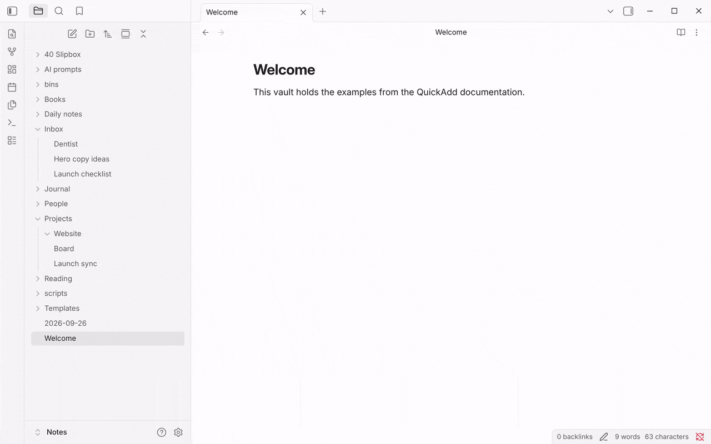

This macro moves every note carrying a tag you pick into a folder you pick. It matches the tag whether it lives in a note's frontmatter or inline in the body, and it can optionally include nested tags (for example `#project/work` when you choose `#project`). No extra plugins are needed - it uses only Obsidian's own API.

## Setup

Imported the package above? The script and the **Move notes with a tag** macro are already in place; skip to running it below.

1. Save the <a href="/scripts/moveNotesWithTag.js" download>Move notes with a tag script</a> to your vault, for example as `scripts/moveNotesWithTag.js` (not inside the `.obsidian` folder). See [the user scripts guide](/docs/UserScripts/) for how QuickAdd loads scripts.
2. In **Settings → QuickAdd**, click **New choice** → **Macro**. The Macro Builder opens; click its name at the top to rename it (for example, `Move tagged notes`). See [the Macro choice docs](/docs/Choices/MacroChoice/) for a full walkthrough.
3. In the Macro Builder, add your script as a **User Script** command.

Run the macro, pick a tag, choose whether to include nested tags, then pick the destination folder. Every matching note moves there.

