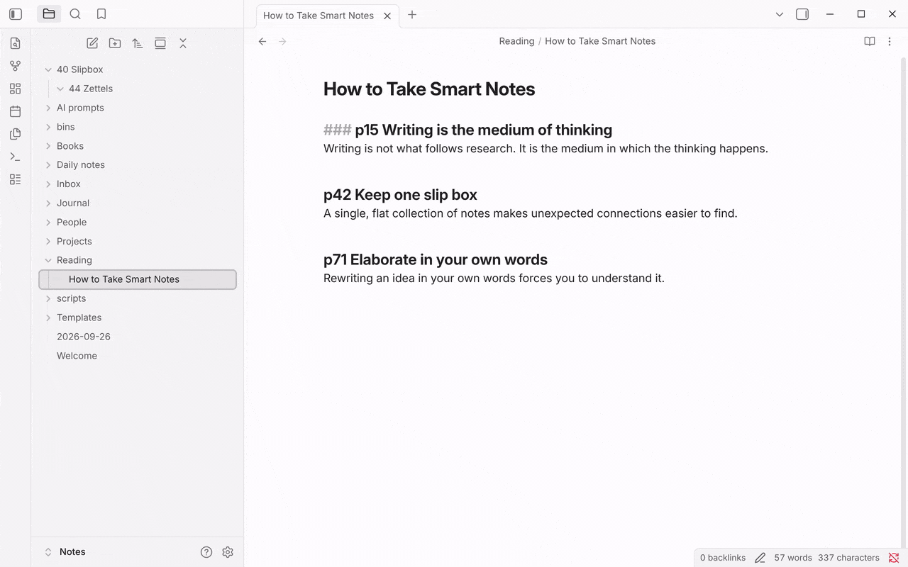

This macro turns the headings of your active note into separate linked notes. For each heading of the level you choose, it creates a new note named after the heading text and links back to that heading - a fast way to break a big note into atomic, connected notes.

## Setup

Imported the package above? The script and the **Zettelize headings** macro are already in place; open a note, run it, and use the settings below to change where notes go.

Get the `.js` file for this user script <a href="/scripts/zettelizer.js" download>here</a>, then add it to a Macro choice. To install it, follow [how to add a script to a macro](/docs/UserScripts/#adding-scripts-to-macros), and see [the Macro choice docs](/docs/Choices/MacroChoice/) for a full walkthrough of creating a macro.

The script has two settings. In **Settings → QuickAdd**, open your macro and click the cog on the script's step to change them:

- **Folder for new notes** - where the new notes go. Defaults to `Zettels`, which is created if it does not exist; leave it empty to use the vault root.
- **Heading level** - which headings become notes. Defaults to `3`, meaning headings with three pound symbols, like ``### header``.

The script looks for headers in your active file with the desired level.
If such a header is found, it will ignore the first 'word' (any sequence of characters - i.e., letters, numbers, symbols, etc - followed by a space). Then, it will create a file with a name containing the remaining text in the heading.

In that file, it will link to the heading it created the file from.