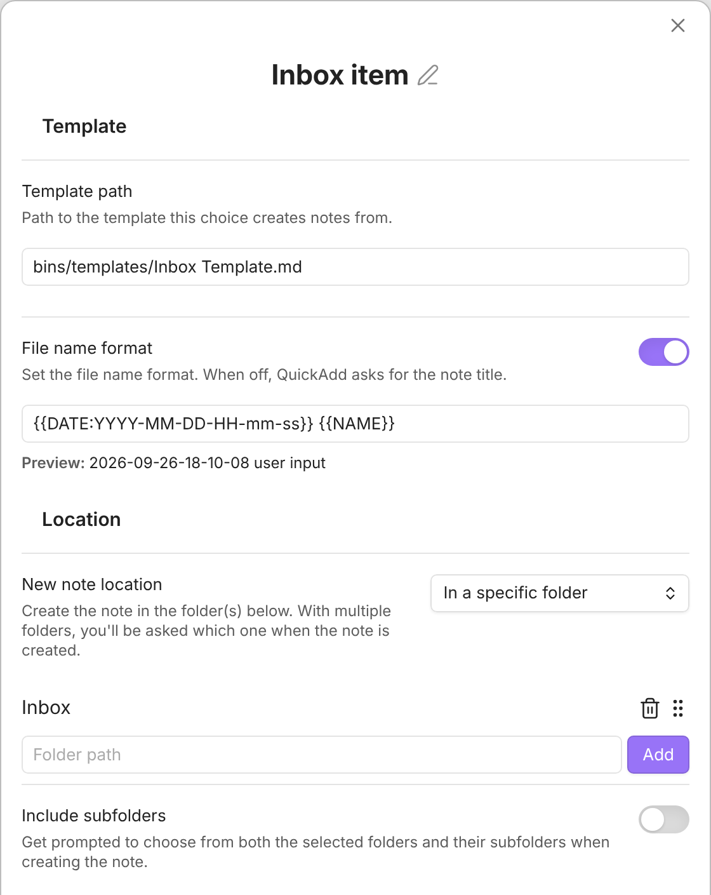

This example gives you a QuickAdd choice that creates a new inbox note in one step. QuickAdd asks you for a short name, then makes a note whose file name is the current date and time followed by what you typed - so every capture lands in your inbox as its own dated note, ready to process later.

## Before you start

- A template note you want each inbox item to start from. The package includes the one below as `Templates/Inbox Template.md`. Building by hand? Save it yourself, or use any note: a template can be as simple as an empty file or contain any [format placeholders](/docs/FormatSyntax/) you like.

```markdown
---
created: {{DATE:YYYY-MM-DD HH:mm}}
tags: [inbox]
---
# {{NAME}}

```

## Setup

Imported the package above? Follow **After importing** in the card, then skip the manual setup below and read [What you get](#what-you-get).

1. In **Settings → QuickAdd**, click **New choice** → **Template**. The Template choice settings open; click its name at the top to rename it (for example, `Inbox Item`). For a full tour of these settings, see [the Template choice docs](/docs/Choices/TemplateChoice/).
2. Set **Template path** to your inbox template:

   ```
   Templates/Inbox Template.md
   ```

3. Turn on **File name format** and set it to:

   ```
   {{DATE:YYYY-MM-DD-HH-mm-ss}} {{NAME}}
   ```

   `{{DATE:YYYY-MM-DD-HH-mm-ss}}` becomes the current date and time down to the second, and `{{NAME}}` becomes whatever you type when the choice runs. Together they keep every inbox note uniquely named and in date order.
4. Set **New note location** to **In a specific folder**, enter `Inbox` in **Folder path**, and click **Add**. Set the remaining options to your liking.



## What you get

Run the choice and type a short name, such as `call dentist`. QuickAdd creates a note named like `2026-07-08-14-30-05 call dentist.md` from your inbox template.
