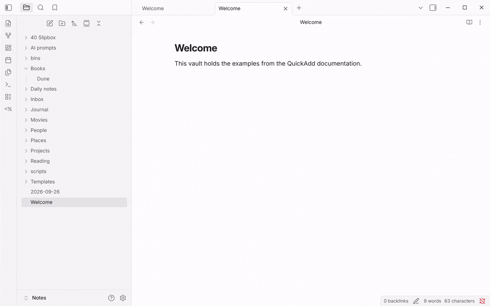
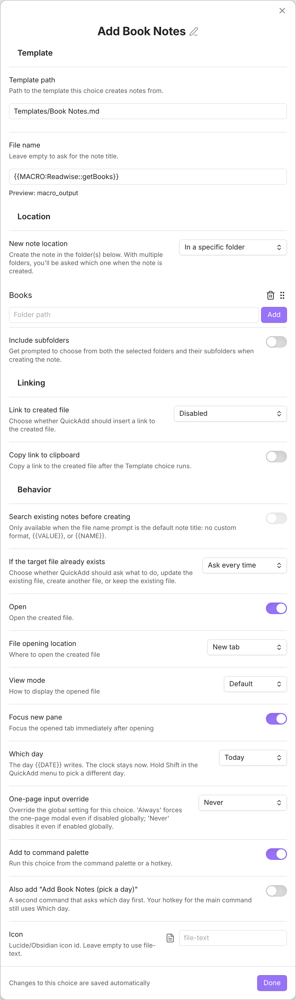

This example creates a new book note from a template and fills in a book's highlights straight from [Readwise](https://readwise.io). When you run it, you pick a book, and QuickAdd builds a note whose body already contains that book's highlights and notes.



## Before you start

- A Readwise account and its access token. Get your token [here](https://readwise.io/access_token).

## Installation

Imported the package above? The script, the **Readwise** macro, the template and the **Add Book Notes** choice are already in place. Save your access token as described under **After importing** in the card, then skip to [the notes on how it behaves](#how-it-behaves).

New to user scripts? See [how to add a script to a macro](/docs/UserScripts/#adding-scripts-to-macros).

1. Download the <a href="/scripts/readwise.js" download>Readwise script</a> and save it in your vault.
2. Create the macro that runs the script: in **Settings → QuickAdd**, click **New choice** → **Macro**. The Macro Builder opens; click its name at the top to rename it (I use `Readwise`). See [the Macro choice docs](/docs/Choices/MacroChoice/) for a full walkthrough.
3. In the builder, add a **User Script** command: type the name of the script you saved (or click **Browse**) and click **Add**.
4. Click the cog on the script's step, paste your token into **Readwise access token**, and click the save icon next to it. QuickAdd keeps it in Obsidian's secret storage, not in `data.json`.
5. Create a [Template choice](/docs/Choices/TemplateChoice/) whose **Template path** points at the template you made from the [one below](#template). Set **File name** to `{{MACRO:Readwise::getBooks}}`, so the note is named after the book you pick. Set the remaining options to your liking. The screenshot shows the packaged choice:



<a id="how-it-behaves"></a>A few notes on how it behaves:

- The note is named after the book you select, minus what a file name can't hold: `Dune: Part One` becomes `Dune - Part One`. The alias keeps the real title.
- Running the choice opens a menu to choose a book, and the highlights are appended into the template where the macro placeholder sits.
- Customize the template however you like, but keep `{{MACRO:Readwise::instaFetchBook}}` - that placeholder is what fetches the highlights and marks where they are inserted. If you named your macro something other than `Readwise`, replace `Readwise` in that placeholder with your macro's name.
- The script fills in `{{VALUE:author}}` and `{{VALUE:Book Title}}` from the book you pick. If you use [one-page input](/docs/Advanced/onePageInputs/), set **One-page input override** to **Never** on the **Add Book Notes** choice (the package already does), or the form asks you for them before the script has a chance to.

## Script

Most of the setup is shown in the gif.

The script is the <a href="/scripts/readwise.js" download>Readwise script</a> from step 1; open it to read or adapt it.

## Template

```md
---
image:
tags: in/books
aliases:
    - "{{VALUE:Book Title}}"
cssclass:
---

# Title: [[{{TITLE}}]]

## Metadata

Tags::
Type:: [[Book]]
Author:: {{VALUE:author}}
Reference::
Rating::
Reviewed Date:: [[{{DATE:YYYY-MM-DD - ddd MMM D}}]]
Finished Year:: [[{{DATE:YYYY}}]]

# Thoughts

# Actions Taken / Changes

# Summary of Key Points

# Highlights & Notes

{{MACRO:Readwise::instaFetchBook}}
```
