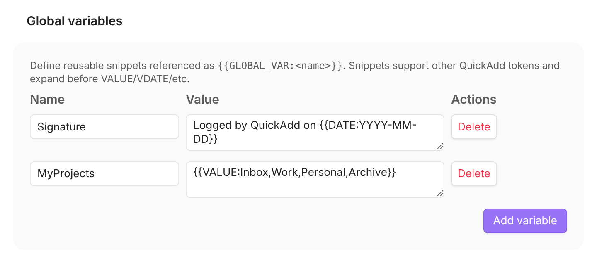

A global variable is a named snippet you define once in QuickAdd's settings and
reuse anywhere QuickAdd fills in placeholders. Keep your list of projects, a
folder path, or a block of boilerplate in one place, then drop it into any
choice or template with `{{GLOBAL_VAR:<name>}}`. Edit the snippet in settings
and every choice that uses it updates at once.

Unlike a [run variable](/docs/VariablesDataFlow/), which lives only while one
choice is running, a global variable is saved with your vault and available to
every choice, every time.

For example, define a snippet named `Signature`:

```text title="QuickAdd settings → Global variables"
Name:  Signature
Value: Logged by QuickAdd on {{DATE:YYYY-MM-DD}}
```

Then use it in a capture or template:

```markdown title="You write"
{{GLOBAL_VAR:Signature}}
```

```markdown title="You get"
Logged by QuickAdd on 2026-07-08
```

Snippets can hold other placeholders (like the `{{DATE}}` above), so a global
variable can be a fixed string, a small template, or a reusable option list.

Good places to use one:

- A single list of projects, tags, or folders reused across many choices and templates
- Constants you'd otherwise retype: paths, emojis, boilerplate text, or a YAML block

## Define a global variable {#define}

1. Open **Settings → QuickAdd → Advanced → Global variables**. Before QuickAdd
   2.30.0, **Global variables** is a section of the main QuickAdd tab.
2. Add a **name** and a **value**. The value is free text and supports all of
   [format syntax](/docs/FormatSyntax/).
3. That's it - changes save automatically as you type.



:::tip
In the format fields of a choice's settings, such as **What** or
**Note name**, type `{{glob` to get suggestions for the variables you've
defined, then pick one to insert it. Use descriptive names,
and avoid two names that differ only by case.
:::

## Use it anywhere: `{{GLOBAL_VAR:<name>}}` {#use}

Write `{{GLOBAL_VAR:<name>}}` and QuickAdd replaces it with that snippet's
value. It works everywhere QuickAdd formats text:

| Where | Which fields |
| --- | --- |
| **Template choice** | File name, folder paths, template content |
| **Capture choice** | Target path, content formatting |
| **Macros** | Inline formatting strings |

Good to know:

- The `GLOBAL_VAR` keyword is case-insensitive, so `{{global_var:Signature}}` also works. The name after the colon is **case-sensitive**: `{{GLOBAL_VAR:signature}}` does not find a variable named `Signature`.
- A name that doesn't match any global variable becomes an **empty string** rather than erroring.

## Put other placeholders inside a snippet {#nested-tokens}

A snippet's value can contain any QuickAdd placeholder - `{{VALUE:...}}`,
`{{VDATE:...}}`, `{{FIELD:...}}`, `{{RANDOM:n}}`, and so on. When the snippet is
inserted, those placeholders run just like they would if you'd typed them
directly.

```text title="QuickAdd settings → Global variables"
Name:  MyProjects
Value: {{VALUE:Inbox,Work,Personal,Archive}}
```

```markdown title="You write (a template path)"
Projects/{{GLOBAL_VAR:MyProjects}}/{{DATE:YYYY}}/
```

Running a choice that uses `MyProjects` shows the `Inbox / Work / Personal /
Archive` picker, and your pick lands in the path.

Good to know:

- A snippet can reference **another global variable**. QuickAdd resolves up to 5 levels of nesting, so an accidental loop stops instead of hanging.
- Globals expand **early** in the formatter, so any placeholders inside a snippet are processed by the passes that follow.
- The [one-page input form](/docs/Advanced/onePageInputs/) looks inside your snippets too, so prompts they introduce (like `{{VALUE:...}}`) appear up front with the rest.
