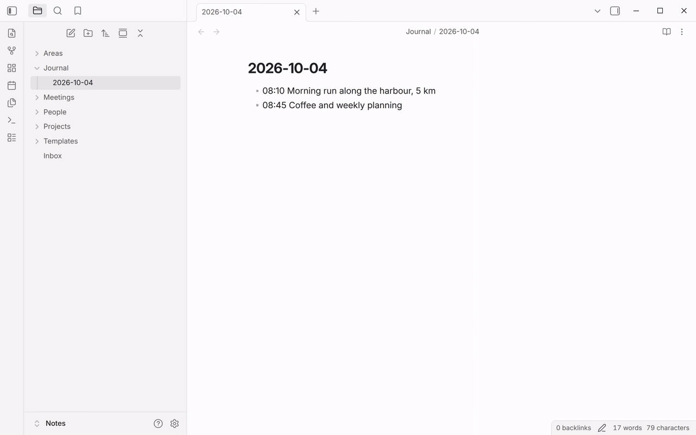

QuickAdd turns your repetitive Obsidian actions - creating a note from a
template, logging a line to your journal, running a script - into single
commands you trigger with a hotkey. Set a workflow up once, then run it in a
keystroke from anywhere in your vault.

New here? Let QuickAdd [set up your first choices](#first-run), or build your
[first workflow](#first-workflow) below in about a minute.

## Install QuickAdd

Install QuickAdd from Obsidian's Community plugins browser, then enable it.

If you cannot use the plugin browser, follow the
[manual installation guide](/docs/ManualInstallation/).

## Choose the right choice type

| If you want to... | Use this | Start here |
| --- | --- | --- |
| Create a new note from a reusable file | Template choice | [Template Choices](/docs/Choices/TemplateChoice/) |
| Append text to a journal, log, task list, or existing file | Capture choice | [Capture Choices](/docs/Choices/CaptureChoice/) |
| Run one or more Obsidian commands, scripts, or choices | Macro choice | [Macro Choices](/docs/Choices/MacroChoice/) |
| Group choices into a nested menu | Multi choice | [Multi Choices](/docs/Choices/MultiChoice/) |
| Share configured workflows across vaults | Package | [Share QuickAdd Packages](/docs/Choices/Packages/) |

Most workflows start with either a Template choice or a Capture choice. Add a
Macro choice when you need scripting, multiple steps, or data from another
plugin or API.

You don't pick the type directly. **New choice** in the settings list offers
[presets](/docs/Choices/Presets/) named after what you want to happen, such as
**Log with a timestamp** or **Run a script**. Each one creates a choice of the
right type, already set up.

## Your first choices {#first-run}

An empty list in **Settings → QuickAdd** asks **What do you do in
Obsidian?** Click every answer that fits, such as **Keep a daily journal** or
**Meeting and people notes**, then click **Create choices**. QuickAdd adds
ready-to-run choices for each answer, set up for your vault: with daily notes
on, the journal and task choices write to today's daily note, and without
them to a dated note in `Journal/`. Each card says what it adds before you
pick it, and the [presets page](/docs/Choices/Presets/#first-run) lists them
all.

Run one from the command palette (Ctrl/Cmd+P) with **QuickAdd: Run**. To build
a choice yourself instead, click **New choice** under the question, or follow
the first workflow below.

## First workflow

Let's build a capture that adds a timestamped line to your daily journal. It
takes about a minute.

1. Open **Settings → QuickAdd**, click **New choice**, and pick **Add to a
   note**. It creates a Capture choice and opens its settings right away, as a
   page of the settings window.
2. Set **Name** to `Add to journal`. (Before QuickAdd 2.30.0, the settings open
   in a dialog; click the name at the top to rename it.)
3. Set **Capture to** to `Journal/{{DATE}}.md` - the note today's entries land in.
4. Turn on **Create file if it doesn't exist**, so the first capture of the day
   creates today's note instead of stopping with a "Target file missing" notice.
5. In **Capture format**, enter `- {{DATE:HH:mm}} {{VALUE}}` - the shape
   of one entry. (Before QuickAdd 2.30.0, turn on the **Capture format**
   toggle first.)
6. Close the settings. Open the command palette (Ctrl/Cmd+P), run
   **QuickAdd: Run**, pick `Add to journal`, and type your entry.

QuickAdd writes a line like `- 09:42 Standup moved to Wednesday` at the bottom
of today's journal note, without opening it.

Under the choice's name, the settings list and the launcher now show what it
does: *Adds a line at the bottom of Journal/{date}*.

Once it works the way you want, click the ⚡ icon next to the choice to add it
to the command palette, then give it a hotkey in Obsidian's **Settings →
Hotkeys**.

The `{{DATE}}` and `{{VALUE}}` above are [format syntax](/docs/FormatSyntax/):
placeholders QuickAdd fills in each time you run the choice. There are
placeholders for dates, your answers, links, clipboard content, and more. When a
prompt asks you for text, the [suggester system](/docs/SuggesterSystem/) lets you
type `[[` or `#` to pull in a file, tag, or heading from your vault.

## Common paths

### I want examples first

Use the [examples overview](/docs/Examples/) to pick a complete workflow by choice
type, difficulty, prerequisites, and outcome.

Good first examples:

- [Capture: Add entries to your daily note](/docs/Examples/Capture_ToDailyNote/)
- [Template: Add an Inbox Item](/docs/Examples/Template_AddAnInboxItem/)
- [Macro: Book Finder](/docs/Examples/Macro_BookFinder/)
- [Capture: Canvas Capture](/docs/Examples/Capture_CanvasCapture/)

### I want to automate with scripts

Start with the [scripting overview](/docs/Advanced/ScriptingGuide/), then move to
[User Scripts](/docs/UserScripts/) and the [QuickAdd API reference](/docs/QuickAddAPI/)
when you need exact method details.

### I want to call QuickAdd from outside Obsidian

Use [Obsidian URI](/docs/Advanced/ObsidianUri/) for URI-triggered workflows, or the
[QuickAdd CLI](/docs/Advanced/CLI/) for shell scripts and external automation.
